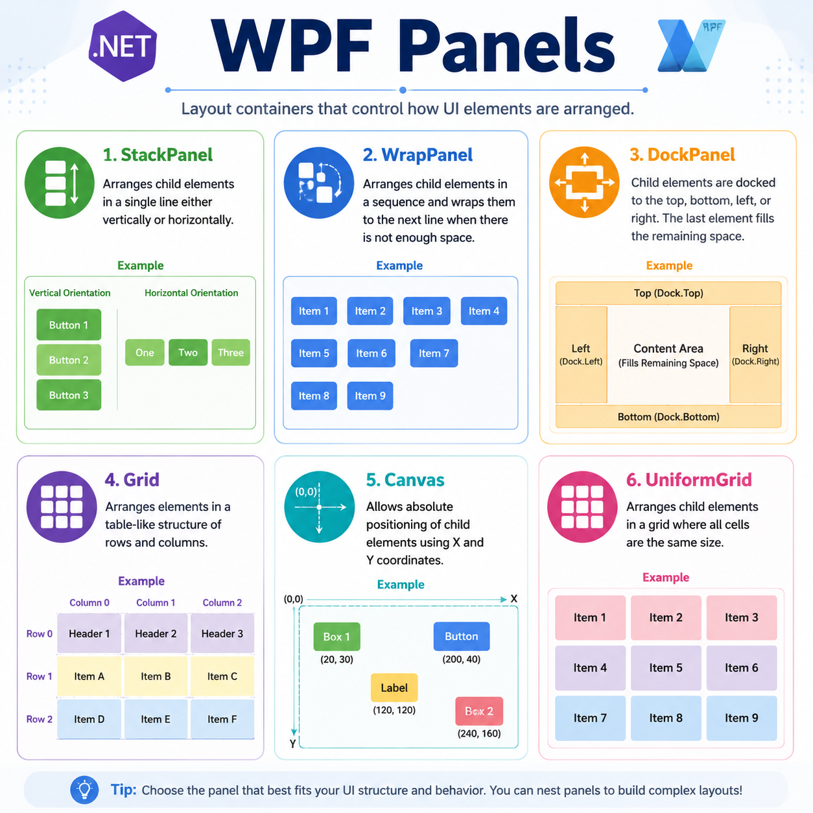

# Table of Contents


1. [WPF Panels Overview](#wpf-panels-overview)
2. [What Is a Panel?](#what-is-a-panel)
3. [Why Panels Matter](#why-panels-matter)
4. [Common WPF Panels](#common-wpf-panels)
   1. [StackPanel](#stackpanel)
   2. [WrapPanel](#wrappanel)
   3. [DockPanel](#dockpanel)
   4. [Grid](#grid)
   5. [Canvas](#canvas)
   6. [UniformGrid](#uniformgrid)
5. [How Layout Works in WPF](#how-layout-works-in-wpf)
6. [Choosing the Right Panel](#choosing-the-right-panel)
7. [Nested Panels](#nested-panels)
8. [Panel Comparison Table](#panel-comparison-table)
9. [Best Practices](#best-practices)

---

# WPF Panels Overview

In **WPF**, panels are the containers that control how child elements are **arranged** and **sized** on the screen.

Think of a panel as a *layout manager*:

- It decides **where** controls go
- It influences **how much space** they get
- It helps build interfaces that are clean, flexible, and resizable

Without panels, placing UI elements would be much harder and less adaptive.

---

# What Is a Panel?

A **Panel** is a special type of control used to contain other visual elements.

Common examples of items placed inside a panel:

- `Button`
- `TextBox`
- `Label`
- `Image`
- Other panels

> A panel does not usually display content by itself.  
> Its main job is to **organize child elements**.

In WPF, many layouts are created by putting controls inside one or more panels.

---

# Why Panels Matter

Panels are essential because desktop windows can be resized, and the UI should adapt correctly.

## Benefits of Panels

- **Automatic layout**
- **Responsive resizing**
- **Cleaner UI structure**
- **Easier maintenance**
- **Better control alignment**

For example:

- A vertical menu can be created with a `StackPanel`
- A toolbar-like area can use a `WrapPanel`
- A form layout often uses a `Grid`
- Free-positioned drawing surfaces can use a `Canvas`

---

# Common WPF Panels

## StackPanel

A `StackPanel` arranges child elements in a **single line**:

- **Vertically** *(top to bottom)* by default
- **Horizontally** if `Orientation="Horizontal"`

### When to Use

Use `StackPanel` when:

- You want controls one after another
- The layout is simple
- Items should flow in one direction only

### Example

```xml
<StackPanel Orientation="Vertical" Margin="16">
    <TextBlock Text="Account Name" Margin="0,0,0,6"/>
    <TextBox Width="220" Margin="0,0,0,10"/>
    <Button Content="Save Changes" Width="140"/>
</StackPanel>
```

### Horizontal Stack Example

```xml
<StackPanel Orientation="Horizontal" Margin="12">
    <Button Content="Previous" Margin="0,0,8,0"/>
    <Button Content="Next" Margin="0,0,8,0"/>
    <Button Content="Finish"/>
</StackPanel>
```

### Key Points

- Very simple and useful
- Good for menus, button rows, or vertical groups
- Not ideal for complex forms
- In the stacking direction, it can grow based on content

---

## WrapPanel

A `WrapPanel` places items in a row or column and automatically moves them to the next line when there is not enough space.

### When to Use

Use `WrapPanel` when:

- You have repeated items
- Available space may change
- You want a flowing layout

Examples:

- Thumbnail galleries
- Tag lists
- Tool buttons
- Product cards

### Example

```xml
<WrapPanel Margin="14">
    <Button Content="Home" Width="90" Height="34" Margin="4"/>
    <Button Content="Library" Width="90" Height="34" Margin="4"/>
    <Button Content="Downloads" Width="90" Height="34" Margin="4"/>
    <Button Content="Settings" Width="90" Height="34" Margin="4"/>
    <Button Content="Support" Width="90" Height="34" Margin="4"/>
</WrapPanel>
```

### Key Points

- Automatically wraps items
- Works well in resizable windows
- Easier than manually handling rows
- Good for repeated blocks of similar content

---

## DockPanel

A `DockPanel` attaches child elements to one side of the container:

- `Top`
- `Bottom`
- `Left`
- `Right`

Usually, the last child fills the remaining space.

### When to Use

Use `DockPanel` when creating layouts such as:

- Header + content
- Sidebar + main area
- Status bar + central view

### Example

```xml
<DockPanel Margin="10">
    <TextBlock DockPanel.Dock="Top"
               Text="Control Center"
               FontSize="20"
               Margin="0,0,0,10"/>

    <StackPanel DockPanel.Dock="Left" Width="140">
        <Button Content="Overview" Margin="0,0,0,6"/>
        <Button Content="Reports" Margin="0,0,0,6"/>
        <Button Content="Logs"/>
    </StackPanel>

    <Border Background="LightSteelBlue" Padding="12">
        <TextBlock Text="Main workspace goes here."/>
    </Border>
</DockPanel>
```

### Important Behavior

By default:

- The final child element stretches into the remaining area

You can change that behavior:

```xml
<DockPanel LastChildFill="False">
    <Button DockPanel.Dock="Top" Content="Top Area"/>
    <Button DockPanel.Dock="Left" Content="Left Area"/>
    <Button Content="Not Auto-Filled"/>
</DockPanel>
```

### Key Points

- Great for application shells
- Easy to build sidebars and top bars
- Simple alternative to more complex layout structures

---

## Grid

A `Grid` is one of the most powerful and commonly used WPF panels.

It arranges content in **rows** and **columns**.

### Why Grid Is So Important

A `Grid` is ideal when you need:

- Structured layouts
- Form-like interfaces
- Precise alignment
- Resizable sections

### Row and Column Definitions

A grid is built using:

- `Grid.RowDefinitions`
- `Grid.ColumnDefinitions`

### Example

```xml
<Grid Margin="18">
    <Grid.RowDefinitions>
        <RowDefinition Height="Auto"/>
        <RowDefinition Height="Auto"/>
        <RowDefinition Height="*"/>
    </Grid.RowDefinitions>

    <Grid.ColumnDefinitions>
        <ColumnDefinition Width="Auto"/>
        <ColumnDefinition Width="220"/>
    </Grid.ColumnDefinitions>

    <TextBlock Grid.Row="0" Grid.Column="0"
               Text="Email:"
               Margin="0,0,10,10"
               VerticalAlignment="Center"/>

    <TextBox Grid.Row="0" Grid.Column="1"
             Margin="0,0,0,10"/>

    <TextBlock Grid.Row="1" Grid.Column="0"
               Text="Password:"
               Margin="0,0,10,10"
               VerticalAlignment="Center"/>

    <PasswordBox Grid.Row="1" Grid.Column="1"
                 Margin="0,0,0,10"/>

    <Button Grid.Row="2" Grid.Column="1"
            Content="Sign In"
            Width="110"
            HorizontalAlignment="Left"/>
</Grid>
```

### Sizing Options in Grid

Grid rows and columns commonly use:

| Value | Meaning |
|---|---|
| `Auto` | Size based on content |
| Fixed value like `120` | Exact size |
| `*` | Take remaining available space |
| `2*`, `3*` | Weighted share of remaining space |

### Star Sizing Example

```xml
<Grid>
    <Grid.ColumnDefinitions>
        <ColumnDefinition Width="2*"/>
        <ColumnDefinition Width="3*"/>
    </Grid.ColumnDefinitions>

    <Border Grid.Column="0" Background="MistyRose"/>
    <Border Grid.Column="1" Background="Honeydew"/>
</Grid>
```

This means:

- First column gets **2 parts**
- Second column gets **3 parts**

### Spanning Rows or Columns

A control can cover multiple cells.

```xml
<Grid Margin="12">
    <Grid.RowDefinitions>
        <RowDefinition Height="Auto"/>
        <RowDefinition Height="Auto"/>
    </Grid.RowDefinitions>
    <Grid.ColumnDefinitions>
        <ColumnDefinition Width="Auto"/>
        <ColumnDefinition Width="*"/>
    </Grid.ColumnDefinitions>

    <TextBlock Grid.Row="0"
               Grid.Column="0"
               Text="Notes:"
               Margin="0,0,8,0"/>

    <TextBox Grid.Row="0"
             Grid.Column="1"
             Grid.RowSpan="2"
             Height="70"
             AcceptsReturn="True"/>
</Grid>
```

### Key Points

- Best choice for many business-style windows
- Very flexible and powerful
- Excellent for labels + inputs alignment
- Supports complex layouts cleanly

---

## Canvas

A `Canvas` positions child elements using exact coordinates.

Common attached properties:

- `Canvas.Left`
- `Canvas.Top`
- `Canvas.Right`
- `Canvas.Bottom`

### When to Use

Use `Canvas` when you need:

- Absolute positioning
- Drawing-like layouts
- Drag-and-drop surfaces
- Game boards or diagram designers

### Example

```xml
<Canvas Background="Beige" Width="360" Height="180">
    <Button Content="Node A"
            Canvas.Left="20"
            Canvas.Top="25"
            Width="90"
            Height="32"/>

    <Button Content="Node B"
            Canvas.Left="150"
            Canvas.Top="95"
            Width="90"
            Height="32"/>
</Canvas>
```

### Important Note

`Canvas` does **not** automatically arrange controls in a responsive way.

> If the window changes size, controls inside a `Canvas` usually stay at fixed positions unless you handle layout manually.

### Key Points

- Gives maximum placement control
- Not suitable for normal forms or flexible app layouts
- Best for scenarios needing exact coordinates

---

## UniformGrid

A `UniformGrid` places all child elements into equally sized cells.

Every item gets the same amount of space.

### When to Use

Use `UniformGrid` when:

- You want a neat, evenly divided layout
- All items should look equal
- A grid-like visual arrangement is needed without manually defining rows and columns

Examples:

- Calculator buttons
- Icon dashboards
- Simple game boards

### Example

```xml
<UniformGrid Rows="2" Columns="3" Margin="10">
    <Button Content="One"/>
    <Button Content="Two"/>
    <Button Content="Three"/>
    <Button Content="Four"/>
    <Button Content="Five"/>
    <Button Content="Six"/>
</UniformGrid>
```

### Key Points

- Fast and simple
- Equal-sized cells only
- Less flexible than `Grid`
- Great for symmetric layouts

---

# How Layout Works in WPF

WPF layout generally happens in two stages:

## 1. Measure Pass

Each element tells its parent how much space it would like.

## 2. Arrange Pass

The parent decides the final size and position of each child.

This is why panels matter so much:  
they control these layout decisions.

> Different panels use different rules during the measure and arrange process.

For example:

- A `StackPanel` stacks items
- A `Grid` calculates rows and columns
- A `WrapPanel` checks when to wrap
- A `Canvas` places items at exact coordinates

---

# Choosing the Right Panel

Choosing the right panel depends on the kind of UI you want.

## Quick Guide

- Use **`StackPanel`** for simple vertical or horizontal groups
- Use **`WrapPanel`** for flowing items that may wrap
- Use **`DockPanel`** for edge-based layouts
- Use **`Grid`** for forms and structured alignment
- Use **`Canvas`** for exact positioning
- Use **`UniformGrid`** for equally sized cells

---

# Nested Panels

In real applications, a single panel is often not enough.  
You can place panels inside other panels.

## Example: Combining Panels

```xml
<DockPanel>
    <Border DockPanel.Dock="Top"
            Background="SlateGray"
            Padding="10">
        <TextBlock Text="Inventory Manager"
                   Foreground="White"
                   FontSize="18"/>
    </Border>

    <StackPanel DockPanel.Dock="Left"
                Width="160"
                Background="Gainsboro">
        <Button Content="Items" Margin="8"/>
        <Button Content="Orders" Margin="8"/>
        <Button Content="Suppliers" Margin="8"/>
    </StackPanel>

    <Grid Margin="12">
        <Grid.RowDefinitions>
            <RowDefinition Height="Auto"/>
            <RowDefinition Height="*"/>
        </Grid.RowDefinitions>

        <TextBlock Text="Dashboard"
                   FontSize="22"
                   Margin="0,0,0,12"/>

        <WrapPanel Grid.Row="1">
            <Border Width="120" Height="70" Background="LightBlue" Margin="6"/>
            <Border Width="120" Height="70" Background="LightGreen" Margin="6"/>
            <Border Width="120" Height="70" Background="LightCoral" Margin="6"/>
        </WrapPanel>
    </Grid>
</DockPanel>
```

## Why Nest Panels?

Because different sections of a window often need different layout behavior.

For example:

1. The main window may use a `DockPanel`
2. The content area may use a `Grid`
3. A button section may use a `StackPanel`
4. A list of cards may use a `WrapPanel`

This is very common in WPF design.

---

# Panel Comparison Table

| Panel | Layout Style | Best For | Resizable Behavior | Complexity |
|---|---|---|---|---|
| `StackPanel` | One direction | Menus, tool groups, simple sections | Moderate | Low |
| `WrapPanel` | Flow + wrap | Tags, thumbnails, repeated items | Good | Low |
| `DockPanel` | Edge docking | App shell layouts | Good | Medium |
| `Grid` | Rows and columns | Forms, dashboards, structured UI | Excellent | Medium to High |
| `Canvas` | Absolute positioning | Diagrams, drag surfaces, custom visuals | Weak by default | Low |
| `UniformGrid` | Equal cells | Keypads, equal button sets | Good | Low |

---

# Best Practices

## 1. Prefer `Grid` for Structured Layouts

If alignment matters, especially in forms, `Grid` is usually the strongest choice.

## 2. Avoid Overusing `Canvas`

`Canvas` may seem easy at first, but it often creates layouts that do not resize well.

## 3. Keep Layouts Simple

Use the simplest panel that solves the problem.

- Don’t use a `Grid` if a `StackPanel` is enough
- Don’t use absolute positioning for normal UI forms

## 4. Combine Panels Wisely

Use nested panels to let each part of the window behave correctly.

## 5. Use Margins and Alignment Carefully

Panels handle placement, but spacing still depends on properties like:

- `Margin`
- `HorizontalAlignment`
- `VerticalAlignment`
- `Padding`

## 6. Think About Window Resizing

Always ask:

- What happens if the window becomes larger?
- What happens if it becomes smaller?
- Will controls stay readable and usable?

## 7. Learn Each Panel’s Strength

A good WPF developer chooses a panel based on layout behavior, not just convenience.

> The secret to clean WPF UI design is not memorizing every control.  
> It is understanding how layout containers behave.