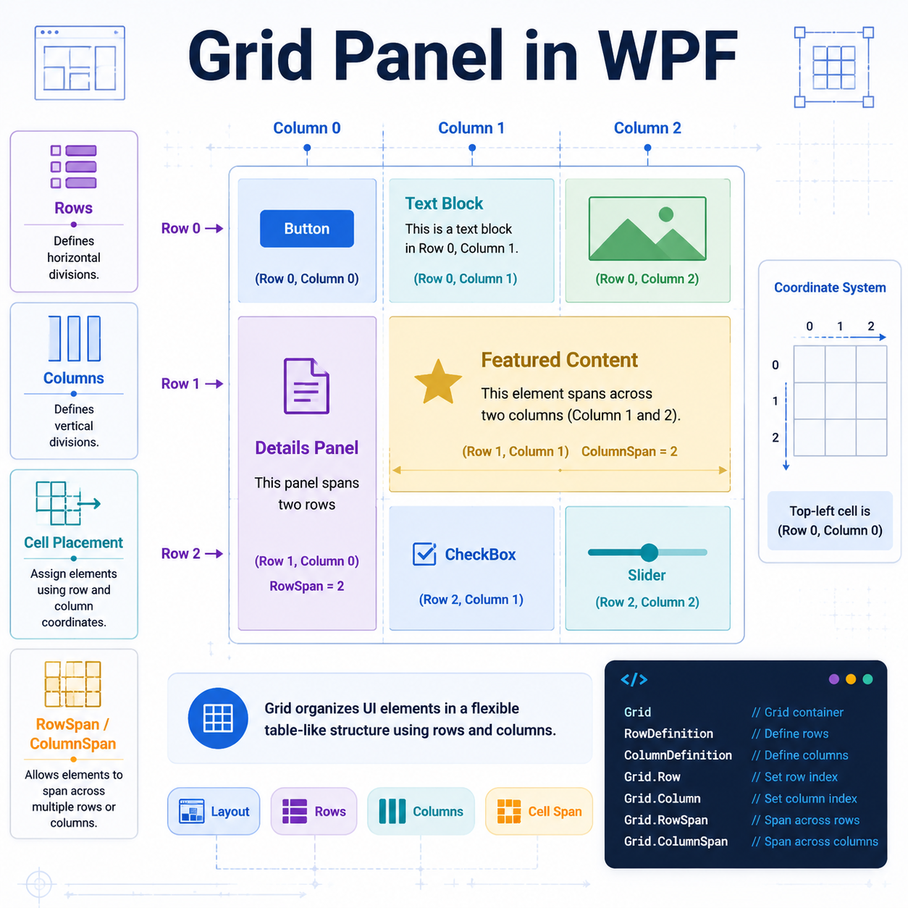

# Table of Contents

1. [GridPanel in WPF](#gridpanel-in-wpf)
2. [What a Grid Is](#what-a-grid-is)
3. [Why Use a Grid](#why-use-a-grid)
4. [Rows and Columns](#rows-and-columns)
   1. [Defining Rows](#defining-rows)
   2. [Defining Columns](#defining-columns)
   3. [Sizing Modes](#sizing-modes)
5. [Placing Controls in a Grid](#placing-controls-in-a-grid)
6. [Spanning Multiple Rows or Columns](#spanning-multiple-rows-or-columns)
7. [Spacing, Alignment, and Margins](#spacing-alignment-and-margins)
8. [Nested Grids](#nested-grids)
9. [Shared Size Groups](#shared-size-groups)
10. [Grid Lines and Layering](#grid-lines-and-layering)
11. [Common Attached Properties](#common-attached-properties)
12. [Examples](#examples)
    1. [Basic Grid Example](#basic-grid-example)
    2. [Auto, Fixed, and Star Sizing Example](#auto-fixed-and-star-sizing-example)
    3. [RowSpan and ColumnSpan Example](#rowspan-and-columnspan-example)
    4. [Nested Grid Example](#nested-grid-example)
13. [Common Mistakes](#common-mistakes)
14. [Important Notes](#important-notes)

---

# GridPanel in WPF

In **WPF**, the layout container usually referred to as **`Grid`** is one of the most powerful and commonly used panels.

> ⚠️ In practice, developers usually say **Grid**, not **GridPanel**.

A `Grid` arranges child elements into a structure of:

- **rows**
- **columns**
- **cells**

This makes it ideal for building:

- forms
- dashboards
- data entry screens
- application windows
- responsive layouts

---

# What a Grid Is

A **`Grid`** is a layout panel that divides available space into a table-like structure.

Unlike an HTML table, a WPF `Grid` is designed for **flexible layout**, not just displaying tabular data.

Each child can be placed in:

- a specific **row**
- a specific **column**

It can also span across multiple cells.

## Mental model

Think of a `Grid` as a sheet divided into boxes:

| Column 0 | Column 1 | Column 2 |
|---|---|---|
| Row 0 | Row 0 | Row 0 |
| Row 1 | Row 1 | Row 1 |
| Row 2 | Row 2 | Row 2 |

Each control goes into one box unless told otherwise.

---

# Why Use a Grid

A `Grid` is useful when you want **precise but flexible layout control**.

## Common advantages

- ✅ Organizes content cleanly
- ✅ Supports resizing well
- ✅ Works great for forms and labels
- ✅ Allows proportional sizing with `*`
- ✅ Supports overlapping elements
- ✅ Can mix fixed and dynamic sizes

## Compared with other panels

| Panel | Best for |
|---|---|
| `StackPanel` | Simple vertical or horizontal stacking |
| `Canvas` | Absolute positioning |
| `WrapPanel` | Flowing items to next line |
| `DockPanel` | Docking to edges |
| `Grid` | Structured row/column layout |

---

# Rows and Columns

A `Grid` does not automatically create visible rows and columns unless you define them.

You define them with:

- `RowDefinitions`
- `ColumnDefinitions`

---

## Defining Rows

Use `Grid.RowDefinitions` to describe each row.

```xml
<Grid>
    <Grid.RowDefinitions>
        <RowDefinition Height="Auto"/>
        <RowDefinition Height="70"/>
        <RowDefinition Height="*"/>
    </Grid.RowDefinitions>
</Grid>
```

### Meaning

- `Auto` → row size depends on content
- `70` → fixed height of 70 device-independent units
- `*` → remaining space

---

## Defining Columns

Use `Grid.ColumnDefinitions` to describe each column.

```xml
<Grid>
    <Grid.ColumnDefinitions>
        <ColumnDefinition Width="120"/>
        <ColumnDefinition Width="Auto"/>
        <ColumnDefinition Width="2*"/>
    </Grid.ColumnDefinitions>
</Grid>
```

### Meaning

- `120` → fixed width
- `Auto` → width depends on content
- `2*` → takes a proportional share of remaining space

---

## Sizing Modes

WPF `Grid` supports three main sizing styles.

| Mode | Example | Meaning |
|---|---|---|
| Fixed | `Width="140"` | Exact size |
| Auto | `Width="Auto"` | Size based on content |
| Star | `Width="*"` or `Width="3*"` | Share remaining space proportionally |

### Star sizing

`*` means *take a share of the leftover space*.

Example:

```xml
<Grid.ColumnDefinitions>
    <ColumnDefinition Width="*"/>
    <ColumnDefinition Width="2*"/>
    <ColumnDefinition Width="*"/>
</Grid.ColumnDefinitions>
```

This creates proportions of:

- `1 : 2 : 1`

If the remaining width is `400`, the columns get:

- first = `100`
- second = `200`
- third = `100`

> 💡 `*` sizing is one of the main reasons `Grid` is so powerful.

---

# Placing Controls in a Grid

By default, a child goes into:

- `Row = 0`
- `Column = 0`

To place controls elsewhere, use attached properties:

- `Grid.Row`
- `Grid.Column`

## Example

```xml
<Grid>
    <Grid.RowDefinitions>
        <RowDefinition Height="Auto"/>
        <RowDefinition Height="Auto"/>
    </Grid.RowDefinitions>

    <Grid.ColumnDefinitions>
        <ColumnDefinition Width="Auto"/>
        <ColumnDefinition Width="*"/>
    </Grid.ColumnDefinitions>

    <TextBlock Grid.Row="0"
               Grid.Column="0"
               Margin="6"
               Text="Username:"/>

    <TextBox Grid.Row="0"
             Grid.Column="1"
             Margin="6"
             Text="demo_user"/>

    <TextBlock Grid.Row="1"
               Grid.Column="0"
               Margin="6"
               Text="Password:"/>

    <PasswordBox Grid.Row="1"
                 Grid.Column="1"
                 Margin="6"/>
</Grid>
```

This creates a simple two-row form.

---

# Spanning Multiple Rows or Columns

A control can occupy more than one cell.

Use:

- `Grid.RowSpan`
- `Grid.ColumnSpan`

## Example

```xml
<Button Grid.Row="0"
        Grid.Column="0"
        Grid.ColumnSpan="2"
        Margin="8"
        Content="Save Settings"/>
```

This button stretches across two columns.

## When spanning is useful

- page headers
- section titles
- large preview areas
- buttons that should cover multiple cells

---

# Spacing, Alignment, and Margins

Inside a `Grid`, control placement is affected by:

- `Margin`
- `HorizontalAlignment`
- `VerticalAlignment`
- `Padding` *(for controls that support it)*

## Example

```xml
<TextBox Grid.Row="0"
         Grid.Column="1"
         Margin="10"
         HorizontalAlignment="Stretch"
         VerticalAlignment="Center"/>
```

## Important idea

A `Grid` defines the **cell area**, but the child control still decides how to use that area based on alignment and size settings.

### Common alignment values

| Property | Common Values |
|---|---|
| `HorizontalAlignment` | `Left`, `Center`, `Right`, `Stretch` |
| `VerticalAlignment` | `Top`, `Center`, `Bottom`, `Stretch` |

> 📌 `Stretch` is very common inside `Grid` layouts.

---

# Nested Grids

You can place a `Grid` inside another `Grid`.

This is called **nesting**.

## Why nest grids?

- break complex layouts into smaller parts
- keep forms readable
- create sections such as header/content/footer
- mix multiple layout strategies

## Example idea

- outer grid:
  - header row
  - content row
  - footer row
- inner grid:
  - form fields inside content area

---

# Shared Size Groups

Sometimes you want columns in different grids to have the **same size**.

WPF supports this with:

- `SharedSizeGroup`
- `Grid.IsSharedSizeScope`

## Example

```xml
<StackPanel Grid.IsSharedSizeScope="True">

    <Grid Margin="4">
        <Grid.ColumnDefinitions>
            <ColumnDefinition Width="Auto" SharedSizeGroup="LabelGroup"/>
            <ColumnDefinition Width="*" />
        </Grid.ColumnDefinitions>

        <TextBlock Grid.Column="0" Margin="5" Text="First Name"/>
        <TextBox Grid.Column="1" Margin="5" Text="Sara"/>
    </Grid>

    <Grid Margin="4">
        <Grid.ColumnDefinitions>
            <ColumnDefinition Width="Auto" SharedSizeGroup="LabelGroup"/>
            <ColumnDefinition Width="*" />
        </Grid.ColumnDefinitions>

        <TextBlock Grid.Column="0" Margin="5" Text="Contact Email"/>
        <TextBox Grid.Column="1" Margin="5" Text="sara@example.test"/>
    </Grid>

</StackPanel>
```

## Result

The first columns in both grids will use the same width, based on the widest one.

This is great for aligned forms.

---

# Grid Lines and Layering

## Showing grid lines

For learning and debugging, a `Grid` can show cell lines with:

```xml
<Grid ShowGridLines="True">
```

> ⚠️ `ShowGridLines` is mainly for debugging, not for production design.

---

## Layering in a Grid

Multiple elements can be placed in the same row and column.

If this happens, they can overlap.

### Example

```xml
<Grid>
    <Rectangle Fill="#220000FF"/>
    <TextBlock Text="Overlay Text"
               FontSize="24"
               HorizontalAlignment="Center"
               VerticalAlignment="Center"/>
</Grid>
```

The `TextBlock` appears on top of the `Rectangle`.

This allows simple overlay designs.

---

# Common Attached Properties

The `Grid` uses attached properties to position children.

| Property | Purpose |
|---|---|
| `Grid.Row` | Sets the row index |
| `Grid.Column` | Sets the column index |
| `Grid.RowSpan` | Makes element span multiple rows |
| `Grid.ColumnSpan` | Makes element span multiple columns |

## Example

```xml
<Label Grid.Row="2"
       Grid.Column="1"
       Grid.ColumnSpan="3"
       Content="Status: Ready"/>
```

---

# Examples

## Basic Grid Example

```xml
<Grid Margin="12">
    <Grid.RowDefinitions>
        <RowDefinition Height="Auto"/>
        <RowDefinition Height="Auto"/>
    </Grid.RowDefinitions>

    <Grid.ColumnDefinitions>
        <ColumnDefinition Width="110"/>
        <ColumnDefinition Width="220"/>
    </Grid.ColumnDefinitions>

    <TextBlock Grid.Row="0"
               Grid.Column="0"
               Margin="5"
               VerticalAlignment="Center"
               Text="Project Name"/>

    <TextBox Grid.Row="0"
             Grid.Column="1"
             Margin="5"
             Text="InventoryApp"/>

    <TextBlock Grid.Row="1"
               Grid.Column="0"
               Margin="5"
               VerticalAlignment="Center"
               Text="Version"/>

    <TextBox Grid.Row="1"
             Grid.Column="1"
             Margin="5"
             Text="2.4.1"/>
</Grid>
```

---

## Auto, Fixed, and Star Sizing Example

```xml
<Grid>
    <Grid.RowDefinitions>
        <RowDefinition Height="Auto"/>
    </Grid.RowDefinitions>

    <Grid.ColumnDefinitions>
        <ColumnDefinition Width="90"/>
        <ColumnDefinition Width="Auto"/>
        <ColumnDefinition Width="*"/>
    </Grid.ColumnDefinitions>

    <Border Grid.Column="0" Background="LightCoral" Margin="4" Padding="8">
        <TextBlock Text="Fixed"/>
    </Border>

    <Border Grid.Column="1" Background="LightGoldenrodYellow" Margin="4" Padding="8">
        <TextBlock Text="Auto Sized Area"/>
    </Border>

    <Border Grid.Column="2" Background="LightSkyBlue" Margin="4" Padding="8">
        <TextBlock Text="Takes Remaining Width"/>
    </Border>
</Grid>
```

---

## RowSpan and ColumnSpan Example

```xml
<Grid Margin="10" ShowGridLines="True">
    <Grid.RowDefinitions>
        <RowDefinition Height="60"/>
        <RowDefinition Height="60"/>
        <RowDefinition Height="60"/>
    </Grid.RowDefinitions>

    <Grid.ColumnDefinitions>
        <ColumnDefinition Width="100"/>
        <ColumnDefinition Width="100"/>
        <ColumnDefinition Width="100"/>
    </Grid.ColumnDefinitions>

    <Border Grid.Row="0"
            Grid.Column="0"
            Grid.ColumnSpan="3"
            Background="#FFB7D7F0"
            Margin="3">
        <TextBlock Text="Header"
                   HorizontalAlignment="Center"
                   VerticalAlignment="Center"/>
    </Border>

    <Border Grid.Row="1"
            Grid.Column="0"
            Grid.RowSpan="2"
            Background="#FFC8E6C9"
            Margin="3">
        <TextBlock Text="Menu"
                   HorizontalAlignment="Center"
                   VerticalAlignment="Center"/>
    </Border>

    <Border Grid.Row="1"
            Grid.Column="1"
            Grid.ColumnSpan="2"
            Background="#FFFFF3B0"
            Margin="3">
        <TextBlock Text="Content Top"
                   HorizontalAlignment="Center"
                   VerticalAlignment="Center"/>
    </Border>

    <Border Grid.Row="2"
            Grid.Column="1"
            Background="#FFFFCCBC"
            Margin="3">
        <TextBlock Text="Pane A"
                   HorizontalAlignment="Center"
                   VerticalAlignment="Center"/>
    </Border>

    <Border Grid.Row="2"
            Grid.Column="2"
            Background="#FFD1C4E9"
            Margin="3">
        <TextBlock Text="Pane B"
                   HorizontalAlignment="Center"
                   VerticalAlignment="Center"/>
    </Border>
</Grid>
```

---

## Nested Grid Example

```xml
<Grid Margin="12">
    <Grid.RowDefinitions>
        <RowDefinition Height="Auto"/>
        <RowDefinition Height="*"/>
        <RowDefinition Height="Auto"/>
    </Grid.RowDefinitions>

    <Border Grid.Row="0" Background="#FF2D3E50" Padding="10">
        <TextBlock Text="Account Settings"
                   Foreground="White"
                   FontSize="20"
                   FontWeight="SemiBold"/>
    </Border>

    <Grid Grid.Row="1" Margin="0,12,0,12">
        <Grid.ColumnDefinitions>
            <ColumnDefinition Width="140"/>
            <ColumnDefinition Width="*"/>
        </Grid.ColumnDefinitions>

        <Grid.RowDefinitions>
            <RowDefinition Height="Auto"/>
            <RowDefinition Height="Auto"/>
            <RowDefinition Height="Auto"/>
        </Grid.RowDefinitions>

        <TextBlock Grid.Row="0" Grid.Column="0" Margin="6" Text="Display Name"/>
        <TextBox Grid.Row="0" Grid.Column="1" Margin="6" Text="Mina Darzi"/>

        <TextBlock Grid.Row="1" Grid.Column="0" Margin="6" Text="Department"/>
        <ComboBox Grid.Row="1" Grid.Column="1" Margin="6" SelectedIndex="1">
            <ComboBoxItem Content="Design"/>
            <ComboBoxItem Content="Engineering"/>
            <ComboBoxItem Content="Support"/>
        </ComboBox>

        <TextBlock Grid.Row="2" Grid.Column="0" Margin="6" Text="Notifications"/>
        <CheckBox Grid.Row="2" Grid.Column="1" Margin="6" Content="Enable weekly alerts"/>
    </Grid>

    <StackPanel Grid.Row="2"
                Orientation="Horizontal"
                HorizontalAlignment="Right">
        <Button Content="Cancel" Margin="5" Padding="12,6"/>
        <Button Content="Apply" Margin="5" Padding="12,6"/>
    </StackPanel>
</Grid>
```

---

# Common Mistakes

## 1. Forgetting row or column definitions

If you do not define enough rows or columns:

- controls may all appear in the default cell
- layout may not look as expected

---

## 2. Confusing `Auto` and `*`

### `Auto`
- sizes to content

### `*`
- sizes to remaining space

Using the wrong one can make layouts feel cramped or stretched.

---

## 3. Expecting spacing automatically

A `Grid` does **not** automatically add spacing between children.

You usually need:

- `Margin`
- nested containers
- borders/padding where needed

---

## 4. Overusing nested grids

Nested grids are helpful, but too many can make XAML hard to read.

Use them carefully and keep layout organized.

---

## 5. Using `ShowGridLines` in final UI

This property is mostly for debugging and layout learning.

---

## 6. Misunderstanding default placement

If `Grid.Row` and `Grid.Column` are not set:

- the child goes to row `0`
- the child goes to column `0`

This surprises many beginners.

---

# Important Notes

## `Grid` is not for tabular data display

Although it looks table-like, `Grid` is a **layout container**.

For real data tables, controls like these may be more appropriate:

- `DataGrid`
- `ListView`
- `ItemsControl`

---

## Device-independent units

WPF measurements are usually in **device-independent units**.

- `1 unit = 1/96 inch`

So `Width="96"` means about 1 inch on a standard scale.

---

## Children can overlap

Unlike some layout panels, `Grid` allows overlapping content in the same cell.

This is useful for:

- badges
- overlays
- layered backgrounds
- loading indicators

---

## Grid is often the default choice

When you are unsure which panel to use for a structured screen layout, `Grid` is often a strong first choice.

> 🧠 A simple rule:
>
> - use **`StackPanel`** for simple stacking
> - use **`Grid`** for structured layouts with rows and columns