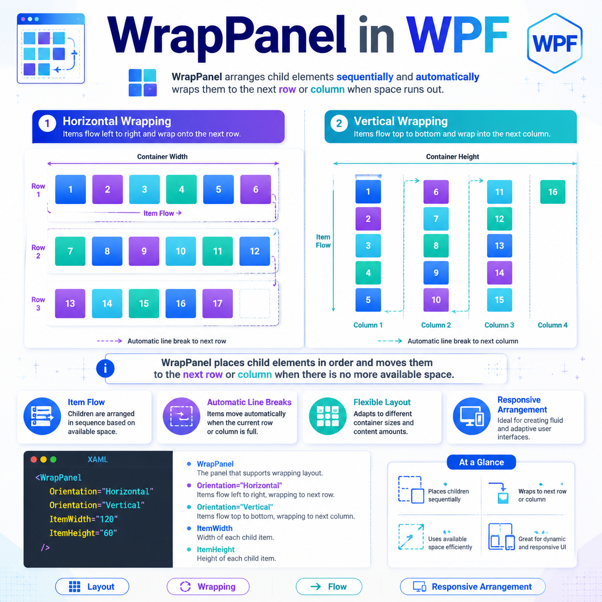

# Meaning of `*` in WPF `Grid`

In WPF `Grid`, the `*` means **star sizing**.

It tells the `Grid`:

> **Use the remaining available space and divide it proportionally.**

---

## Your Code

```xml
<Grid>
    <Grid.ColumnDefinitions>
        <ColumnDefinition Width="389*"/>
        <ColumnDefinition Width="92*"/>
    </Grid.ColumnDefinitions>
</Grid>
```

This means:

- first column gets **389 parts**
- second column gets **92 parts**

So the total is:

- `389 + 92 = 481 parts`

The grid divides the available width into **481 equal shares**.

Then:

- column 1 gets `389 / 481`
- column 2 gets `92 / 481`

---

## Approximate Percentages

| Column | Star Value | Approximate Share |
|---|---:|---:|
| First | `389*` | about **80.9%** |
| Second | `92*` | about **19.1%** |

So this is roughly like saying:

- first column = **81%**
- second column = **19%**

---

## Example with Real Width

If the available width is `962` units:

- first column: `962 × 389 / 481 ≈ 778`
- second column: `962 × 92 / 481 ≈ 184`

---

## Simple Comparison

These are all star sizing:

```xml
<ColumnDefinition Width="*"/>
<ColumnDefinition Width="2*"/>
<ColumnDefinition Width="3*"/>
```

This means the space is divided in the ratio:

- `1 : 2 : 3`

So:

- first gets 1 part
- second gets 2 parts
- third gets 3 parts

---

## Important Idea

`*` does **not** mean pixels.

So:

- `Width="92"` → fixed width of 92 units
- `Width="92*"` → 92 proportional shares of remaining space

These are completely different.

---

## Why someone writes large values like `389*`

Usually, large star values come from:

- a designer-generated XAML file
- converting an older layout
- trying to preserve a ratio from a previous design

Functionally, this:

```xml
389* : 92*
```

is the same proportion as:

```xml
<ColumnDefinition Width="4.23*"/>
<ColumnDefinition Width="1*"/>
```

or even approximately:

```xml
<ColumnDefinition Width="81*"/>
<ColumnDefinition Width="19*"/>
```

because only the **ratio** matters.

---

## Rule to Remember

- `Auto` → size to content
- number like `150` → fixed size
- `*` → share remaining space
- `2*`, `3*`, `389*` → bigger proportional shares

> **Star sizing = proportional sizing of leftover space.**

## For your code

```xml
389* : 92*
```

means:

> **Make the first column much wider than the second, using a proportional split of the available width.**