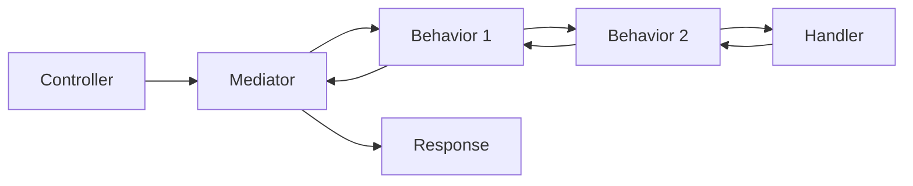
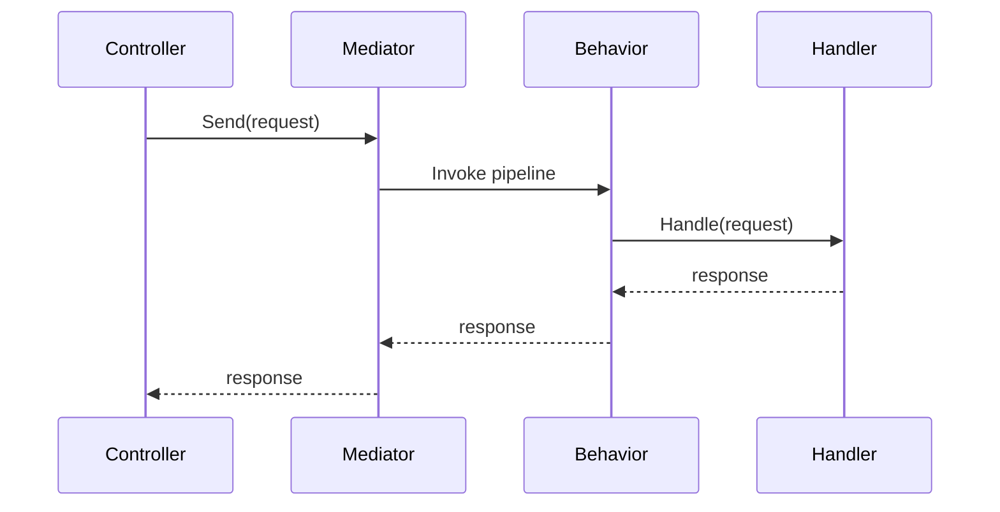

## Chapter 1 — Introduction

### What Mediator is

The **Mediator** pattern is a design pattern that moves communication between objects into a central component called a mediator. In ASP.NET Core, the most common implementation is **MediatR**, which is a lightweight library for in-process messaging with no dependencies. [github](https://github.com/LuckyPennySoftware/MediatR/blob/main/README.md)

The main idea is simple: instead of a controller calling many services directly, it sends a request to a mediator, and the mediator finds the right handler. This reduces coupling and keeps application code easier to organize. [github](https://github.com/jbogard/MediatR/blob/master/README.md?plain=1)

### Why it exists

Without a mediator, controllers often become large because they contain business logic, validation, orchestration, and error handling. A mediator helps move that logic into focused handlers, which makes code easier to test and change. [learn.microsoft](https://learn.microsoft.com/pl-pl/dotnet/architecture/microservices/microservice-ddd-cqrs-patterns/microservice-application-layer-implementation-web-api)

Think of it like a receptionist in an office: you do not walk into every department yourself; you ask the receptionist, and they route your request to the correct person. That is the mediator idea in plain English.

### Real-world uses

Mediator is especially useful when you want:
- Clean request handling in Web APIs.
- CQRS-style separation of reads and writes.
- Vertical Slice Architecture, where each feature lives in its own folder.
- Centralized cross-cutting concerns like logging, validation, and transactions through pipelines. [mediatr](https://mediatr.io)

### Brief history

The pattern itself is older than .NET, but MediatR became popular in the .NET ecosystem because it provided a simple, focused implementation for application architecture. The current project describes itself as “simple” and “unambitious,” which is a good clue that its goal is clarity, not magic. [github](https://github.com/jbogard/MediatR/blob/master/README.md?plain=1)

## Chapter 2 — Core Concepts

### Mediator

A **mediator** is an object that coordinates communication between other objects. In MediatR, that role is played by `IMediator`, `ISender`, and `IPublisher`. [github](https://github.com/jbogard/MediatR/blob/master/README.md?plain=1)

**Problem:** direct dependencies make code harder to scale.
**Solution:** send a request through a mediator.
**Analogy:** a post office sorting letters.

```csharp
public record GetUserByIdQuery(int UserId) : IRequest<UserDto>;

public sealed class GetUserByIdHandler : IRequestHandler<GetUserByIdQuery, UserDto>
{
    public Task<UserDto> Handle(GetUserByIdQuery request, CancellationToken cancellationToken)
    {
        return Task.FromResult(new UserDto(request.UserId, "Reza"));
    }
}
```

This code defines a request and a handler. The request is the message; the handler is the code that knows how to process it. It works because MediatR maps the request type to the matching handler type. [github](https://github.com/jbogard/MediatR/blob/master/README.md?plain=1)

### Request and response

A **request** is something you want answered. In MediatR, `IRequest<TResponse>` means “send this message and expect a result”. [github](https://github.com/jbogard/MediatR/blob/master/README.md?plain=1)

```csharp
public record GetOrderQuery(Guid OrderId) : IRequest<OrderDto>;
```

This is a query object. It is small on purpose. That makes it easy to pass around, test, and understand.

### Command

A **command** is a request that changes state. It usually returns `Unit` or a small result object. In simple English: commands do work; queries read data.

```csharp
public record CreateOrderCommand(string ProductName, int Quantity) : IRequest<Guid>;
```

### Notification

A **notification** is a message sent to many handlers. It is useful when one event should trigger multiple reactions, such as logging, cache invalidation, or sending an email. [github](https://github.com/jbogard/MediatR/blob/master/README.md?plain=1)

```csharp
public record OrderCreatedNotification(Guid OrderId) : INotification;
```

### Pipeline behavior

A **pipeline behavior** is middleware for MediatR. It runs around request handling and is often used for validation, logging, metrics, and transactions. [github](https://github.com/jbogard/MediatR/blob/master/README.md?plain=1)



The request flows through behaviors before it reaches the handler, then flows back with the response. This is why behaviors are useful for reusable application rules.

## Chapter 3 — Building Blocks

### `IMediator`

`IMediator` is the central abstraction for sending requests and publishing notifications. MediatR registers it as transient by default. [github](https://github.com/jbogard/MediatR/blob/master/README.md?plain=1)

Use it when you want the full mediator API. Avoid using it everywhere if `ISender` or `IPublisher` is more specific.

### `ISender`

`ISender` is used for sending requests only. It is often the better choice in controllers because it makes intent clearer. [github](https://github.com/jbogard/MediatR/blob/master/README.md?plain=1)

```csharp
public sealed class UsersController(ISender sender) : ControllerBase
{
    [HttpGet("{id:int}")]
    public Task<UserDto> Get(int id)
        => sender.Send(new GetUserByIdQuery(id));
}
```

This code is clean because the controller only coordinates HTTP and does not know the business logic.

### `IPublisher`

`IPublisher` is used for notifications. Use it when one event should fan out to multiple handlers. [github](https://github.com/jbogard/MediatR/blob/master/README.md?plain=1)

### Handlers

Handlers are the real workers. They contain the logic for one request or one notification. A good handler is small, focused, and testable.

### Behaviors

Behaviors sit between the caller and the handler. They are the best place for concerns that should apply to many requests, such as:
- Validation.
- Logging.
- Timing.
- Authorization checks.
- Transactions.

### When to use and not use

Use MediatR when your app has many use cases and you want clear boundaries between request handling and infrastructure concerns. Do not use it just because it is fashionable; for tiny apps, direct service calls may be simpler.

## Chapter 4 — Practical Examples

### Hello world

```csharp
public record Ping : IRequest<string>;

public sealed class PingHandler : IRequestHandler<Ping, string>
{
    public Task<string> Handle(Ping request, CancellationToken cancellationToken)
        => Task.FromResult("Pong");
}
```

This is the smallest useful example. The request has no data, and the handler returns a string. It works because MediatR dispatches the `Ping` request to `PingHandler`. [github](https://github.com/jbogard/MediatR/blob/master/README.md?plain=1)

### Controller example

```csharp
[ApiController]
[Route("api/[controller]")]
public sealed class PingController(ISender sender) : ControllerBase
{
    [HttpGet]
    public async Task<ActionResult<string>> Get(CancellationToken cancellationToken)
    {
        var result = await sender.Send(new Ping(), cancellationToken);
        return Ok(result);
    }
}
```

The controller is tiny, which is exactly the goal. It handles HTTP concerns only.

### Real application example

A realistic feature folder might look like this:

```text
Features/
  Orders/
    Create/
      CreateOrderCommand.cs
      CreateOrderHandler.cs
      CreateOrderValidator.cs
    GetById/
      GetOrderQuery.cs
      GetOrderHandler.cs
```

This structure keeps each feature together. It is easier to navigate than putting all commands, handlers, and validators into one giant folder.

### Production-style example

```csharp
public record CreateOrderCommand(string ProductName, int Quantity) : IRequest<Guid>;

public sealed class CreateOrderHandler : IRequestHandler<CreateOrderCommand, Guid>
{
    private readonly IOrderRepository _orderRepository;

    public CreateOrderHandler(IOrderRepository orderRepository)
    {
        _orderRepository = orderRepository;
    }

    public async Task<Guid> Handle(CreateOrderCommand request, CancellationToken cancellationToken)
    {
        var order = new Order(request.ProductName, request.Quantity);
        await _orderRepository.AddAsync(order, cancellationToken);
        return order.Id;
    }
}
```

This handler is still simple, but now it talks to a repository. It works because the handler owns the use case and the repository owns persistence.

## Chapter 5 — Internal Mechanics

### How dispatch works

When you call `sender.Send(...)`, MediatR looks up the matching handler from dependency injection and executes it. The package uses generic types and dispatching rules to route the request to the correct handler. [github](https://github.com/jbogard/MediatR/blob/master/README.md?plain=1)



### Memory and runtime behavior

MediatR is in-process, so it does not send messages over the network. That makes it fast and simple compared with distributed messaging systems. The tradeoff is that it does not help with cross-service communication by itself. [github](https://github.com/jbogard/MediatR/blob/master/README.md?plain=1)

### Performance

For most web applications, the overhead of mediator dispatch is small and acceptable. The real cost is usually not MediatR itself, but unnecessary abstraction, too many tiny handlers, or expensive work inside handlers.

### Tradeoffs

Mediator improves organization but adds another layer. If you already have a very small CRUD app, direct service calls may be easier to read.

## Chapter 6 — Real World Patterns

### CQRS

CQRS means **Command Query Responsibility Segregation**. In plain English, it means writes and reads are separated. MediatR fits this style very well because commands and queries become separate message types. [learn.microsoft](https://learn.microsoft.com/pl-pl/dotnet/architecture/microservices/microservice-ddd-cqrs-patterns/microservice-application-layer-implementation-web-api)

### Vertical Slice Architecture

Vertical Slice Architecture organizes code by feature instead of by technical layer. MediatR supports this style because each feature can have its own request, handler, and validator. [mediatr](https://mediatr.io)

### Behavior-based validation

Validation is often implemented as a pipeline behavior so every request does not need repeated validation code. This reduces duplication and keeps handlers focused.

### Notification-based integration

Notifications are useful for side effects. For example, an order creation handler can publish `OrderCreatedNotification`, and separate handlers can send email, write audit logs, or update projections.

## Chapter 7 — Common Mistakes

### Putting too much in handlers

A handler should coordinate a use case, not become a “god class.” If it grows too large, move business rules into domain services or domain entities.

### Using mediator for everything

Not every method call needs to go through MediatR. Small helper methods and simple internal logic should stay direct.

### Creating chatty requests

Do not model every tiny step as a separate request if it makes the system harder to follow. Use mediator for meaningful use cases, not every line of code.

### Ignoring cancellation tokens

ASP.NET Core passes cancellation tokens for a reason. Forward them to handlers and repositories so requests can stop cleanly when the client disconnects.

## Chapter 8 — Best Practices

- Use `ISender` in controllers when you only send requests.
- Use `IPublisher` for notifications.
- Keep requests small and focused.
- Keep handlers thin and testable.
- Put cross-cutting concerns in behaviors.
- Use feature-based folder structure.
- Pass `CancellationToken` through the full call chain.
- Add validation before business logic when possible.
- Prefer explicit names like `CreateOrderCommand` over vague names like `ProcessRequest`.

💡 Tip: Start with one feature and one handler. Only add advanced patterns when the codebase actually needs them.

⚠ Common mistake: Turning MediatR into a dumping ground for all application logic.

✅ Best practice: Keep handlers as application orchestration, not infrastructure replacement.

## Chapter 9 — Advanced Topics

### Open generic behaviors

MediatR supports open generic behaviors, which means one behavior can apply to many request types. This is very useful for logging and metrics. [github](https://github.com/jbogard/MediatR/blob/master/README.md?plain=1)

### Request pre- and post-processors

Pre-processors run before the handler, and post-processors run after it. These are useful for standardized steps that should happen around many requests. [github](https://github.com/jbogard/MediatR/blob/master/README.md?plain=1)

### Exception handlers

MediatR can register request exception handlers and exception actions. This helps you centralize error handling for specific request types. [github](https://github.com/jbogard/MediatR/blob/master/README.md?plain=1)

### Streams

MediatR supports streaming requests as well. This is useful when a request should produce a sequence of results instead of one result. [github](https://github.com/jbogard/MediatR/blob/master/README.md?plain=1)

## Chapter 10 — Hands-on Exercises

1. Build a `Ping` request and return `"Pong"`.
2. Create a `GetProductByIdQuery` and a handler that reads from an in-memory list.
3. Add a `CreateProductCommand` and store the result in memory.
4. Add a logging behavior that measures request time.
5. Add a notification that runs two handlers: one logs, one updates a cache.

## Chapter 11 — Solutions

### Exercise 1

```csharp
public record Ping : IRequest<string>;
public sealed class PingHandler : IRequestHandler<Ping, string>
{
    public Task<string> Handle(Ping request, CancellationToken cancellationToken)
        => Task.FromResult("Pong");
}
```

This works because the request and handler types match exactly.

### Exercise 4

A logging behavior should implement `IPipelineBehavior<TRequest, TResponse>`. It can start a timer, call `next()`, then log elapsed time. The reason this works is that behaviors wrap the handler execution.

## Chapter 12 — Cheat Sheet

| Concept | Meaning | Example |
|---|---|---|
| `IRequest<T>` | Request with response | `GetUserQuery` |
| `IRequestHandler<T,R>` | Handles one request | `GetUserHandler` |
| `INotification` | Event for many handlers | `OrderCreated` |
| `IPipelineBehavior` | Cross-cutting middleware | Logging, validation |
| `ISender` | Send requests | `sender.Send(...)` |
| `IPublisher` | Publish notifications | `publisher.Publish(...)` |

**Rules**
- Request names should describe intent.
- Handlers should do one job.
- Behaviors should be reusable.
- Notifications are for side effects, not return values.

## Chapter 13 — Interview Questions

### Beginner
What problem does MediatR solve?  
Expected answer: it reduces coupling and centralizes request handling. [github](https://github.com/jbogard/MediatR/blob/master/README.md?plain=1)

### Intermediate
What is the difference between a command and a query?  
Expected answer: commands change state; queries read state.

### Senior
When should you avoid MediatR?  
Expected answer: when the application is very small, direct calls are simpler and clearer.

### Scenario-based
How would you add validation to every request?  
Expected answer: use a pipeline behavior or a pre-processor.

## Chapter 14 — Frequently Asked Questions

### Is MediatR mandatory in ASP.NET Core?

No. It is a design choice, not a requirement.

### Is MediatR the same as messaging across services?

No. It is in-process messaging, not distributed messaging. [github](https://github.com/jbogard/MediatR/blob/master/README.md?plain=1)

### Is it good for CQRS?

Yes, it is commonly used with CQRS and vertical slice styles. [mediatr](https://mediatr.io)

### Is it still relevant in modern .NET?

Yes. The current package supports .NET 8.0+ and remains widely used. [mediatr](https://mediatr.io)

## Chapter 15 — Production Tips

### Logging

Use a behavior for request timing and tracing. That keeps logging consistent across the app.

### Testing

Test handlers directly. They are usually easy to unit test because they are small classes with clear inputs and outputs.

### Deployment and maintenance

Keep request/handler pairs organized by feature. That makes large codebases easier to maintain over time.

### Scaling

MediatR scales well for application architecture, but it does not replace distributed messaging, background jobs, or service buses.

## Questions people are not asking enough

One important question is whether mediator is solving an actual complexity problem or just adding architectural style. Another is whether the team has enough discipline to keep handlers small; without that, MediatR can hide complexity instead of reducing it.

A second overlooked question is observability: once requests are routed through many behaviors, can your team still easily trace what happened? In real systems, logging, metrics, and correlation IDs matter as much as the pattern itself.

Another question is how mediator fits with other patterns like domain events, background processing, and eventual consistency. MediatR is excellent inside one process, but it should not be forced to do the job of a message bus or workflow engine.

## What you should ask next

- Which requests belong in handlers, and which business rules should stay in domain entities?
- Which cross-cutting concerns should live in pipeline behaviors?
- When should you prefer notifications versus direct handler calls?
- How do you test MediatR-based features cleanly?
- How do you avoid over-abstracting a simple ASP.NET Core app?

## Key takeaways

Mediator helps you separate HTTP concerns from application logic. MediatR is the common .NET implementation, and it supports requests, notifications, behaviors, and streams. [github](https://github.com/jbogard/MediatR/blob/master/README.md?plain=1)

## Checklist

- Use `ISender` for request/response flows.
- Use `IPublisher` for notifications.
- Keep handlers focused.
- Put shared logic in behaviors.
- Pass cancellation tokens.
- Organize by feature.

## Mini quiz

1. What problem does mediator solve?
2. What is the difference between `ISender` and `IPublisher`?
3. Why are pipeline behaviors useful?
4. When should you not use MediatR?
5. What is one advantage of feature-based folder structure?

If you want, I can turn this into a **fully expanded book-length version** with each chapter written in much greater depth, complete with more diagrams, richer examples, and a polished publishing-style structure.