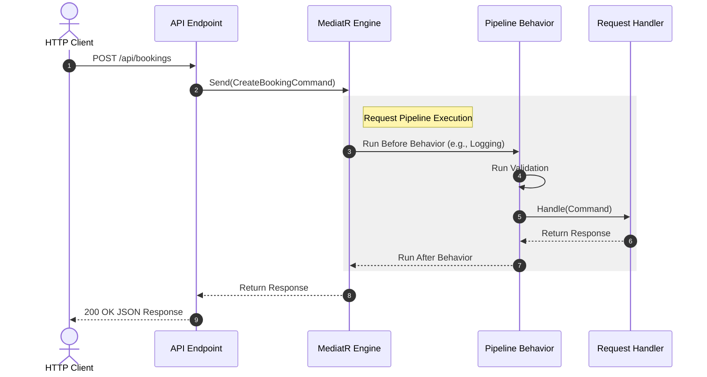

# Understanding Mediator in ASP.NET Core: A Practical Guide
*By a Senior Engineer for Growing Developers*

---

## Chapter 1 — Introduction

### What is the Mediator Pattern?
At its core, the **Mediator pattern** is a behavioral design pattern that reduces chaotic dependencies between objects. It restricts direct communications between the objects and forces them to collaborate only through a mediator object.

In plain English: instead of classes talking directly to each other and creating a messy web of dependencies, they send their messages to a central broker (the mediator). The mediator then routes that message to the correct destination.

### Why Does It Exist?
In software engineering, as an application grows, the number of classes increases. If these classes communicate directly with one another, the system quickly degrades into "spaghetti code." 

```
Without Mediator (Tight Coupling)       With Mediator (Loose Coupling)
      ┌─── Class A ───┐                        ┌─── Class A ───┐
      │       │       │                        │               │
      ▼       ▼       ▼                        ▼               ▼
   Class B ◄──┼───► Class C                Class B ◄──► Mediator ◄──► Class C
              │                                        ▲               ▲
              ▼                                        │               │
           Class D                                     └─── Class D ───┘
```

#### The Problem: Tight Coupling and Spaghetti Code
When `Class A` needs to trigger an action in `Class B`, instantiate something in `Class C`, and log a message in `Class D`, `Class A` must hold references to all three classes. 
* This makes `Class A` difficult to test because you must mock three different dependencies.
* It makes `Class A` fragile; any change in the constructor of `Class B`, `C`, or `D` breaks `Class A`.
* It prevents reuse. You cannot easily move `Class A` to another project because it is tightly bound to its dependencies.

#### The Solution: A Central Hub
The Mediator pattern decouples these relationships. Classes no longer need to know who processes their requests. They only need to know about the mediator.

### Analogy: The Air Traffic Control (ATC) Tower
Imagine an airport with dozens of airplanes. If every pilot had to communicate directly with every other pilot to coordinate takeoffs and landings, the sky would be in chaos. Pilots would need to know the location, speed, and heading of every other plane nearby.

Instead, airports use an **Air Traffic Control (ATC) Tower**. 
* Pilots do not talk to each other.
* They talk only to the ATC (the Mediator).
* The ATC coordinates who lands, who takes off, and who waits.
* The planes are decoupled from one another.

### History of the Pattern
The Mediator pattern was first popularized in 1994 by the "Gang of Four" (GoF) in their seminal book *Design Patterns: Elements of Reusable Object-Oriented Software*. 

In the modern .NET ecosystem, the pattern is almost synonymous with the open-source library **MediatR**, created by Jimmy Bogard. Released in the mid-2010s, MediatR transformed how ASP.NET Core developers structure their controllers, minimal APIs, and business logic, serving as a primary driver for CQRS (Command Query Responsibility Segregation) and Clean Architecture.

### Real-World Use Cases in ASP.NET Core
1. **API Controllers / Minimal APIs**: Keeping HTTP endpoints thin by offloading request processing to independent handlers.
2. **Domain Event Handling**: Dispatching events (e.g., `OrderPlacedEvent`) to multiple background handlers (e.g., `SendEmailHandler`, `InventoryUpdateHandler`) without coupling the order creation logic to notification logic.
3. **Cross-Cutting Concerns**: Implementing logging, validation, caching, or transaction management globally across all requests using pipeline behaviors.

---

### Key Takeaways
* The Mediator pattern promotes loose coupling by preventing objects from referring to each other explicitly.
* It centralizes interaction logic, making individual components easier to test, modify, and reuse.
* In .NET, the `MediatR` library is the standard implementation of this pattern.

### Checklist
- [ ] Understand the difference between tight and loose coupling.
- [ ] Recognize when direct dependencies are creating a "spaghetti" architecture.
- [ ] Identify the role of a mediator as an "Air Traffic Controller."

### Mini Quiz
1. **What is the primary architectural benefit of the Mediator pattern?**
   * A) It makes code run faster.
   * B) It reduces direct coupling between components by routing communication through a central point.
   * C) It automatically saves data to the database.
2. **In the Air Traffic Control analogy, what represents the "Mediator"?**
   * A) The runway.
   * B) The individual airplanes.
   * C) The Air Traffic Control tower.
3. **True or False: Using a mediator means your classes must have direct references to every other class they interact with.**

*Answers: 1: B, 2: C, 3: False*

---

## Chapter 2 — Core Concepts

To master the Mediator pattern in ASP.NET Core, you must understand its core abstractions. In the .NET ecosystem (specifically using the `MediatR` library), there are five fundamental concepts:

| Concept | Plain English Definition | Role | Analogous To |
| :--- | :--- | :--- | :--- |
| **Request (Command/Query)** | The message containing the data and intent. | Carries data to be processed. | A letter sent in the mail. |
| **Handler** | The specific block of code that processes a Request. | Performs the actual work. | The recipient who reads and acts on the letter. |
| **Notification** | A message published to multiple interested parties. | Broadcasts information to whoever is listening. | A public announcement or radio broadcast. |
| **Notification Handler** | One of potentially many subscribers to a Notification. | Listens for and reacts to events. | A listener tuning into a radio channel. |
| **Pipeline Behavior** | Middleware that wraps the execution of requests. | Executes code before or after a handler runs. | A security checkpoint or sorting office for mail. |

```
                 [ Pipeline Behavior ] (Logging, Validation, etc.)
                          │
  Request (1:1) ──────────┼─────────► Handler (Processes and returns result)
                          │
  Notification (1:N) ─────┼─────────► Notification Handler A
                          │       ├──► Notification Handler B
                          ▼       └──► Notification Handler C
```

### Mental Models and Analogies

#### 1. Request-Handler (1-to-1)
This is a point-to-point communication channel. You submit one specific question or instruction, and you expect one specific answer or action.
* **Analogy**: Ordering a specific dish from a waiter. You ask for a "Pepperoni Pizza" (Request), and the kitchen (Handler) prepares and returns that exact pizza to you.

#### 2. Notification-NotificationHandler (1-to-Many)
This is a publish-subscribe (Pub/Sub) model. You announce that something has occurred, and you do not care who listens or what they do with that information.
* **Analogy**: A fire alarm sounding in a building. The alarm doesn't call individual occupants; it broadcasts the signal. One person exits the building, another calls the fire department, and another grabs a fire extinguisher. These are independent handlers reacting to the same notification.

---

### Simple Code Examples

Let's look at how these translate into C# code using the MediatR library.

#### The Request and Handler
A Request implements `IRequest<TResponse>`. A Handler implements `IRequestHandler<TRequest, TResponse>`.

```csharp
using MediatR;

namespace MediatorDemo.Core;

// 1. The Request (Message)
// This record holds the input data. It expects an integer response (the new user ID).
public record CreateUserCommand(string Username, string Email) : IRequest<int>;

// 2. The Handler
// This class contains the business logic to process the request.
public class CreateUserHandler : IRequestHandler<CreateUserCommand, int>
{
    public async Task<int> Handle(CreateUserCommand request, CancellationToken cancellationToken)
    {
        // Simulate database insertion
        await Task.Delay(50, cancellationToken);
        
        // Return a mock created ID
        return new Random().Next(1, 1000);
    }
}
```

##### What the Code Does
* `CreateUserCommand`: A simple C# record containing immutable data. By implementing `IRequest<int>`, it declares that whoever handles this command must return an `int`.
* `CreateUserHandler`: Implements `IRequestHandler<CreateUserCommand, int>`. The framework automatically matches this handler with its corresponding command. The logic inside `Handle` executes when the command is dispatched.

---

### Common Mistakes
* **Mistake**: Putting complex business logic inside the Request object.
  * *Why*: Requests should be simple, lightweight data transfer objects (DTOs). They describe *what* needs to be done, not *how* to do it. Keep them as records or simple classes with no behavior.
* **Mistake**: Making a Handler responsible for multiple unrelated Requests.
  * *Why*: This violates the Single Responsibility Principle. Each handler should process exactly one request type.

### Best Practices
* ✅ **Use C# records for requests**: Records are immutable by default, which ensures that request data cannot be altered unexpectedly during its lifecycle.
* ✅ **Keep handlers focused**: Ensure a handler does one thing. If a handler is becoming too large, delegate sub-tasks to domain services.

---

### Key Takeaways
* **Requests** are 1-to-1 operations that expect a response.
* **Notifications** are 1-to-many operations that broadcast events.
* **Handlers** isolate the execution logic from the dispatching controller or endpoint.

### Checklist
- [ ] Use `IRequest<T>` for messages that expect a return value.
- [ ] Use `IRequestHandler<TRequest, TResponse>` for processing requests.
- [ ] Use C# `record` types to ensure immutability of requests.

### Mini Quiz
1. **Which interface should a message implement if it needs to return a value of type `string`?**
   * A) `INotification`
   * B) `IRequest<string>`
   * C) `IRequestHandler<string>`
2. **What is the difference between a Request and a Notification in MediatR?**
   * A) Requests have multiple handlers; Notifications have only one.
   * B) Requests are executed asynchronously; Notifications are always synchronous.
   * C) Requests have a 1-to-1 relationship with handlers; Notifications have a 1-to-many relationship.
3. **Why are C# `record` types preferred for defining Requests?**
   * A) They are faster to compile.
   * B) They provide built-in immutability, preventing side effects during request dispatching.
   * C) They don't require namespaces.

*Answers: 1: B, 2: C, 3: B*

---

## Chapter 3 — Building Blocks

To successfully integrate the Mediator pattern into ASP.NET Core, we need to explore how MediatR integrates with the built-in Dependency Injection (DI) container.

### The Service Lifecycle
MediatR coordinates registrations automatically. However, you must understand how dependencies inside your handlers behave.

```
                  ┌────────────────────────┐
                  │   ASP.NET Core DI      │
                  └───────────┬────────────┘
                              │ Registers
                              ▼
 ┌─────────────────────────────────────────────────────────┐
 │  - IMediator (Transient/Scoped)                         │
 │  - Handlers (Transient/Scoped depending on registration)│
 └────────────────────────────┬────────────────────────────┘
                              │ Resolves
                              ▼
                  ┌────────────────────────┐
                  │    Request Execution   │
                  └────────────────────────┘
```

#### MediatR Service Lifetimes
When you register MediatR using the standard registration extension, the following lifecycles are configured:
* **`IMediator` / `ISender` / `IPublisher`**: Typically registered as **Transient** or **Scoped**. In modern MediatR versions, they are registered with a Scoped lifetime to match the scope of web requests.
* **Your Handlers**: Handlers are registered as **Transient** by default. This means a new instance of your handler is created every time a request is sent.

💡 **Tip:** Because handlers are transient, you must be careful when injecting dependencies. If you inject a **Scoped** dependency (such as an Entity Framework `DbContext`) into a **Transient** handler, the handler safely adopts the scope of the active HTTP web request.

---

### Captive Dependencies: A Major Pitfall
A **captive dependency** occurs when a service with a longer lifetime holds onto a service with a shorter lifetime.

⚠ **Common Mistake:** Registering a custom class that wraps `IMediator` as a **Singleton**, while injecting scoped services into your handlers. If a Singleton calls `IMediator.Send()`, and the matching Handler requires a Scoped database context, DI container validation will throw an exception at runtime (or silently capture the scoped dependency, leading to memory leaks and concurrency bugs).

---

### Internal Dispatch Mechanism (Simplified)
How does MediatR find the right handler without hardcoded switch statements? It relies on the Dependency Injection engine.

```
IMediator.Send(Command)
  │
  ├──► 1. Ask IServiceProvider for: IRequestHandler<Command, TResult>
  │
  ├──► 2. DI container instantiates the Handler and injects its dependencies
  │
  └──► 3. Invoke handler.Handle(...)
```

1. You call `_mediator.Send(new RegisterUserCommand())`.
2. MediatR constructs the generic type representation: `IRequestHandler<RegisterUserCommand, Unit>`.
3. It asks the ASP.NET Core `IServiceProvider` to resolve this type.
4. The DI container looks up its internal registry, instantiates the matching handler, injects any constructor dependencies (like DB contexts), and returns it to MediatR.
5. MediatR calls the `Handle` method on the returned instance.

---

### Registering MediatR in Program.cs
In modern ASP.NET Core applications (.NET 8 and .NET 9), registering MediatR is simple. It uses assembly scanning to automatically find all commands and handlers.

```csharp
// Program.cs
using Microsoft.AspNetCore.Builder;
using Microsoft.Extensions.DependencyInjection;

var builder = WebApplication.CreateBuilder(args);

// Register MediatR. 
// This scans the assembly containing the Program class for any IRequestHandler implementations.
builder.Services.AddMediatR(cfg => {
    cfg.RegisterServicesFromAssembly(typeof(Program).Assembly);
});

var app = builder.Build();
app.Run();
```

✅ **Best Practice:** Keep your commands and handlers in a clean architecture setup. If they reside in a different project (e.g., an `Application` class library), pass a type from that assembly instead:
`cfg.RegisterServicesFromAssembly(typeof(IApplicationMarker).Assembly);`

---

### Key Takeaways
* MediatR scans assemblies to register handlers automatically with the DI container.
* Handlers are resolved from the active dependency injection scope.
* Care must be taken to avoid capturing scoped dependencies inside singleton instances.

### Checklist
- [ ] Add the `MediatR` NuGet package to your project.
- [ ] Register MediatR in `Program.cs` using `RegisterServicesFromAssembly`.
- [ ] Ensure any dependencies injected into your handlers have compatible lifecycles.

### Mini Quiz
1. **What is the default lifetime registration style of MediatR handlers in ASP.NET Core?**
   * A) Singleton
   * B) Scoped
   * C) Transient
2. **What runtime issue can occur if a Singleton service directly holds and invokes a Scoped handler via MediatR?**
   * A) Compile-time error
   * B) Captive dependency issue (runtime scope validation errors or memory leaks)
   * C) Nothing, it is perfectly safe
3. **How does MediatR locate your handlers during application startup?**
   * A) It reads them from an XML configuration file.
   * B) It scans the designated assemblies using reflection.
   * C) You must register each handler manually in `Program.cs`.

*Answers: 1: C, 2: B, 3: B*

---

## Chapter 4 — Practical Examples

Let's build a functional, real-world API endpoint using the Mediator pattern in ASP.NET Core. We will progress from a simple command to a complete, production-grade API implementation.

### The Domain: Booking a Hotel Room
We want to expose an HTTP endpoint that processes a room booking request.

```
HTTP POST /bookings
       │
       ▼ (Controller / Minimal API)
[ CreateBookingCommand ]
       │
       ▼ (IMediator.Send)
[ Validation Behavior ]  ──(Fail)──► Return 400 Bad Request
       │
       ▼ (Pass)
[ CreateBookingHandler ] ──► Save to DB ──► Return Booking ID
```

---

### Step 1: Install NuGet Packages
Ensure you have the following packages installed:
```shell
dotnet add package MediatR
dotnet add package FluentValidation.DependencyInjectionExtensions
```

### Step 2: Define the Request (Command) and Response
Create an immutable command representing the user's intent to book a room.

```csharp
using MediatR;

namespace MediatorDemo.Features.Bookings;

// The output payload we will return to the API consumer
public record BookingResponse(Guid Id, string GuestName, string RoomNumber, decimal TotalPrice);

// The command payload received from the API
public record CreateBookingCommand(
    string GuestName, 
    string RoomNumber, 
    DateTime CheckIn, 
    DateTime CheckOut, 
    decimal PricePerNight
) : IRequest<BookingResponse>;
```

### Step 3: Implement the Business Logic (Handler)
This handler coordinates the database interaction (mocked for simplicity) and return objects.

```csharp
using MediatR;

namespace MediatorDemo.Features.Bookings;

public class CreateBookingHandler : IRequestHandler<CreateBookingCommand, BookingResponse>
{
    // Real-world applications would inject an EF Core DbContext here
    // private readonly ApplicationDbContext _context;
    
    public async Task<BookingResponse> Handle(CreateBookingCommand request, CancellationToken cancellationToken)
    {
        // 1. Calculate number of nights
        int totalNights = (request.CheckOut - request.CheckIn).Days;
        if (totalNights <= 0)
        {
            throw new ArgumentException("Check-out date must be after check-in date.");
        }

        // 2. Perform business calculations
        decimal totalAmount = totalNights * request.PricePerNight;
        Guid mockBookingId = Guid.NewGuid();

        // 3. Simulate database persistence saving action
        await Task.Delay(100, cancellationToken);

        // 4. Return response
        return new BookingResponse(
            Id: mockBookingId,
            GuestName: request.GuestName,
            RoomNumber: request.RoomNumber,
            TotalPrice: totalAmount
        );
    }
}
```

### Step 4: Create the Endpoint (Controller or Minimal API)
We will use a Minimal API endpoint to keep our code clean and modern.

```csharp
using MediatorDemo.Features.Bookings;
using MediatR;
using Microsoft.AspNetCore.Builder;
using Microsoft.AspNetCore.Http;
using Microsoft.AspNetCore.Mvc;

var builder = WebApplication.CreateBuilder(args);

// Register MediatR
builder.Services.AddMediatR(cfg => cfg.RegisterServicesFromAssembly(typeof(Program).Assembly));

var app = builder.Build();

// Endpoint using ISender (a specialized, read-only interface of IMediator)
app.MapPost("/api/bookings", async ([FromBody] CreateBookingCommand command, ISender sender) =>
{
    try
    {
        BookingResponse result = await sender.Send(command);
        return Results.Ok(result);
    }
    catch (ArgumentException ex)
    {
        return Results.BadRequest(new { error = ex.Message });
    }
});

app.Run();
```

---

### Code Execution Walkthrough

#### What the Code Does
1. **The Client** makes an HTTP POST request to `/api/bookings` with a JSON payload containing the booking details.
2. **ASP.NET Core** binds the JSON body into an instance of `CreateBookingCommand`.
3. **Minimal API** injects the `ISender` service automatically.
4. **`sender.Send(command)`** is called. MediatR coordinates with the DI container to locate `CreateBookingHandler`, instantiates it, and invokes `Handle()`.
5. **The Handler** executes the business calculation, simulates database persistence, and returns the response DTO.
6. **The Client** receives an HTTP 200 OK status containing the computed JSON response.

#### Why It Is Written This Way
* **Minimal API is thin**: Notice that the endpoint logic contains no database references or calculations. Its only job is to handle HTTP transport issues (routing and status codes).
* **`ISender` instead of `IMediator`**: Modern MediatR splits dispatching into two interfaces: `ISender` (for sending 1-to-1 requests) and `IPublisher` (for broadcasting 1-to-many notifications). Using `ISender` in your endpoints adheres to the Interface Segregation Principle—your controller only receives the capabilities it actually needs.

---

### Key Takeaways
* Minimal APIs or Controllers should serve as thin entry points that delegate complex requests to handlers.
* Decoupling endpoints from business logic simplifies unit testing.
* Use `ISender` instead of the full `IMediator` interface when you only need to send commands.

### Checklist
- [ ] Create a specific command record with required properties.
- [ ] Put core validation and execution logic inside the handler.
- [ ] Map the API endpoint to use `ISender` to dispatch the command.

### Mini Quiz
1. **What interface should you inject into your endpoints to send a single command?**
   * A) `IPublisher`
   * B) `ISender`
   * C) `IRequest`
2. **Where should complex business calculations reside in this pattern?**
   * A) Inside the API Controller/Endpoint definition.
   * B) Inside the Command record.
   * C) Inside the Handler class.
3. **What happens if you throw an exception inside the handler?**
   * A) It is swallowed silently by MediatR.
   * B) It propagates up the call stack back to the invoking API endpoint.
   * C) The application immediately crashes without response.

*Answers: 1: B, 2: C, 3: B*

---

## Chapter 5 — Internal Mechanics

Developers often worry about the performance and architectural trade-offs of using a mediator framework. In this chapter, we will open the hood of MediatR and analyze its internal runtime execution model.

### Execution Flow Sequence Diagram
This is the complete lifecycle of a single call to `IMediator.Send`.



---

### Behind the Scenes: How MediatR Avoids Slow Reflection
In early iterations of .NET mediator frameworks, resolving generic types dynamically required heavy runtime reflection, which impacted application throughput. Modern MediatR mitigates this overhead using **cached delegates and Compiled Expressions**.

When your application starts, MediatR maps requests to handlers. Instead of using standard reflection (`Type.GetMethod().Invoke()`) on every request, it constructs a compiled lambda expression at startup. This step converts reflection calls into direct native method calls, executing at near-native speed.

Additionally, modern versions of MediatR support source generators. This moves the scanning work from application startup to compilation time, further improving startup times in cloud-native environments (such as Docker containers running in AWS or Kubernetes).

---

### Memory and Performance Trade-offs
While MediatR is highly optimized, it does introduce a minor tax.

| Metric | Direct Call (Normal C# Service) | Mediator Pattern Execution | Impact / Mitigation |
| :--- | :--- | :--- | :--- |
| **Call Stack Depth** | Shallow (Direct call) | Deep (Multiple layers of internal execution) | Negligible impact on modern hardware. |
| **Allocations** | Very low | Slightly higher (Due to runtime boxing & state machine allocation) | Use C# `readonly struct` or `record` to minimize allocation overhead. |
| **Startup Overhead** | None | Low-to-medium (Assembly scanning at launch) | Use source generators or explicit assembly registrations to speed up startup. |

#### When to Avoid MediatR
* **Ultra-low latency systems**: If you are writing high-frequency trading engines where microsecond allocations matter, direct method invocation is preferable to avoid garbage collection pressure from mediator wrapper objects.
* **Trivial CRUD apps**: If your handlers only call `_dbContext.Add(entity); await SaveChangesAsync();`, implementing a mediator abstraction can add unnecessary complexity.

---

### Key Takeaways
* MediatR caches execution delegates to minimize runtime reflection overhead.
* The application startup time is affected by assembly scanning, but runtime execution is highly optimized.
* Highly performance-sensitive systems should measure GC allocations from request wrappers before committing to mediator patterns globally.

### Checklist
- [ ] Understand that MediatR adds layers to the call stack.
- [ ] Recognize that pipeline behaviors run sequentially.
- [ ] Profile performance-critical code paths to ensure allocations remain within limits.

### Mini Quiz
1. **How does modern MediatR keep invocation fast at runtime?**
   * A) It converts all code to C++ at runtime.
   * B) It uses compiled expressions and caches execution delegates.
   * C) It runs every handler on a separate thread automatically.
2. **What phase of the application lifecycle is affected most by assembly scanning?**
   * A) Application Startup
   * B) Runtime Request Loop
   * C) Code compilation
3. **In which scenario should you consider avoiding MediatR due to potential allocation overhead?**
   * A) Standard SaaS Line-of-Business Application
   * B) Ultra-low-latency financial processing systems
   * C) E-commerce API endpoints

*Answers: 1: B, 2: A, 3: B*

---

## Chapter 6 — Real-World Patterns: CQRS and VSA

The Mediator pattern is rarely used in isolation. In modern ASP.NET Core development, it is frequently paired with **CQRS (Command Query Responsibility Segregation)** and **Vertical Slice Architecture (VSA)**.

### CQRS (Command Query Responsibility Segregation)
CQRS is an architectural pattern that splits read operations (Queries) from write operations (Commands). 

* **Command**: Modifies system state. Does not return domain data (often returns an ID or a success status).
* **Query**: Reads system state. Must not modify the database. Returns read-only data (DTOs).

```
                      ┌───────────────┐
                      │  API Request  │
                      └───────┬───────┘
                              │
              ┌───────────────┴───────────────┐
              ▼                               ▼
      [ Read (Query) ]                [ Write (Command) ]
              │                               │
              ▼                               ▼
       Retrieve Data                    Update State
       (Optimized Read Model)           (Domain/Write Model)
```

#### Why Pair CQRS with Mediator?
MediatR matches this separation of concerns. You create distinct request classes for Commands and Queries:

```csharp
// The WRITE side (Command)
public record CreateProductCommand(string Name, decimal Price) : IRequest<Guid>;

// The READ side (Query)
public record GetProductByIdQuery(Guid ProductId) : IRequest<ProductDto>;
```

This enforces strict separation of code paths, making it easier to optimize queries independently of commands (e.g., routing read queries to a read-replica database).

---

### Vertical Slice Architecture (VSA)
Traditional N-Tier Architecture organizes code by technical layer: Controllers, Services, Repositories. When you add a feature, you must touch files in every layer.

**Vertical Slice Architecture** organizes code by **feature**. Everything related to a feature (the endpoint, command, handler, validation, and domain logic) lives in a single folder or even a single file.

```
Traditional Layered Architecture          Vertical Slice Architecture
 ┌───────────────────────────────┐         ┌───────────────────────────────┐
 │          Controllers          │         │ Feature: CreateBooking        │
 ├───────────────────────────────┤         │  - Endpoint.cs                │
 │           Services            │         │  - CreateBookingCommand.cs    │
 ├───────────────────────────────┤         │  - CreateBookingHandler.cs    │
 │         Repositories          │         │  - Validator.cs               │
 └───────────────────────────────┘         └───────────────────────────────┘
```

#### Code Implementation of a Single-File Vertical Slice
Here is how a single slice is defined. All components of this specific action are kept together, making maintenance straightforward.

```csharp
using FluentValidation;
using MediatR;
using Microsoft.AspNetCore.Builder;
using Microsoft.AspNetCore.Http;
using Microsoft.AspNetCore.Routing;

namespace MediatorDemo.Features.Products;

// 1. Endpoint Map
public static class CreateProductEndpoint
{
    public static void MapEndpoint(IEndpointRouteBuilder app)
    {
        app.MapPost("/api/products", async (CreateProductRequest request, ISender sender) =>
        {
            var command = new CreateProductCommand(request.Name, request.Price);
            var id = await sender.Send(command);
            return Results.Created($"/api/products/{id}", new { Id = id });
        });
    }
}

// 2. DTOs and Messages
public record CreateProductRequest(string Name, decimal Price);
public record CreateProductCommand(string Name, decimal Price) : IRequest<Guid>;

// 3. Validator
public class CreateProductValidator : AbstractValidator<CreateProductCommand>
{
    public CreateProductValidator()
    {
        RuleFor(x => x.Name).NotEmpty().MaximumLength(100);
        RuleFor(x => x.Price).GreaterThan(0);
    }
}

// 4. Handler
public class CreateProductHandler : IRequestHandler<CreateProductCommand, Guid>
{
    public async Task<Guid> Handle(CreateProductCommand request, CancellationToken cancellationToken)
    {
        // Business logic execution (e.g., Save to DB via EF Core)
        var newId = Guid.NewGuid();
        await Task.Delay(10, cancellationToken);
        return newId;
    }
}
```

---

### Key Takeaways
* **CQRS** splits reads from writes to enable target optimizations.
* **Vertical Slice Architecture** groups code by feature instead of technical layer, minimizing file context-switching.
* MediatR acts as the backbone for both patterns, processing features via discrete handlers.

### Checklist
- [ ] Separate command actions from query actions.
- [ ] Group related request, handler, validation, and endpoint classes into a single file or folder.
- [ ] Avoid putting unrelated features in the same class file.

### Mini Quiz
1. **Which pattern separates read operations from write operations?**
   * A) Layered Architecture
   * B) CQRS (Command Query Responsibility Segregation)
   * C) Dependency Inversion
2. **What is a major advantage of Vertical Slice Architecture?**
   * A) It guarantees that database queries run faster.
   * B) It keeps all code for a specific feature in one place, making it easier to maintain and refactor.
   * C) It completely eliminates the need for database migrations.
3. **In CQRS, is a Query allowed to modify data in the database?**
   * A) Yes, always.
   * B) No, queries should be read-only operations with no side effects.
   * C) Only if the command fails.

*Answers: 1: B, 2: B, 3: B*

---

## Chapter 7 — Common Mistakes

When developers begin implementing the Mediator pattern in production, they often run into anti-patterns that complicate maintenance. Let’s look at three common design mistakes, why they occur, and how to fix them.

### Mistake 1: Fat Handlers with Leaked Orchestration Logic
A handler's job is to orchestrate a single logical operation. When complex business rules, emailing, database writes, and caching are mixed together in a single handler, it becomes hard to test and maintain.

#### ❌ Incorrect Code: The "Do-Everything" Handler
```csharp
public class OrderCheckoutHandler : IRequestHandler<OrderCheckoutCommand, bool>
{
    public async Task<bool> Handle(OrderCheckoutCommand request, CancellationToken cancellationToken)
    {
        // 1. Save order state to database
        // 2. Charge customer payment gateway (tight coupling)
        // 3. Format and send invoice email (violates Single Responsibility)
        // 4. Send SMS alert
        // 5. Update warehouse inventory
        return true;
    }
}
```

#### Why This Is Bad
If the payment gateway API fails, the order database transaction is rolled back, but the user receives no feedback. If the SMS alert service is down, the entire order checkout process fails.

#### ✅ Corrected Code: Event-Driven Separation via Notifications
Let the handler manage the core transaction (saving the order), then publish a notification so other services can react asynchronously.

```csharp
// Create a Domain Notification
public record OrderPlacedEvent(Guid OrderId, decimal Amount) : INotification;

// Core Handler focuses ONLY on placing the order
public class OrderCheckoutHandler : IRequestHandler<OrderCheckoutCommand, bool>
{
    private readonly IPublisher _publisher;

    public OrderCheckoutHandler(IPublisher publisher)
    {
        _publisher = publisher;
    }

    public async Task<bool> Handle(OrderCheckoutCommand request, CancellationToken cancellationToken)
    {
        // Save order logic ...
        Guid orderId = Guid.NewGuid();

        // Publish event to decoupled consumers
        await _publisher.Publish(new OrderPlacedEvent(orderId, request.TotalAmount), cancellationToken);
        
        return true;
    }
}

// Decoupled notification consumer 1: Payment Processor
public class ProcessPaymentOnOrderPlaced : INotificationHandler<OrderPlacedEvent>
{
    public async Task Handle(OrderPlacedEvent notification, CancellationToken cancellationToken)
    {
        // Call payment gateway here
    }
}

// Decoupled notification consumer 2: Email System
public class SendInvoiceOnOrderPlaced : INotificationHandler<OrderPlacedEvent>
{
    public async Task Handle(OrderPlacedEvent notification, CancellationToken cancellationToken)
    {
        // Format and send invoice email here
    }
}
```

---

### Mistake 2: Returning Domain Entities Directly
Returning database entities (e.g., Entity Framework model classes) directly from handlers to controllers can lead to structural issues.

#### Why This Is Bad
1. **Serialization Loop Errors**: Domain entities often reference other related tables (e.g., `Product` has `Category`, which has list of `Products`). JSON serialization can trigger infinite loops or lazy-loading exceptions.
2. **Leaked System Internals**: Exposing database columns (like password hashes or internal row versions) to clients creates security vulnerabilities.

#### ✅ Best Practice Solution
Always return clean Data Transfer Objects (DTOs) from queries and commands.

---

### Mistake 3: Creating Chain-of-Dependency Handlers
Another common issue is having one mediator handler directly call another mediator handler.

```
❌ Bad Architecture:
CreateUserHandler ──► IMediator.Send() ──► UpdateCRMHandler ──► IMediator.Send() ──► SendWelcomeEmailHandler
```

#### Why This Is Bad
This creates a complex execution chain that is difficult to debug, increases call stack overhead, and makes database transactions hard to coordinate.

#### ✅ Best Practice Solution
If a workflow requires multiple steps, orchestrate them using a dedicated **Domain Service** or coordinate them through **Notifications** (as shown in Mistake 1).

---

### Key Takeaways
* Handlers should be thin coordinators of business logic, not dumping grounds for unrelated tasks.
* Map domain entities to DTOs before returning them to client layers.
* Avoid handler nesting (`IMediator.Send` inside a handler's execution path).

### Checklist
- [ ] Handlers should not directly invoke other handlers via `IMediator.Send`.
- [ ] Return clean DTOs instead of raw database entities.
- [ ] Delegate secondary tasks (emailing, analytics) to notification handlers.

### Mini Quiz
1. **Why is calling `IMediator.Send` inside another handler considered an anti-pattern?**
   * A) It causes a compilation error.
   * B) It creates coupled, circular dependency chains that are hard to debug and manage.
   * C) It is too fast for the CPU to process.
2. **What should a core handler do after completing its primary database action if other services need to run secondary workflows?**
   * A) Call the secondary APIs directly inside the handler.
   * B) Publish an `INotification` to allow secondary handlers to process tasks independently.
   * C) Tell the client to call another API.
3. **Which of the following should be returned from a Mediator Query Handler?**
   * A) The active EF DbContext instance.
   * B) A database entity class.
   * C) A lightweight Data Transfer Object (DTO).

*Answers: 1: B, 2: B, 3: C*

---

## Chapter 8 — Best Practices

Writing maintainable, clean mediator pipelines requires following industry-standard patterns. This chapter covers practices for structure, naming, validation, and performance.

### Best Practice 1: Clean Naming Conventions
Choose clear, descriptive names for your files and classes. This helps developers navigate the codebase easily.

* **Commands**: Represent an intent to change state. Use active verbs.
  * *Good*: `RegisterNewUserCommand`, `CancelSubscriptionCommand`
  * *Bad*: `UserRegistration`, `SubscriptionProcess`
* **Queries**: Represent an intent to retrieve data. Use "Get" prefixing.
  * *Good*: `GetProductByIdQuery`, `GetActiveUsersListQuery`
* **Handlers**: Append "Handler" to the message name.
  * *Good*: `RegisterNewUserHandler`, `GetProductByIdHandler`

---

### Best Practice 2: Organize by Feature (Slices)
Avoid grouping files into folders like `/Commands`, `/Queries`, `/Handlers`. This separates the query from its handler, which are usually modified together.

Instead, keep them in the same folder or file:
```
📂 Features
  📂 Users
    📂 RegisterUser
      📄 RegisterUserCommand.cs
      📄 RegisterUserValidator.cs
      📄 RegisterUserHandler.cs
      📄 RegisterUserEndpoint.cs
```

---

### Best Practice 3: Separate Cross-Cutting Concerns Using Pipeline Behaviors
Do not duplicate logic like request logging, execution timing, or validation across every handler. Use MediatR **Pipeline Behaviors** (similar to ASP.NET Core Middleware) to handle these concerns globally.

```
Request ──► [ Logging Behavior ] ──► [ Validation Behavior ] ──► [ Handlers ]
```

#### Implementation: A Global Performance Logging Behavior
This behavior logs a warning if any request takes longer than 500 milliseconds to complete.

```csharp
using MediatR;
using Microsoft.Extensions.Logging;
using System.Diagnostics;

namespace MediatorDemo.Infrastructure.Behaviors;

public class PerformanceBehavior<TRequest, TResponse> 
    : IPipelineBehavior<TRequest, TResponse> where TRequest : IRequest<TResponse>
{
    private readonly ILogger<PerformanceBehavior<TRequest, TResponse>> _logger;
    private readonly Stopwatch _timer;

    public PerformanceBehavior(ILogger<PerformanceBehavior<TRequest, TResponse>> logger)
    {
        _logger = logger;
        _timer = new Stopwatch();
    }

    public async Task<TResponse> Handle(
        TRequest request, 
        RequestHandlerDelegate<TResponse> next, 
        CancellationToken cancellationToken)
    {
        _timer.Start();

        // 1. Let the request flow down the pipeline to the next behavior or handler
        TResponse response = await next();

        _timer.Stop();

        long elapsedMilliseconds = _timer.ElapsedMilliseconds;

        if (elapsedMilliseconds > 500)
        {
            string requestName = typeof(TRequest).Name;
            _logger.LogWarning(
                "Long Running Request Detected: {Name} took ({Elapsed} ms) to resolve. Payload details: {@Request}",
                requestName, elapsedMilliseconds, request);
        }

        return response;
    }
}
```

#### Registering Behaviors in Program.cs
Ensure behaviors are registered during startup:

```csharp
builder.Services.AddMediatR(cfg => {
    cfg.RegisterServicesFromAssembly(typeof(Program).Assembly);
    
    // Register global pipeline behaviors in the order they should execute
    cfg.AddOpenBehavior(typeof(PerformanceBehavior<,>));
});
```

---

### Key Takeaways
* Name commands with active verbs and queries with "Get" prefixes.
* Use Vertical Feature Folders to keep related code together.
* Implement cross-cutting logic like validation, performance measuring, and logging in pipeline behaviors to keep handlers clean.

### Checklist
- [ ] Use active-verb patterns when naming Command payloads.
- [ ] Place command, handler, and DTO components inside feature-scoped folders.
- [ ] Offload generic logging, transaction handling, and performance tracing tasks to `IPipelineBehavior`.

### Mini Quiz
1. **What is the primary benefit of MediatR Pipeline Behaviors?**
   * A) They allow you to write less database SQL.
   * B) They centralize cross-cutting concerns (like validation, logging, and caching) without duplicating code in individual handlers.
   * C) They make web pages render faster.
2. **Which of the following is the best name for a query retrieving list of orders?**
   * A) `OrderRetrieveManagement`
   * B) `GetCustomerOrdersListQuery`
   * C) `PullDataStore`
3. **How do you register an open generic pipeline behavior in MediatR?**
   * A) Register it manually in the database.
   * B) Using `cfg.AddOpenBehavior(typeof(MyBehavior<,>))` inside the AddMediatR configuration block.
   * C) By placing a `[Behavior]` attribute on top of every controller.

*Answers: 1: B, 2: B, 3: B*

---

## Chapter 9 — Advanced Topics

Once you are comfortable with basic setups, you can explore more advanced capabilities of the mediator pipeline: custom validation behavior, polymorphic handling, and transaction management.

### Topic 1: Fluent Validation Pipeline Behavior
In Chapter 4, we saw manual error handling using try-catch blocks. Let’s automate this by creating a global validation behavior that scans our application, executes FluentValidation schemas, and throws custom API-friendly exceptions before requests ever hit the handlers.

```csharp
using FluentValidation;
using MediatR;

namespace MediatorDemo.Infrastructure.Behaviors;

public class ValidationBehavior<TRequest, TResponse> 
    : IPipelineBehavior<TRequest, TResponse> where TRequest : IRequest<TResponse>
{
    private readonly IEnumerable<IValidator<TRequest>> _validators;

    public ValidationBehavior(IEnumerable<IValidator<TRequest>> validators)
    {
        _validators = validators;
    }

    public async Task<TResponse> Handle(
        TRequest request, 
        RequestHandlerDelegate<TResponse> next, 
        CancellationToken cancellationToken)
    {
        if (_validators.Any())
        {
            var context = new ValidationContext<TRequest>(request);

            // Execute validations in parallel
            var validationResults = await Task.WhenAll(
                _validators.Select(v => v.ValidateAsync(context, cancellationToken))
            );

            // Extract failure logs
            var failures = validationResults
                .SelectMany(r => r.Errors)
                .Where(f => f != null)
                .ToList();

            if (failures.Count != 0)
            {
                throw new ValidationException(failures);
            }
        }

        // If validation passes, continue execution
        return await next();
    }
}
```

By adding this validation behavior to your MediatR configuration, you can write clean validator files (e.g., inheriting from `AbstractValidator<T>`) for your requests. If a validation rule is violated, the pipeline interrupts execution and throws a `ValidationException` which can be handled by a global error-handling middleware.

---

### Topic 2: Polymorphic Command Dispatching
Sometimes, you need to handle polymorphic requests. For example, imagine you are building a payment processor that accepts different payment methods:

```csharp
public interface IPaymentRequest : IRequest<PaymentReceiptDto> { }

public record CreditCardPayment(string CardNumber, decimal Amount) : IPaymentRequest;
public record CryptoPayment(string WalletAddress, decimal Amount) : IPaymentRequest;
```

#### How to Handle Polymorphism Efficiently
MediatR supports polymorphic dispatching natively:
* You can define a base request interface or abstract class.
* You can register specific handlers for each concrete subclass:
  ```csharp
  public class CreditCardPaymentHandler : IRequestHandler<CreditCardPayment, PaymentReceiptDto> { ... }
  public class CryptoPaymentHandler : IRequestHandler<CryptoPayment, PaymentReceiptDto> { ... }
  ```
When you call `_mediator.Send(payment)` passing down the runtime subtype, MediatR resolves and invokes the correct concrete handler.

---

### Topic 3: Transaction Management Behavior
One of the most powerful use cases for pipeline behaviors is managing database transactions globally. This ensures that commands are automatically wrapped in a transaction, rolling back if an unhandled exception occurs.

```csharp
using MediatR;
using System.Transactions;

namespace MediatorDemo.Infrastructure.Behaviors;

public class TransactionBehavior<TRequest, TResponse> 
    : IPipelineBehavior<TRequest, TResponse> where TRequest : IRequest<TResponse>
{
    public async Task<TResponse> Handle(
        TRequest request, 
        RequestHandlerDelegate<TResponse> next, 
        CancellationToken cancellationToken)
    {
        // Skip transactions for Query operations to optimize performance
        if (typeof(TRequest).Name.EndsWith("Query"))
        {
            return await next();
        }

        using var scope = new TransactionScope(
            TransactionScopeOption.Required,
            new TransactionOptions { IsolationLevel = IsolationLevel.ReadCommitted },
            TransactionScopeAsyncFlowOption.Enabled
        );

        TResponse response = await next();

        // Complete the transaction if no errors occurred
        scope.Complete();

        return response;
    }
}
```

---

### Key Takeaways
* Global validation pipeline behaviors help keep validation logic out of both your controllers and your core handler logic.
* MediatR natively supports polymorphic request processing out of the box.
* Use transaction behaviors to wrap state-modifying requests in database transactions automatically, keeping your database consistent.

### Checklist
- [ ] Add the `ValidationBehavior` to your global request pipelines.
- [ ] Ensure transaction pipeline behaviors bypass read-only query requests to maximize performance.
- [ ] Use generic constraints (`where TRequest : IRequest<TResponse>`) inside pipeline behaviors.

### Mini Quiz
1. **How can you ensure read-only queries are not wrapped in slow database transactions when using a transaction behavior?**
   * A) Delete the query files entirely.
   * B) Inspect the type name of `TRequest` (e.g., checking if it ends with "Query") and bypass transaction creation.
   * C) Create a separate database for each file type manually.
2. **What happens inside a pipeline behavior if you call `await next()`?**
   * A) The application exits immediately.
   * B) Execution passes to the next behavior in the pipeline or to the final handler.
   * C) The current step restarts from the beginning.
3. **If a validator fails in the `ValidationBehavior`, why does the handler not run?**
   * A) Because the framework detects compile errors.
   * B) The validation behavior throws an exception before `next()` is called, stopping the pipeline execution.
   * C) The handler automatically cancels itself.

*Answers: 1: B, 2: B, 3: B*

---

## Chapter 10 — Hands-on Exercises

This chapter contains exercises of increasing difficulty to test your understanding. Try to complete them yourself before reading the solutions in Chapter 11.

### Exercise 1 (Easy): Create a "User Profile Update" Flow
* **Goal**: Build a simple command, handler, and endpoint to update a user's address.
* **Requirements**:
  1. Define `UpdateUserAddressCommand` which accepts `UserId`, `Street`, `City`, and `PostalCode`.
  2. Implement a handler that returns a boolean indicating success.
  3. Wire the endpoint up to an API endpoint inside a Minimal API project.

---

### Exercise 2 (Medium): Add Logging Behavior with Request Properties
* **Goal**: Build a pipeline behavior that logs metadata for every incoming command.
* **Requirements**:
  1. Create a pipeline behavior named `LoggingBehavior<TRequest, TResponse>`.
  2. Before a command runs, log the command name and serialize its input parameters (payload).
  3. After execution, log that the command successfully ran along with the execution duration.
  4. Ensure this behavior **only** executes for Commands (requests that change state) and does not log Query payloads.

---

### Exercise 3 (Hard): Coordinate Parallel Background Notifications
* **Goal**: Build an asynchronous post-registration processing flow.
* **Requirements**:
  1. Create an `AccountRegisteredNotification` that holds a new user's details.
  2. Implement three independent, concurrent handlers:
     * `SyncToCRMNotificationHandler` (simulates syncing to CRM)
     * `SendActivationEmailNotificationHandler` (simulates sending email)
     * `ProvisionUserFolderNotificationHandler` (simulates workspace provisioning)
  3. Ensure that if one handler fails, it does not prevent the other handlers from running.

---

### Checklist
- [ ] Write down the solutions for Exercise 1.
- [ ] Implement the logging constraint filter for Exercise 2.
- [ ] Write error handling inside notification dispatches for Exercise 3.

---

## Chapter 11 — Solutions

This chapter provides step-by-step solutions to the exercises in Chapter 10.

### Solution 1: User Profile Update Flow
Here is the code structure for a complete vertical slice addressing Exercise 1.

```csharp
// Features/Users/UpdateAddress.cs
using MediatR;

namespace MediatorDemo.Features.Users;

// 1. The Command
public record UpdateUserAddressCommand(
    Guid UserId, 
    string Street, 
    string City, 
    string PostalCode
) : IRequest<bool>;

// 2. The Handler
public class UpdateUserAddressHandler : IRequestHandler<UpdateUserAddressCommand, bool>
{
    public async Task<bool> Handle(UpdateUserAddressCommand request, CancellationToken cancellationToken)
    {
        // Simulate updating the user's address in the database
        await Task.Delay(50, cancellationToken);
        
        // Return true to indicate successful execution
        return true;
    }
}
```

---

### Solution 2: Logging Behavior with Request Properties
This solution uses runtime reflection checks to ensure only Commands (and not Queries) are logged.

```csharp
// Infrastructure/Behaviors/LoggingBehavior.cs
using MediatR;
using Microsoft.Extensions.Logging;
using System.Text.Json;

namespace MediatorDemo.Infrastructure.Behaviors;

public class LoggingBehavior<TRequest, TResponse> 
    : IPipelineBehavior<TRequest, TResponse> where TRequest : IRequest<TResponse>
{
    private readonly ILogger<LoggingBehavior<TRequest, TResponse>> _logger;

    public LoggingBehavior(ILogger<LoggingBehavior<TRequest, TResponse>> logger)
    {
        _logger = logger;
    }

    public async Task<TResponse> Handle(
        TRequest request, 
        RequestHandlerDelegate<TResponse> next, 
        CancellationToken cancellationToken)
    {
        string requestName = typeof(TRequest).Name;

        // Apply Constraint: Only process Commands (ignore items ending with 'Query')
        if (!requestName.EndsWith("Query"))
        {
            string payloadJson = JsonSerializer.Serialize(request);
            _logger.LogInformation("Processing Command: {CommandName} | Payload: {Payload}", 
                requestName, payloadJson);
        }

        TResponse response = await next();

        if (!requestName.EndsWith("Query"))
        {
            _logger.LogInformation("Successfully completed Command: {CommandName}", requestName);
        }

        return response;
    }
}
```

---

### Solution 3: Parallel Background Notifications
This solution handles notification failures gracefully. It wraps each notification handler in a try-catch block so that if one fails, the others can still finish running.

```csharp
// Features/Registration/Notifications.cs
using MediatR;
using Microsoft.Extensions.Logging;

namespace MediatorDemo.Features.Registration;

// 1. The Shared Notification definition
public record AccountRegisteredNotification(string Username, string Email) : INotification;

// 2. CRM Handler
public class SyncToCRMNotificationHandler : INotificationHandler<AccountRegisteredNotification>
{
    private readonly ILogger<SyncToCRMNotificationHandler> _logger;
    public SyncToCRMNotificationHandler(ILogger<SyncToCRMNotificationHandler> logger) => _logger = logger;

    public async Task Handle(AccountRegisteredNotification notification, CancellationToken cancellationToken)
    {
        _logger.LogInformation("Syncing '{User}' to CRM database...", notification.Username);
        await Task.Delay(30, cancellationToken);
    }
}

// 3. Email Handler (Fails on purpose to test resilience)
public class SendActivationEmailNotificationHandler : INotificationHandler<AccountRegisteredNotification>
{
    private readonly ILogger<SendActivationEmailNotificationHandler> _logger;
    public SendActivationEmailNotificationHandler(ILogger<SendActivationEmailNotificationHandler> logger) => _logger = logger;

    public Task Handle(AccountRegisteredNotification notification, CancellationToken cancellationToken)
    {
        _logger.LogError("CRITICAL: SMTP Service down! Failed to send email to {Email}", notification.Email);
        throw new InvalidOperationException("Email service offline");
    }
}

// 4. Provisioning Handler (This should run successfully even if the Email handler fails)
public class ProvisionUserFolderNotificationHandler : INotificationHandler<AccountRegisteredNotification>
{
    private readonly ILogger<ProvisionUserFolderNotificationHandler> _logger;
    public ProvisionUserFolderNotificationHandler(ILogger<ProvisionUserFolderNotificationHandler> logger) => _logger = logger;

    public async Task Handle(AccountRegisteredNotification notification, CancellationToken cancellationToken)
    {
        _logger.LogInformation("Setting up directory storage for {User}...", notification.Username);
        await Task.Delay(20, cancellationToken);
    }
}
```

#### How to Configure Custom Resilient Publishing Strategies
By default, MediatR publishes notifications sequentially. If a handler throws an exception, execution stops immediately, and subsequent handlers are not executed.

To change this behavior, you can configure MediatR to use a **parallel, resilient publishing strategy** using a `Task.WhenAll` structure during startup:

```csharp
// Program.cs
builder.Services.AddMediatR(cfg => {
    cfg.RegisterServicesFromAssembly(typeof(Program).Assembly);
    
    // Configure parallel notification dispatching
    cfg.NotificationPublisher = new TaskWhenAllPublisher();
});
```

The built-in `TaskWhenAllPublisher` runs notifications in parallel. This matches our requirements: a failure in `SendActivationEmailNotificationHandler` will no longer prevent the `SyncToCRM` or `ProvisionUserFolder` handlers from executing.

---

### Key Takeaways
* Pipeline behaviors can use type-name constraints to selectively run logic only on Commands.
* The default sequential notification publisher stops execution if a handler throws an exception.
* Using `TaskWhenAllPublisher` allows notification handlers to execute in parallel, keeping the rest of the application running even if one handler fails.

---

## Chapter 12 — Cheat Sheet

This chapter serves as a quick reference guide for common syntax, configuration options, and API endpoints.

### API Reference Table

| Objective | Target Interface | Implementation Base Class | Signature Method |
| :--- | :--- | :--- | :--- |
| **Send 1-to-1 Command** | `ISender` | None | `await _sender.Send(command)` |
| **Publish 1-to-Many Event** | `IPublisher` | None | `await _publisher.Publish(event)` |
| **Define Command/Query** | `IRequest<TResponse>` | None (Typically a `record` type) | `public record MyRequest() : IRequest<bool>;` |
| **Define Handler** | `IRequestHandler<TIn, TOut>` | `IRequestHandler<TIn, TOut>` | `Task<TOut> Handle(TIn req, CancellationToken ct)` |
| **Define Event** | `INotification` | None | `public record MyEvent() : INotification;` |
| **Define Pipeline Hook** | `IPipelineBehavior<TIn, TOut>`| `IPipelineBehavior<TIn, TOut>` | `Task<TOut> Handle(TIn, RequestHandlerDelegate<TOut>, CancellationToken)` |

---

### Quick Code Templates

#### Standard Handler
```csharp
public record GetUserDataQuery(Guid UserId) : IRequest<UserDto>;

public class GetUserDataHandler : IRequestHandler<GetUserDataQuery, UserDto>
{
    public async Task<UserDto> Handle(GetUserDataQuery request, CancellationToken cancellationToken)
    {
        // Implementation logic goes here
        return new UserDto(request.UserId, "John Doe");
    }
}
```

#### Program.cs Complete Setup Checklist
```csharp
// Registering assembly scanners
builder.Services.AddMediatR(cfg => {
    // 1. Scan specific Assembly
    cfg.RegisterServicesFromAssembly(typeof(Program).Assembly);
    
    // 2. Bind open generics pipeline behaviors (First in, first out)
    cfg.AddOpenBehavior(typeof(LoggingBehavior<,>));
    cfg.AddOpenBehavior(typeof(ValidationBehavior<,>));
    
    // 3. Choose publishing strategy: TaskWhenAll or default sequential
    cfg.NotificationPublisher = new TaskWhenAllPublisher();
});
```

---

## Chapter 13 — Interview Questions

This chapter covers questions you might encounter during interviews, ranging from junior to senior developer concepts.

### Beginner: "What is MediatR and what does it do in ASP.NET?"
**Expected Answer:**
> "MediatR is an open-source implementation of the Mediator pattern for .NET. It helps decouple our code by acting as a central coordinator. Instead of controllers communicating directly with databases, services, or other application classes, they send structured command or query messages to MediatR. MediatR then matches those messages to their registered handlers, keeping our controllers clean and our code modular."

---

### Intermediate: "What is the difference between `IMediator`, `ISender`, and `IPublisher`?"
**Expected Answer:**
> "In older versions of MediatR, the single `IMediator` interface was used for everything. In modern versions, it has been split into two interfaces to follow the Interface Segregation Principle:
> 1. `ISender`: Exposes the `Send` method for 1-to-1 operations (Commands and Queries).
> 2. `IPublisher`: Exposes the `Publish` method for 1-to-many event notifications.
> Using `ISender` in your endpoints is a best practice because it makes it clear that the endpoint only expects to process single requests."

---

### Senior: "How do you handle database transactions across multiple handlers triggered by a single request?"
**Expected Answer:**
> "Having handlers directly call other handlers is an anti-pattern because it creates tight coupling. Instead, we should use a global transaction behavior (`IPipelineBehavior`). This behavior intercepts the initial request, opens a database transaction, and processes the handler.
> If the handler publishes domain notifications, those notifications are executed within the same transaction scope. If any notification handler fails, the transaction rolls back, keeping the database consistent without coupling the handlers together."

---

### Scenario-Based: "A background handler in a legacy system throws an error, causing the entire HTTP request to fail. How would you fix this?"
**Expected Answer:**
> "By default, MediatR runs notifications sequentially. If a notification handler throws an exception, the remaining handlers are blocked, and the exception bubbles up, causing the API request to fail.
> To fix this, we have two options:
> 1. Wrap each notification handler's logic in a try-catch block to handle failures gracefully.
> 2. Configure MediatR's `NotificationPublisher` to use the `TaskWhenAllPublisher` strategy, which runs notification handlers in parallel and prevents a single handler's failure from blocking the others."

---

## Chapter 14 — Frequently Asked Questions

This chapter addresses common questions developers have when working with the Mediator pattern.

### Q: "Is the Mediator pattern an anti-pattern? Doesn't it hide dependencies?"
**A:** No, but like any pattern, it can be overused.
It does hide dependencies from your endpoints, but this is often intentional. An API endpoint does not need to know that creating a user requires a DB context, a CRM logger, and an email sender; it only needs to know that sending a `CreateUserCommand` will produce a result. 

However, overusing it can make debugging more difficult since you cannot simply "Go to Definition" on `sender.Send()` to find the handler. You must search for the corresponding `IRequestHandler` type instead.

---

### Q: "Should I write a Command/Query for every single database operation?"
**A:** Not necessarily.
For simple CRUD applications, MediatR can add unnecessary boilerplate. If you have an endpoint that simply returns a list of lookup table values, injecting a DB context directly into your Minimal API can be simpler and cleaner. Use MediatR when you have business rules, validation, or background processes to coordinate.

---

### Q: "Can I use MediatR with other dependency injection containers besides the built-in Microsoft container?"
**A:** Yes.
The standard package is designed for Microsoft's built-in dependency injection container, but it can be configured to work with Autofac, Lamar, Castle Windsor, or any container that supports generic resolution.

---

## Chapter 15 — Production Tips

This chapter provides practical advice from experienced engineers on monitoring, debugging, logging, and testing mediator pipelines in production.

### Tip 1: OpenTelemetry and Activity Tracking
In production environments, tracking how requests flow through your system is critical. MediatR works well with OpenTelemetry. You can create a global pipeline behavior to track activity tracing across handlers:

```csharp
using MediatR;
using System.Diagnostics;

namespace MediatorDemo.Infrastructure.Behaviors;

public class TracingBehavior<TRequest, TResponse> 
    : IPipelineBehavior<TRequest, TResponse> where TRequest : IRequest<TResponse>
{
    private static readonly ActivitySource Source = new("MediatorDemo.Application");

    public async Task<TResponse> Handle(
        TRequest request, 
        RequestHandlerDelegate<TResponse> next, 
        CancellationToken cancellationToken)
    {
        string requestName = typeof(TRequest).Name;

        // Start a tracing span for this specific handler execution
        using Activity? activity = Source.StartActivity($"Mediator Handler: {requestName}");
        
        // Add metadata tags to trace data
        activity?.SetTag("mediator.request_type", typeof(TRequest).FullName);

        return await next();
    }
}
```

Using this approach, tools like Jaeger, Zipkin, or AWS X-Ray can visualize the exact time spent inside each handler.

---

### Tip 2: Unit Testing Handlers Made Simple
One of the main benefits of using the Mediator pattern is how easy it makes unit testing. Because handlers are simple classes with explicit dependencies, you do not need to mock the entire ASP.NET Core runtime or `IMediator` itself to test them.

#### Implementation: Unit Testing a Handler
Here is a test implementation using **xUnit** and **Moq**:

```csharp
using MediatorDemo.Features.Bookings;
using Xunit;

namespace MediatorDemo.Tests;

public class CreateBookingHandlerTests
{
    [Fact]
    public async Task Handle_Should_Calculate_TotalPrice_Correctly()
    {
        // 1. Arrange
        var handler = new CreateBookingHandler();
        var command = new CreateBookingCommand(
            GuestName: "Alice Smith",
            RoomNumber: "101",
            CheckIn: DateTime.Today,
            CheckOut: DateTime.Today.AddDays(3), // 3 nights
            PricePerNight: 100.00m
        );

        // 2. Act
        BookingResponse result = await handler.Handle(command, CancellationToken.None);

        // 3. Assert
        Assert.NotNull(result);
        Assert.Equal(300.00m, result.TotalPrice); // 3 nights * $100 = $300
    }
}
```

Because the test instantiates `CreateBookingHandler` directly, you do not need assembly scanning or a service provider. You simply pass in the command DTO and verify the output.

---

### Tip 3: Debugging MediatR Call Stacks
If you find yourself lost in a deep call stack while debugging, remember to filter your debugger's Call Stack panel. 

In Visual Studio or JetBrains Rider, you can right-click the Call Stack window and enable **Just My Code**. This hides MediatR's internal request routing and assembly scanning frames, showing only your application's entry points, behaviors, and handlers.

---

### Key Takeaways
* Use global telemetry behaviors to track execution times and integrate with monitoring tools like Jaeger or OpenTelemetry.
* Unit testing is simplified because handlers can be instantiated directly with mocked dependencies.
* Enable "Just My Code" in your IDE to make debugging deep mediator call stacks straightforward.