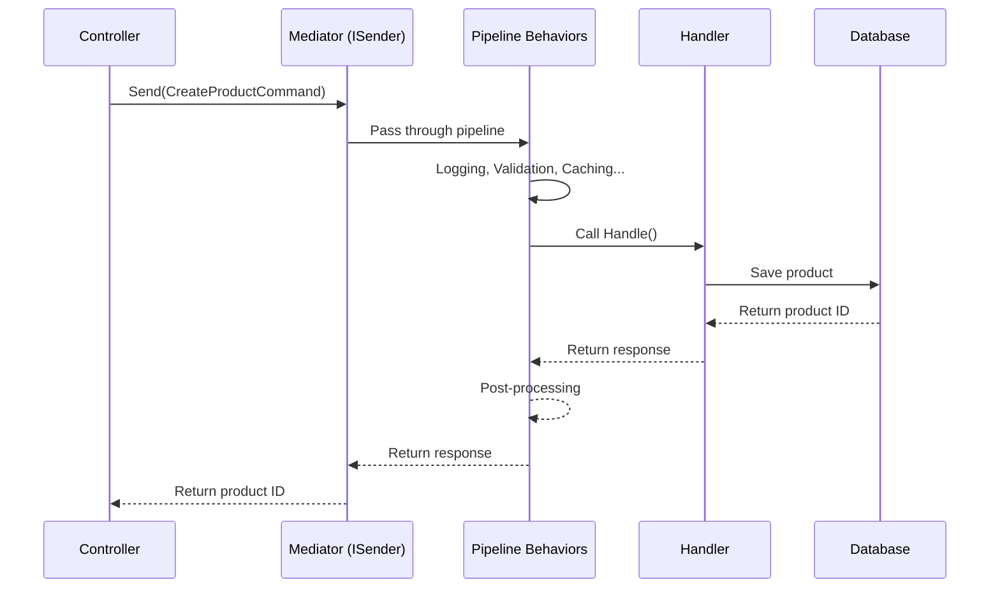
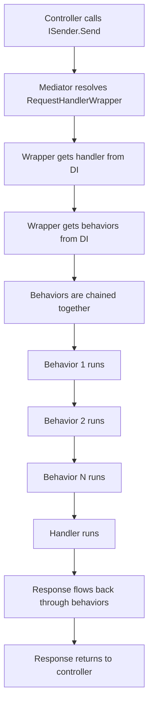

# The Mediator in ASP.NET Core

## A Complete Practical Guide

---

# Chapter 1: Introduction

## What Is the Mediator Pattern?

Imagine you're at a busy office. Instead of walking directly to every colleague's desk to ask questions, you call the receptionist. The receptionist knows exactly who handles what, routes your request to the right person, and brings back the answer. You never need to know who actually did the work—you just talk to the receptionist.

**The Mediator pattern is exactly this receptionist for your code.**

In software terms, the Mediator pattern is a behavioral design pattern that **decouples** (separates) the components that send requests from the components that handle those requests.

Instead of writing this:

```csharp
// Controller directly depends on a service
public class ProductsController : ControllerBase
{
    private readonly IProductService _productService;
    
    public ProductsController(IProductService productService)
    {
        _productService = productService;
    }
    
    [HttpPost]
    public async Task<IActionResult> Create(ProductDto product)
    {
        // Controller knows exactly which service to call
        var result = await _productService.CreateProductAsync(product);
        return Ok(result);
    }
}
```

You write this:

```csharp
// Controller depends only on the mediator
public class ProductsController : ControllerBase
{
    private readonly ISender _mediator;
    
    public ProductsController(ISender mediator)
    {
        _mediator = mediator;
    }
    
    [HttpPost]
    public async Task<IActionResult> Create(CreateProductCommand command)
    {
        // Controller doesn't know who handles this—it just sends a message
        var result = await _mediator.Send(command);
        return Ok(result);
    }
}
```

The controller no longer cares *who* handles the request. It just sends a message (the command) and gets a response. The mediator figures out the rest.

## Why Does This Pattern Exist?

### The Problem: Tight Coupling

In traditional ASP.NET Core applications, controllers directly call services. Services call repositories. Repositories call databases. This creates a web of direct dependencies.

Here's what happens as your application grows:

```
┌────────────┐
│ Controller │───calls───►┌──────────┐
└────────────┘            │ Service  │───calls───►┌────────────┐
                          └──────────┘            │ Repository │
                                                   └────────────┘
```

This seems fine for small apps. But when you have 50 controllers, 100 services, and 50 repositories, you get:

- **Bloat**: Controllers become fat with business logic
- **Coupling**: Changing one service breaks ten others
- **Testing nightmares**: To test a controller, you need to mock five services
- **Maintenance hell**: Nobody knows which service calls which other service

### The Solution: Mediation

The Mediator pattern solves this by introducing a central coordinator:

```
┌────────────┐                  ┌─────────────┐
│ Controller │───sends───►│   Mediator   │───routes───►┌─────────┐
└────────────┘                  └─────────────┘            │ Handler │
                                 └─────────┘
```

Now controllers only know about the mediator. Handlers only know about their dependencies. The mediator connects them.

## What Problems Does It Solve?

| Problem | How Mediator Solves It |
|---------|----------------------|
| **Fat controllers** | Controllers become thin—they only send requests |
| **Tight coupling** | Components communicate through the mediator, not directly |
| **Scattered business logic** | Each handler contains one piece of business logic |
| **Hard-to-test code** | Handlers are small, focused, and easy to test in isolation |
| **Cross-cutting concerns** | Logging, validation, caching go in one place (pipeline behaviors) |
| **No clear boundaries** | Each feature groups its command, handler, and logic together |

## A Brief History

- **1994**: The Mediator pattern is first documented in the "Gang of Four" book *Design Patterns: Elements of Reusable Object-Oriented Software*
- **2011**: Jimmy Bogard creates **MediatR**, a .NET library implementing the pattern
- **2016**: ASP.NET Core is released, and MediatR becomes the standard way to implement the pattern
- **2020s**: MediatR becomes ubiquitous in .NET—nearly every modern ASP.NET Core project uses it

Today, **MediatR is the most popular library** for implementing the Mediator pattern in .NET.

## Real-World Use Cases

### 1. Vertical Slice Architecture

Instead of organizing code by layers (Controllers, Services, Repositories), organize by **features**. Each feature has its own command, query, handler, and validator in one folder.

```
Features/
├── Orders/
│   ├── CreateOrderCommand.cs
│   ├── CreateOrderHandler.cs
│   └── CreateOrderValidator.cs
├── Products/
│   ├── GetProductQuery.cs
│   ├── GetProductHandler.cs
│   └── ...
```

### 2. CQRS (Command Query Responsibility Segregation)

Separate **commands** (write operations) from **queries** (read operations).

```csharp
// Command - changes state
public record CreateOrderCommand(string CustomerName) : IRequest<Guid>;

// Query - reads data
public record GetOrderQuery(Guid OrderId) : IRequest<Order>;
```

This separation allows you to optimize reads and writes independently.

### 3. Event-Driven Architecture

When something happens, publish a **notification**. Multiple handlers can react to it.

```csharp
// Something happened
await mediator.Publish(new OrderCreatedNotification(orderId));

// Multiple handlers react
public class SendEmailHandler : INotificationHandler<OrderCreatedNotification> { ... }
public class UpdateInventoryHandler : INotificationHandler<OrderCreatedNotification> { ... }
```

### 4. Microservices Communication

Even within a single service, the mediator pattern helps manage internal communication between bounded contexts.

## When Should You Use the Mediator Pattern?

✅ **Use it when:**
- Your application is growing beyond 10-15 endpoints
- You want to implement CQRS
- You need consistent cross-cutting concerns (logging, validation, caching)
- You're building a team and want clear boundaries between features
- You value testability

❌ **Don't use it when:**
- You have a tiny CRUD app with 3-4 endpoints
- You're building a prototype or proof of concept
- Your team is unfamiliar with the pattern and doesn't have time to learn
- Performance is absolutely critical and you can't afford any abstraction overhead

> 💡 **Tip**: Start without MediatR. As your application grows, refactor to use it. Premature abstraction is worse than no abstraction.

---

## Key Takeaways

1. The Mediator pattern decouples senders from handlers using a central coordinator
2. It solves problems of tight coupling, fat controllers, and scattered logic
3. MediatR is the most popular .NET implementation
4. It works great with CQRS and Vertical Slice Architecture
5. Use it for medium-to-large applications, skip it for tiny CRUD apps

## Checklist

- [ ] I understand what the Mediator pattern is
- [ ] I know why tight coupling is a problem
- [ ] I can explain the problems the pattern solves
- [ ] I know when to use it and when not to
- [ ] I understand the basic flow: Controller → Mediator → Handler

## Mini Quiz

1. **What is the primary purpose of the Mediator pattern?**
   a) To improve performance
   b) To decouple senders from handlers
   c) To simplify database access
   d) To replace dependency injection

2. **Which library is most commonly used to implement the Mediator pattern in .NET?**
   a) AutoMapper
   b) FluentValidation
   c) MediatR
   d) Entity Framework

3. **What problem does the Mediator pattern solve?**
   a) Slow database queries
   b) Tight coupling between components
   c) Memory leaks
   d) Authentication issues

4. **When should you NOT use the Mediator pattern?**
   a) In a large enterprise application
   b) When using CQRS
   c) In a tiny CRUD app with 3 endpoints
   d) When you need cross-cutting concerns

5. **What is CQRS?**
   a) A database technology
   b) A pattern separating read and write operations
   c) A testing framework
   d) A logging library

---

**Answers:**
1. b
2. c
3. b
4. c
5. b

---

# Chapter 2: Core Concepts

## 2.1 The Four Pillars of MediatR

MediatR has four core concepts you need to understand. Think of them as the characters in our office receptionist analogy:

| Concept | Analogy | Purpose |
|---------|---------|---------|
| **Request** | A memo you give to the receptionist | What you want done |
| **Handler** | The person who actually does the work | Does the actual work |
| **Mediator** | The receptionist | Routes requests to handlers |
| **Response** | The answer you get back | The result of the work |

Let's explore each one in detail.

## 2.2 Requests: The "What"

### Definition
A **Request** is a message that describes *what* you want to happen. It doesn't contain logic—just data.

### Purpose
Requests are the **input** to your system. They carry all the information needed to perform an operation.

### Simple Explanation
A request is like an order form at a restaurant. The form says "I want a cheeseburger with fries" but doesn't tell the kitchen *how* to make it.

### Analogy
Think of a request as a **shopping list**. You give the list to someone (the mediator), and they go get the items. You don't care *how* they get them—you just care that you get your items.

### Types of Requests

MediatR has two types of requests:

#### 1. Request/Response (IRequest&lt;T&gt;)

A request that expects a response. Used for **commands** (write operations) and **queries** (read operations).

```csharp
// A command that returns the new product ID
public record CreateProductCommand(string Name, decimal Price) : IRequest<int>;

// A query that returns a product
public record GetProductQuery(int Id) : IRequest<Product>;
```

#### 2. Notifications (INotification)

A request that doesn't expect a response. Used for **events**—things that happened.

```csharp
// Something happened—we don't need a response
public record ProductCreatedNotification(int ProductId) : INotification;
```

### Why It Matters

By making requests simple data objects (records), you:
- Keep business logic out of your API layer
- Make requests easy to serialize (send over the network)
- Make requests easy to test
- Clearly document what each operation needs

### Code Example

```csharp
// Bad: Request with logic
public class CreateProductCommand
{
    public string Name { get; set; }
    public decimal Price { get; set; }
    
    // ❌ Logic doesn't belong here!
    public bool IsValid() => !string.IsNullOrEmpty(Name) && Price > 0;
}

// Good: Request is just data
public record CreateProductCommand(string Name, decimal Price) : IRequest<int>;
// 👆 Pure data—no logic, no behavior
```

### Common Mistake

⚠️ **Putting logic in requests**: Requests should be pure data. All logic belongs in handlers.

## 2.3 Handlers: The "How"

### Definition
A **Handler** contains the actual logic that processes a request. For every request type, there's exactly one handler.

### Purpose
Handlers contain **business logic**—the rules and operations that make your application work.

### Simple Explanation
If a request is a shopping list, the handler is the person who goes to the store, finds each item, and brings it back.

### Analogy
A handler is like a **specialist** in an office. The receptionist (mediator) routes your request to the right specialist. The specialist does the actual work.

### Handler Interfaces

```csharp
// For requests that return a response
public interface IRequestHandler<TRequest, TResponse>
    where TRequest : IRequest<TResponse>
{
    Task<TResponse> Handle(TRequest request, CancellationToken cancellationToken);
}

// For requests that return nothing (void)
public interface IRequestHandler<TRequest>
    where TRequest : IRequest
{
    Task Handle(TRequest request, CancellationToken cancellationToken);
}

// For notifications (multiple handlers)
public interface INotificationHandler<TNotification>
    where TNotification : INotification
{
    Task Handle(TNotification notification, CancellationToken cancellationToken);
}
```

### Code Example

```csharp
// The request
public record CreateProductCommand(string Name, decimal Price) : IRequest<int>;

// The handler—contains all the business logic
public class CreateProductHandler : IRequestHandler<CreateProductCommand, int>
{
    private readonly ApplicationDbContext _context;
    
    public CreateProductHandler(ApplicationDbContext context)
    {
        _context = context;
    }
    
    public async Task<int> Handle(CreateProductCommand request, CancellationToken cancellationToken)
    {
        // 1. Create the entity
        var product = new Product
        {
            Name = request.Name,
            Price = request.Price,
            CreatedAt = DateTime.UtcNow
        };
        
        // 2. Save to database
        _context.Products.Add(product);
        await _context.SaveChangesAsync(cancellationToken);
        
        // 3. Return the result
        return product.Id;
    }
}
```

### Why It Works

The handler:
1. **Receives** the request through its `Handle` method
2. **Does the work** using its injected dependencies
3. **Returns** a response (or nothing for void requests)

### Key Rules

- **One handler per request type**—MediatR enforces a 1:1 relationship
- **Handlers should do ONE thing**—Single Responsibility Principle
- **Handlers are testable in isolation**—just instantiate with mocked dependencies

> ✅ **Best Practice**: Keep handlers focused. A handler should contain the logic for exactly one use case.

## 2.4 The Mediator: The "Who Routes"

### Definition
The **Mediator** is the central coordinator that routes requests to their handlers.

### Purpose
The mediator decouples the sender (who sends the request) from the handler (who processes it).

### Simple Explanation
The mediator is like a **switchboard operator**. You tell the operator who you want to talk to, and they connect you.

### How It Works

```csharp
// 1. You send a request through the mediator
await mediator.Send(new CreateProductCommand("Laptop", 999.99m));

// 2. The mediator looks at the request type
// 3. It finds the handler registered for that type
// 4. It creates the handler (via DI) and calls Handle()
// 5. It returns the response to you
```

### The Two Mediator Interfaces

MediatR provides two interfaces for sending requests:

```csharp
// ISender - for request/response (commands and queries)
public interface ISender
{
    Task<TResponse> Send<TResponse>(IRequest<TResponse> request, CancellationToken cancellationToken = default);
    Task<object?> Send(object request, CancellationToken cancellationToken = default);
}

// IPublisher - for notifications (events)
public interface IPublisher
{
    Task Publish<TNotification>(TNotification notification, CancellationToken cancellationToken = default)
        where TNotification : INotification;
}
```

> 💡 **Tip**: Inject `ISender` for commands/queries and `IPublisher` for notifications. Don't inject `IMediator` (the combined interface) unless you need both.

### Why It Matters

The mediator:
- **Reduces coupling**—senders don't know about handlers
- **Enables cross-cutting concerns**—pipeline behaviors wrap every request
- **Makes testing easier**—mock the mediator instead of 10 services

## 2.5 Responses: The "Result"

### Definition
A **Response** is what you get back after sending a request.

### Purpose
Responses carry the result of an operation back to the sender.

### Simple Explanation
If a request is a shopping list, the response is the bag of groceries you get back.

### Code Example

```csharp
// Request returns int (the new product ID)
public record CreateProductCommand(string Name, decimal Price) : IRequest<int>;

// Using it
var productId = await mediator.Send(new CreateProductCommand("Laptop", 999.99m));
// productId is an int

// Request returns a complex object
public record GetProductQuery(int Id) : IRequest<ProductDto>;

// Using it
var product = await mediator.Send(new GetProductQuery(123));
// product is a ProductDto
```

### Common Response Patterns

| Pattern | When to Use |
|---------|-------------|
| `TResponse` | You have a specific result (ID, DTO, etc.) |
| `Unit` | You don't need a response (just success/failure) |
| `Result<T>` or `OneOf<T>` | You want to return success OR failure with details |
| `IEnumerable<T>` | You're returning a list |

```csharp
// Using Unit for void responses
public record DeleteProductCommand(int Id) : IRequest<Unit>;

public class DeleteProductHandler : IRequestHandler<DeleteProductCommand, Unit>
{
    public async Task<Unit> Handle(DeleteProductCommand request, CancellationToken ct)
    {
        // Delete the product
        // ...
        return Unit.Value; // Nothing to return
    }
}
```

## 2.6 The Complete Flow

Here's the complete flow from controller to response:



---

## Key Takeaways

1. **Requests** are data objects describing what you want
2. **Handlers** contain the actual business logic
3. **The Mediator** routes requests to handlers
4. **Responses** carry results back
5. Everything works through **generics** and **dependency injection**

## Checklist

- [ ] I understand the difference between IRequest and INotification
- [ ] I know how to create a handler
- [ ] I understand the mediator's role
- [ ] I know when to use ISender vs IPublisher
- [ ] I understand the request/response flow

## Mini Quiz

1. **What is the difference between IRequest and INotification?**
   a) IRequest is for web requests, INotification is for background tasks
   b) IRequest expects a response, INotification does not
   c) IRequest is synchronous, INotification is asynchronous
   d) There is no difference

2. **How many handlers can handle a single IRequest?**
   a) Zero
   b) Exactly one
   c) As many as you want
   d) It depends on the configuration

3. **What interface should you inject for sending commands?**
   a) IMediator
   b) ISender
   c) IPublisher
   d) IHandler

4. **What does a handler return for a void request?**
   a) null
   b) Unit.Value
   c) Task.CompletedTask
   d) Nothing

5. **What is the primary benefit of using a mediator?**
   a) Better performance
   b) Decoupling senders from handlers
   c) Simpler code
   d) Less memory usage

---

**Answers:**
1. b
2. b
3. b
4. b
5. b

---

# Chapter 3: Building Blocks

## 3.1 Setting Up MediatR in ASP.NET Core

Before you can use MediatR, you need to set it up. This is a one-time process.

### Step 1: Install NuGet Packages

```bash
dotnet add package MediatR
dotnet add package MediatR.Extensions.Microsoft.DependencyInjection
```

### Step 2: Register MediatR

In your `Program.cs`:

```csharp
var builder = WebApplication.CreateBuilder(args);

// Register MediatR
builder.Services.AddMediatR(cfg =>
{
    // Tell MediatR where to find handlers
    // This scans all types in the current assembly
    cfg.RegisterServicesFromAssembly(typeof(Program).Assembly);
    
    // You can also scan multiple assemblies:
    // cfg.RegisterServicesFromAssembly(typeof(CreateProductHandler).Assembly);
    // cfg.RegisterServicesFromAssemblies(typeof(Program).Assembly, typeof(AnotherHandler).Assembly);
});

var app = builder.Build();
```

> 📌 **Important**: `RegisterServicesFromAssembly` tells MediatR which assemblies contain your handlers. MediatR scans these assemblies and automatically registers all handlers, behaviors, and pre/post-processors.

### Step 3: Add Open Behaviors (Optional but Recommended)

```csharp
builder.Services.AddMediatR(cfg =>
{
    cfg.RegisterServicesFromAssembly(typeof(Program).Assembly);
    
    // Add pipeline behaviors (we'll cover these later)
    cfg.AddOpenBehavior(typeof(LoggingBehavior<,>));
    cfg.AddOpenBehavior(typeof(ValidationBehavior<,>));
});
```

### Step 4: Inject and Use

```csharp
[ApiController]
[Route("api/[controller]")]
public class ProductsController : ControllerBase
{
    private readonly ISender _sender;
    
    public ProductsController(ISender sender)
    {
        _sender = sender;
    }
    
    [HttpPost]
    public async Task<IActionResult> Create(CreateProductCommand command)
    {
        var productId = await _sender.Send(command);
        return Ok(productId);
    }
}
```

## 3.2 Request Types

### IRequest&lt;TResponse&gt;

For requests that return a response:

```csharp
public record CreateProductCommand(string Name, decimal Price) : IRequest<int>;
//                                                                      👆 Response type
```

### IRequest (No Response)

For requests that don't return anything:

```csharp
public record DeleteProductCommand(int Id) : IRequest;
// No generic parameter = no response
```

### INotification

For events that multiple handlers can react to:

```csharp
public record ProductCreatedNotification(int ProductId) : INotification;
```

## 3.3 Handler Types

### IRequestHandler&lt;TRequest, TResponse&gt;

For requests that return a response:

```csharp
public class CreateProductHandler : IRequestHandler<CreateProductCommand, int>
//                                    👆 Request type              👆 Response type
{
    public async Task<int> Handle(CreateProductCommand request, CancellationToken ct)
    {
        // Business logic here
        return 123;
    }
}
```

### IRequestHandler&lt;TRequest&gt;

For requests that don't return a response:

```csharp
public class DeleteProductHandler : IRequestHandler<DeleteProductCommand>
{
    public async Task Handle(DeleteProductCommand request, CancellationToken ct)
    {
        // Delete logic here
        // No return value
    }
}
```

### INotificationHandler&lt;TNotification&gt;

For notifications:

```csharp
public class SendEmailHandler : INotificationHandler<ProductCreatedNotification>
{
    public async Task Handle(ProductCreatedNotification notification, CancellationToken ct)
    {
        // Send email about the new product
    }
}

public class UpdateInventoryHandler : INotificationHandler<ProductCreatedNotification>
{
    public async Task Handle(ProductCreatedNotification notification, CancellationToken ct)
    {
        // Update inventory
    }
}
```

## 3.4 Pipeline Behaviors

### What Are Pipeline Behaviors?

Pipeline behaviors are like **ASP.NET Core middleware** but for MediatR requests. They wrap around every request handler, allowing you to add cross-cutting concerns.

### The IPipelineBehavior Interface

```csharp
public interface IPipelineBehavior<TRequest, TResponse>
    where TRequest : notnull
{
    Task<TResponse> Handle(
        TRequest request,
        RequestHandlerDelegate<TResponse> next,
        CancellationToken cancellationToken
    );
}
```

- `request`: The incoming request
- `next`: A delegate that calls the next behavior (or the handler)
- `cancellationToken`: For cancellation

### Simple Logging Behavior

```csharp
public class LoggingBehavior<TRequest, TResponse> : IPipelineBehavior<TRequest, TResponse>
    where TRequest : notnull
{
    private readonly ILogger<LoggingBehavior<TRequest, TResponse>> _logger;
    
    public LoggingBehavior(ILogger<LoggingBehavior<TRequest, TResponse>> logger)
    {
        _logger = logger;
    }
    
    public async Task<TResponse> Handle(
        TRequest request,
        RequestHandlerDelegate<TResponse> next,
        CancellationToken cancellationToken)
    {
        // Before the handler executes
        _logger.LogInformation("Handling {RequestType}", typeof(TRequest).Name);
        
        // Call the next behavior (or the handler)
        var response = await next();
        
        // After the handler executes
        _logger.LogInformation("Handled {RequestType}", typeof(TRequest).Name);
        
        return response;
    }
}
```

### Validation Behavior with FluentValidation

```csharp
public class ValidationBehavior<TRequest, TResponse> : IPipelineBehavior<TRequest, TResponse>
    where TRequest : notnull
{
    private readonly IEnumerable<IValidator<TRequest>> _validators;
    
    public ValidationBehavior(IEnumerable<IValidator<TRequest>> validators)
    {
        _validators = validators;
    }
    
    public async Task<TResponse> Handle(
        TRequest request,
        RequestHandlerDelegate<TResponse> next,
        CancellationToken cancellationToken)
    {
        if (_validators.Any())
        {
            var context = new ValidationContext<TRequest>(request);
            var validationResults = await Task.WhenAll(
                _validators.Select(v => v.ValidateAsync(context, cancellationToken))
            );
            
            var failures = validationResults
                .SelectMany(r => r.Errors)
                .Where(f => f != null)
                .ToList();
            
            if (failures.Any())
            {
                throw new ValidationException(failures);
            }
        }
        
        return await next();
    }
}
```

### Registration

```csharp
builder.Services.AddMediatR(cfg =>
{
    cfg.RegisterServicesFromAssembly(typeof(Program).Assembly);
    
    // Behaviors execute in the order they're added
    cfg.AddOpenBehavior(typeof(LoggingBehavior<,>));
    cfg.AddOpenBehavior(typeof(ValidationBehavior<,>));
});
```

### The Pipeline Flow


## 3.5 Pre-Processors and Post-Processors

MediatR also supports simpler pre/post processing:

```csharp
// Runs before the handler
public class CreateProductPreProcessor : IRequestPreProcessor<CreateProductCommand>
{
    public Task Process(CreateProductCommand request, CancellationToken ct)
    {
        // Log, validate, etc.
        return Task.CompletedTask;
    }
}

// Runs after the handler
public class CreateProductPostProcessor : IRequestPostProcessor<CreateProductCommand, int>
{
    public Task Process(CreateProductCommand request, int response, CancellationToken ct)
    {
        // Log, send notifications, etc.
        return Task.CompletedTask;
    }
}
```

> 💡 **Tip**: Use `IPipelineBehavior` for most cross-cutting concerns. Pre/post-processors are simpler but less flexible.

## 3.6 Lifecycle and Scoping

### Handler Lifetime

Handlers are registered as **scoped** by default. This means:
- A new handler instance is created for each request
- Scoped dependencies (like DbContext) work correctly
- You can inject scoped services into handlers

### Mediator Lifetime

The mediator (ISender/IPublisher) is registered as **singleton** by default.

### Important: Scoped Services in Handlers

```csharp
public class MyHandler : IRequestHandler<MyRequest, int>
{
    private readonly ApplicationDbContext _context; // Scoped
    
    public MyHandler(ApplicationDbContext context)
    {
        _context = context; // ✅ Works—handler is scoped
    }
}
```

> ⚠️ **Common Mistake**: Trying to use scoped services in singleton behaviors. Always register pipeline behaviors as scoped or transient.

```csharp
// ✅ Correct
builder.Services.AddScoped(typeof(IPipelineBehavior<,>), typeof(LoggingBehavior<,>));

// ❌ Wrong—singleton can't use scoped services
builder.Services.AddSingleton(typeof(IPipelineBehavior<,>), typeof(LoggingBehavior<,>));
```

## 3.7 The Service Registration Process

When you call `AddMediatR`, here's what happens:

1. **Scanning**: MediatR scans the specified assemblies for:
   - `IRequestHandler<TRequest, TResponse>` implementations
   - `INotificationHandler<TNotification>` implementations
   - `IPipelineBehavior<TRequest, TResponse>` implementations
   - `IRequestPreProcessor<TRequest>` implementations
   - `IRequestPostProcessor<TRequest, TResponse>` implementations

2. **Registration**: Each found type is registered with the DI container:
   - Handlers: Scoped
   - Behaviors: Transient (unless you specify otherwise)

3. **Wrapper Creation**: For each handler, MediatR creates wrapper classes that handle the actual invocation

```csharp
// Simplified internal structure
internal class RequestHandlerWrapper<TRequest, TResponse> 
    : IRequestHandlerWrapper<TRequest, TResponse>
    where TRequest : IRequest<TResponse>
{
    public async Task<TResponse> Handle(
        TRequest request, 
        IServiceProvider serviceProvider, 
        CancellationToken ct)
    {
        // Resolve the handler from DI
        var handler = serviceProvider.GetRequiredService<IRequestHandler<TRequest, TResponse>>();
        
        // Build the pipeline
        var behaviors = serviceProvider.GetServices<IPipelineBehavior<TRequest, TResponse>>();
        
        // Execute the pipeline
        // ...
    }
}
```

---

## Key Takeaways

1. **Setup**: Install packages, register in Program.cs, scan assemblies
2. **Requests**: Use `IRequest<T>` for commands/queries, `INotification` for events
3. **Handlers**: Implement the appropriate handler interface
4. **Behaviors**: Use `IPipelineBehavior` for cross-cutting concerns
5. **Lifetime**: Handlers are scoped, behaviors are transient

## Checklist

- [ ] I can set up MediatR in an ASP.NET Core project
- [ ] I know the difference between IRequest and INotification
- [ ] I can create a handler for any request type
- [ ] I understand how pipeline behaviors work
- [ ] I know about handler lifetimes and scoping

## Mini Quiz

1. **How do you register MediatR in ASP.NET Core?**
   a) `app.UseMediatR()`
   b) `builder.Services.AddMediatR()`
   c) `mediator.Configure()`
   d) `app.MapMediator()`

2. **What is the default lifetime of a handler?**
   a) Singleton
   b) Scoped
   c) Transient
   d) It depends on the handler

3. **Which interface do you use for cross-cutting concerns?**
   a) IRequestHandler
   b) IPipelineBehavior
   c) INotificationHandler
   d) IMediator

4. **What happens if you have multiple validators for a request?**
   a) Only the first one runs
   b) All of them run
   c) None of them run
   d) It throws an exception

5. **What does AddOpenBehavior do?**
   a) Registers a behavior for all requests
   b) Registers a behavior for a specific request
   c) Opens a connection to the database
   d) Adds behavior to the ASP.NET Core pipeline

---

**Answers:**
1. b
2. b
3. b
4. b
5. a

---

# Chapter 4: Practical Examples

## 4.1 Hello World: The Simplest Example

Let's start with the absolute simplest MediatR example.

### Step 1: Create the Project

```bash
dotnet new webapi -n MediatRHelloWorld
cd MediatRHelloWorld
dotnet add package MediatR
dotnet add package MediatR.Extensions.Microsoft.DependencyInjection
```

### Step 2: Create a Request

```csharp
// Features/Hello/HelloRequest.cs
using MediatR;

// A request that takes a name and returns a greeting
public record HelloRequest(string Name) : IRequest<string>;
```

**What this does**: Creates a request that expects a name and returns a string greeting.

### Step 3: Create a Handler

```csharp
// Features/Hello/HelloHandler.cs
using MediatR;

public class HelloHandler : IRequestHandler<HelloRequest, string>
{
    public Task<string> Handle(HelloRequest request, CancellationToken cancellationToken)
    {
        // Simple business logic
        var greeting = $"Hello, {request.Name}!";
        
        // Return the result
        return Task.FromResult(greeting);
    }
}
```

**What this does**: Takes the name from the request, creates a greeting, and returns it.

### Step 4: Register MediatR

```csharp
// Program.cs
var builder = WebApplication.CreateBuilder(args);

// Register MediatR
builder.Services.AddMediatR(cfg =>
{
    cfg.RegisterServicesFromAssembly(typeof(Program).Assembly);
});

var app = builder.Build();

// Create an endpoint that uses MediatR
app.MapGet("/hello/{name}", async (string name, ISender sender) =>
{
    var greeting = await sender.Send(new HelloRequest(name));
    return Results.Ok(greeting);
});

app.Run();
```

**What this does**: 
1. Registers MediatR and scans for handlers
2. Creates a minimal API endpoint
3. Injects `ISender` (the mediator)
4. Sends the request and returns the response

### Step 5: Run It

```bash
dotnet run
# GET https://localhost:5001/hello/World
# Returns: "Hello, World!"
```

**This is it!** You've just built your first MediatR application.

## 4.2 A Simple CRUD Example

Now let's build something more realistic—a product management API.

### Project Structure

```
MediatRExample/
├── Program.cs
├── Features/
│   └── Products/
│       ├── CreateProductCommand.cs
│       ├── CreateProductHandler.cs
│       ├── GetProductQuery.cs
│       ├── GetProductHandler.cs
│       ├── GetAllProductsQuery.cs
│       ├── GetAllProductsHandler.cs
│       └── ProductDto.cs
├── Data/
│   └── ApplicationDbContext.cs
└── Models/
    └── Product.cs
```

### Step 1: Create the Model and DbContext

```csharp
// Models/Product.cs
public class Product
{
    public int Id { get; set; }
    public string Name { get; set; } = string.Empty;
    public decimal Price { get; set; }
    public DateTime CreatedAt { get; set; }
}
```

```csharp
// Data/ApplicationDbContext.cs
using Microsoft.EntityFrameworkCore;

public class ApplicationDbContext : DbContext
{
    public ApplicationDbContext(DbContextOptions<ApplicationDbContext> options)
        : base(options)
    {
    }
    
    public DbSet<Product> Products { get; set; }
}
```

### Step 2: Create the DTO

```csharp
// Features/Products/ProductDto.cs
public record ProductDto(int Id, string Name, decimal Price);
```

### Step 3: Create Command and Handler (Write)

```csharp
// Features/Products/CreateProductCommand.cs
using MediatR;

public record CreateProductCommand(string Name, decimal Price) : IRequest<int>;
```

```csharp
// Features/Products/CreateProductHandler.cs
using MediatR;

public class CreateProductHandler : IRequestHandler<CreateProductCommand, int>
{
    private readonly ApplicationDbContext _context;
    
    public CreateProductHandler(ApplicationDbContext context)
    {
        _context = context;
    }
    
    public async Task<int> Handle(CreateProductCommand request, CancellationToken cancellationToken)
    {
        var product = new Product
        {
            Name = request.Name,
            Price = request.Price,
            CreatedAt = DateTime.UtcNow
        };
        
        _context.Products.Add(product);
        await _context.SaveChangesAsync(cancellationToken);
        
        return product.Id;
    }
}
```

**What this does**: 
1. Creates a new Product entity
2. Saves it to the database
3. Returns the new product ID

### Step 4: Create Queries and Handlers (Read)

```csharp
// Features/Products/GetProductQuery.cs
using MediatR;

public record GetProductQuery(int Id) : IRequest<ProductDto?>;
```

```csharp
// Features/Products/GetProductHandler.cs
using MediatR;
using Microsoft.EntityFrameworkCore;

public class GetProductHandler : IRequestHandler<GetProductQuery, ProductDto?>
{
    private readonly ApplicationDbContext _context;
    
    public GetProductHandler(ApplicationDbContext context)
    {
        _context = context;
    }
    
    public async Task<ProductDto?> Handle(GetProductQuery request, CancellationToken cancellationToken)
    {
        var product = await _context.Products
            .AsNoTracking()
            .FirstOrDefaultAsync(p => p.Id == request.Id, cancellationToken);
        
        if (product is null)
            return null;
        
        return new ProductDto(product.Id, product.Name, product.Price);
    }
}
```

```csharp
// Features/Products/GetAllProductsQuery.cs
using MediatR;

public record GetAllProductsQuery() : IRequest<IEnumerable<ProductDto>>;
```

```csharp
// Features/Products/GetAllProductsHandler.cs
using MediatR;
using Microsoft.EntityFrameworkCore;

public class GetAllProductsHandler : IRequestHandler<GetAllProductsQuery, IEnumerable<ProductDto>>
{
    private readonly ApplicationDbContext _context;
    
    public GetAllProductsHandler(ApplicationDbContext context)
    {
        _context = context;
    }
    
    public async Task<IEnumerable<ProductDto>> Handle(GetAllProductsQuery request, CancellationToken cancellationToken)
    {
        return await _context.Products
            .AsNoTracking()
            .Select(p => new ProductDto(p.Id, p.Name, p.Price))
            .ToListAsync(cancellationToken);
    }
}
```

### Step 5: Create the Controller

```csharp
// Controllers/ProductsController.cs
using Microsoft.AspNetCore.Mvc;

[ApiController]
[Route("api/[controller]")]
public class ProductsController : ControllerBase
{
    private readonly ISender _sender;
    
    public ProductsController(ISender sender)
    {
        _sender = sender;
    }
    
    [HttpGet]
    public async Task<IActionResult> GetAll()
    {
        var products = await _sender.Send(new GetAllProductsQuery());
        return Ok(products);
    }
    
    [HttpGet("{id}")]
    public async Task<IActionResult> Get(int id)
    {
        var product = await _sender.Send(new GetProductQuery(id));
        
        if (product is null)
            return NotFound();
            
        return Ok(product);
    }
    
    [HttpPost]
    public async Task<IActionResult> Create(CreateProductCommand command)
    {
        var id = await _sender.Send(command);
        return CreatedAtAction(nameof(Get), new { id }, id);
    }
}
```

**What this does**:
- Controllers are thin—they just send requests
- All business logic is in handlers
- Each handler does exactly one thing

> ✅ **Best Practice**: Notice how the controller has no business logic. It only receives HTTP requests and sends MediatR requests.

## 4.3 Adding Validation

### Step 1: Install FluentValidation

```bash
dotnet add package FluentValidation
dotnet add package FluentValidation.DependencyInjectionExtensions
```

### Step 2: Create Validator

```csharp
// Features/Products/CreateProductValidator.cs
using FluentValidation;

public class CreateProductValidator : AbstractValidator<CreateProductCommand>
{
    public CreateProductValidator()
    {
        RuleFor(x => x.Name)
            .NotEmpty().WithMessage("Product name is required")
            .MaximumLength(100).WithMessage("Product name cannot exceed 100 characters");
            
        RuleFor(x => x.Price)
            .GreaterThan(0).WithMessage("Price must be greater than 0");
    }
}
```

### Step 3: Create Validation Behavior

```csharp
// Behaviors/ValidationBehavior.cs
using FluentValidation;
using MediatR;

public class ValidationBehavior<TRequest, TResponse> : IPipelineBehavior<TRequest, TResponse>
    where TRequest : notnull
{
    private readonly IEnumerable<IValidator<TRequest>> _validators;
    
    public ValidationBehavior(IEnumerable<IValidator<TRequest>> validators)
    {
        _validators = validators;
    }
    
    public async Task<TResponse> Handle(
        TRequest request,
        RequestHandlerDelegate<TResponse> next,
        CancellationToken cancellationToken)
    {
        if (!_validators.Any())
            return await next();
            
        var context = new ValidationContext<TRequest>(request);
        var failures = _validators
            .Select(v => v.Validate(context))
            .SelectMany(r => r.Errors)
            .Where(f => f is not null)
            .ToList();
            
        if (failures.Any())
            throw new ValidationException(failures);
            
        return await next();
    }
}
```

### Step 4: Register Everything

```csharp
// Program.cs
var builder = WebApplication.CreateBuilder(args);

// Register DbContext
builder.Services.AddDbContext<ApplicationDbContext>(options =>
    options.UseInMemoryDatabase("ProductsDb"));

// Register MediatR with behaviors
builder.Services.AddMediatR(cfg =>
{
    cfg.RegisterServicesFromAssembly(typeof(Program).Assembly);
    cfg.AddOpenBehavior(typeof(ValidationBehavior<,>));
});

// Register FluentValidation validators
builder.Services.AddValidatorsFromAssembly(typeof(Program).Assembly);

var app = builder.Build();

// ... endpoints and run
```

## 4.4 Adding Logging

```csharp
// Behaviors/LoggingBehavior.cs
using MediatR;

public class LoggingBehavior<TRequest, TResponse> : IPipelineBehavior<TRequest, TResponse>
    where TRequest : notnull
{
    private readonly ILogger<LoggingBehavior<TRequest, TResponse>> _logger;
    
    public LoggingBehavior(ILogger<LoggingBehavior<TRequest, TResponse>> logger)
    {
        _logger = logger;
    }
    
    public async Task<TResponse> Handle(
        TRequest request,
        RequestHandlerDelegate<TResponse> next,
        CancellationToken cancellationToken)
    {
        _logger.LogInformation("Processing {RequestType} with data: {@Request}", 
            typeof(TRequest).Name, request);
            
        try
        {
            var response = await next();
            _logger.LogInformation("Successfully processed {RequestType}", typeof(TRequest).Name);
            return response;
        }
        catch (Exception ex)
        {
            _logger.LogError(ex, "Error processing {RequestType}", typeof(TRequest).Name);
            throw;
        }
    }
}
```

Register it:

```csharp
builder.Services.AddMediatR(cfg =>
{
    cfg.RegisterServicesFromAssembly(typeof(Program).Assembly);
    cfg.AddOpenBehavior(typeof(LoggingBehavior<,>));
    cfg.AddOpenBehavior(typeof(ValidationBehavior<,>));
});
```

> 💡 **Tip**: Order matters! Logging should wrap everything, so add it first.

## 4.5 Production-Quality Example

Here's a complete, production-quality example combining everything:

```csharp
// Program.cs
var builder = WebApplication.CreateBuilder(args);

// 1. Configuration
builder.Services.Configure<AppSettings>(builder.Configuration.GetSection("AppSettings"));

// 2. Database
builder.Services.AddDbContext<ApplicationDbContext>(options =>
    options.UseSqlServer(builder.Configuration.GetConnectionString("DefaultConnection")));

// 3. MediatR with all behaviors
builder.Services.AddMediatR(cfg =>
{
    cfg.RegisterServicesFromAssembly(typeof(Program).Assembly);
    cfg.AddOpenBehavior(typeof(LoggingBehavior<,>));
    cfg.AddOpenBehavior(typeof(ValidationBehavior<,>));
    cfg.AddOpenBehavior(typeof(CachingBehavior<,>));
    cfg.AddOpenBehavior(typeof(TransactionBehavior<,>));
});

// 4. Validation
builder.Services.AddValidatorsFromAssembly(typeof(Program).Assembly);

// 5. Other services
builder.Services.AddScoped<IProductRepository, ProductRepository>();
builder.Services.AddMemoryCache();

// 6. Controllers
builder.Services.AddControllers();

// 7. OpenAPI/Swagger
builder.Services.AddEndpointsApiExplorer();
builder.Services.AddSwaggerGen();

var app = builder.Build();

// 8. Pipeline
if (app.Environment.IsDevelopment())
{
    app.UseSwagger();
    app.UseSwaggerUI();
}

app.UseHttpsRedirection();
app.UseAuthorization();
app.MapControllers();

// 9. Seed data (if needed)
await SeedDataAsync(app);

app.Run();
```

---

## Key Takeaways

1. **Start simple**: Begin with a Hello World example
2. **CRUD is the next step**: Commands for writes, queries for reads
3. **Add behaviors gradually**: Start with logging, then validation
4. **Keep controllers thin**: All logic belongs in handlers
5. **Use records for requests**: They're immutable and concise

## Checklist

- [ ] I can create a basic MediatR request and handler
- [ ] I can set up a CRUD API with MediatR
- [ ] I can add validation using FluentValidation
- [ ] I can add logging using pipeline behaviors
- [ ] I understand the complete request flow

## Mini Quiz

1. **What should a controller do in a MediatR application?**
   a) Contain all business logic
   b) Only send requests to the mediator
   c) Handle database operations
   d) Validate input

2. **What is the benefit of using records for requests?**
   a) Better performance
   b) Immutability and conciseness
   c) They're required by MediatR
   d) They support inheritance

3. **Where does validation logic belong?**
   a) In the controller
   b) In the request
   c) In a pipeline behavior
   d) In the handler

4. **What is the purpose of AsNoTracking()?**
   a) To improve security
   b) To improve performance for read-only queries
   c) To enable lazy loading
   d) To disable change tracking

5. **What is the correct order for registering behaviors?**
   a) Any order works
   b) Outer behaviors first (logging), inner behaviors last (validation)
   c) Inner behaviors first, outer behaviors last
   d) Alphabetical order

---

**Answers:**
1. b
2. b
3. c
4. b
5. b

---

# Chapter 5: Internal Mechanics

## How MediatR Works Under the Hood

Understanding how MediatR works internally helps you use it more effectively and debug issues when they arise.

## 5.1 The Registration Process

When you call `AddMediatR`, here's what happens:

```csharp
// Simplified version of what AddMediatR does
public static IServiceCollection AddMediatR(
    this IServiceCollection services,
    Action<MediatRServiceConfiguration> configure)
{
    var config = new MediatRServiceConfiguration();
    configure(config);
    
    // 1. Scan assemblies for handlers
    var handlerTypes = FindHandlers(config.Assemblies);
    
    // 2. Register each handler
    foreach (var handlerType in handlerTypes)
    {
        var serviceType = GetHandlerInterface(handlerType);
        services.AddScoped(serviceType, handlerType);
    }
    
    // 3. Register the mediator itself
    services.AddSingleton<ISender, Mediator>();
    services.AddSingleton<IPublisher, Mediator>();
    
    // 4. Create wrapper types for each request
    // This is the magic that connects requests to handlers
    services.AddSingleton(typeof(IRequestHandlerWrapper<,>), typeof(RequestHandlerWrapper<,>));
    
    return services;
}
```

### The Wrapper Pattern

The key to MediatR's magic is the **wrapper pattern**:

```csharp
// Internal: MediatR creates a wrapper for each request type
public class RequestHandlerWrapper<TRequest, TResponse> 
    : IRequestHandlerWrapper<TRequest, TResponse>
    where TRequest : IRequest<TResponse>
{
    public async Task<TResponse> Handle(
        TRequest request,
        IServiceProvider serviceProvider,
        CancellationToken cancellationToken)
    {
        // 1. Get the handler from DI
        var handler = serviceProvider.GetRequiredService<IRequestHandler<TRequest, TResponse>>();
        
        // 2. Get all behaviors
        var behaviors = serviceProvider.GetServices<IPipelineBehavior<TRequest, TResponse>>()
            .Reverse()
            .ToList();
        
        // 3. Build the pipeline
        RequestHandlerDelegate<TResponse> handlerDelegate = () => handler.Handle(request, cancellationToken);
        
        // 4. Chain the behaviors
        foreach (var behavior in behaviors)
        {
            var currentHandler = handlerDelegate;
            var currentBehavior = behavior;
            handlerDelegate = () => currentBehavior.Handle(request, currentHandler, cancellationToken);
        }
        
        // 5. Execute the pipeline
        return await handlerDelegate();
    }
}
```

## 5.2 The Request Execution Flow



## 5.3 Memory Usage and Performance

### What MediatR Allocates

For each request, MediatR creates:

1. **The request object** (one allocation)
2. **The handler instance** (one allocation, from DI)
3. **Behavior instances** (one per behavior)
4. **Delegate chain** (one delegate per behavior)
5. **Task objects** (for async operations)

### Performance Considerations

| Concern | Impact | Mitigation |
|---------|--------|------------|
| Reflection | Used only at startup for scanning | ✅ Minimal impact |
| DI resolution | Per request | ✅ Fast in modern DI containers |
| Delegate allocation | Per request | ⚠️ Can be significant in high-throughput |
| Object allocation | Per request | ⚠️ Creates GC pressure |

### Benchmark Comparison

```csharp
// Direct call: ~50ns
await handler.Handle(request);

// Via MediatR: ~500-1000ns
await mediator.Send(request);
```

> 📌 **Interview Tip**: The overhead of MediatR is typically 10-20x a direct call. For most applications, this doesn't matter. But for sub-millisecond latency requirements, consider the tradeoff.

### When Performance Matters

If you have a high-throughput system (10,000+ requests/second), consider:

1. **Using MediatR strategically**—only for complex operations
2. **Caching frequent requests** in behaviors
3. **Using a lighter mediator** like DispatchR
4. **Bypassing MediatR** for simple CRUD operations

## 5.4 The Service Locator Pattern

MediatR internally uses a **service locator** pattern. This is a common criticism:

```csharp
// Inside MediatR's wrapper
var handler = serviceProvider.GetRequiredService<IRequestHandler<TRequest, TResponse>>();
```

This means MediatR:
- Doesn't know about handlers at compile time
- Resolves them at runtime via DI
- Can hide dependencies (you don't see what a handler needs)

```csharp
// ❌ With MediatR: Dependencies are hidden
public class MyController
{
    public MyController(ISender sender) { } // What does this actually need?
}

// ✅ Without MediatR: Dependencies are explicit
public class MyController
{
    public MyController(IProductService productService, IEmailService emailService) { }
    // 👆 Clear what this controller needs
}
```

> 💡 **Tip**: This is a tradeoff. MediatR hides complexity but also hides dependencies. Use it intentionally, not habitually.

## 5.5 The Delegate Chain Construction

Here's how behaviors are chained:

```csharp
// Simplified: Building the behavior chain
RequestHandlerDelegate<TResponse> handlerDelegate = () => 
    handler.Handle(request, cancellationToken);

// Process behaviors in reverse order
foreach (var behavior in behaviors.Reverse())
{
    var nextDelegate = handlerDelegate;
    handlerDelegate = () => behavior.Handle(request, nextDelegate, cancellationToken);
}

// Execute the chain
var response = await handlerDelegate();
```

This creates a **chain of responsibility** where:
1. The first behavior runs
2. It calls the next behavior
3. The next behavior calls the next
4. Eventually the handler runs
5. The response flows back through the chain

## 5.6 Request/Response Type Matching

MediatR uses **generics** to match requests to handlers:

```csharp
// Request type: CreateProductCommand : IRequest<int>
// Handler type: IRequestHandler<CreateProductCommand, int>

// MediatR matches them by their generic parameters
var requestType = typeof(CreateProductCommand);
var handlerType = typeof(IRequestHandler<,>).MakeGenericType(requestType, typeof(int));
var handler = serviceProvider.GetRequiredService(handlerType);
```

This is why:
- Each request type can have only one handler
- The request and handler must match exactly
- You can't have two handlers for the same request

## 5.7 Notifications: One-to-Many

Notifications work differently from requests:

```csharp
// Internal: Publishing a notification
public async Task Publish<TNotification>(TNotification notification, CancellationToken ct)
{
    // Get ALL handlers for this notification type
    var handlers = serviceProvider.GetServices<INotificationHandler<TNotification>>();
    
    // Execute all handlers
    foreach (var handler in handlers)
    {
        await handler.Handle(notification, ct);
    }
}
```

Key differences:
- **One-to-many**: Multiple handlers can handle one notification
- **Parallel execution**: By default, handlers run sequentially
- **No response**: Notifications don't return a value
- **Fire-and-forget**: You don't wait for handlers to complete (unless you want to)

## 5.8 Stream Requests (IAsyncEnumerable)

MediatR 10.0+ supports streaming responses:

```csharp
// Request returns a stream
public record NumberStreamRequest(int Count) : IStreamRequest<int>;

// Handler yields results as they become available
public class NumberStreamHandler : IStreamRequestHandler<NumberStreamRequest, int>
{
    public async IAsyncEnumerable<int> Handle(NumberStreamRequest request, CancellationToken ct)
    {
        for (int i = 1; i <= request.Count; i++)
        {
            await Task.Delay(100, ct);
            yield return i;
        }
    }
}

// Using it
await foreach (var number in mediator.CreateStream(new NumberStreamRequest(10)))
{
    Console.WriteLine(number); // Prints 1, 2, 3, ...
}
```

Stream behaviors wrap the entire stream, not each item.

---

## Key Takeaways

1. **MediatR uses wrappers** to connect requests to handlers
2. **Behaviors are chained** using delegates
3. **Performance overhead** is ~10-20x direct calls
4. **Notifications** are one-to-many, requests are one-to-one
5. **Streaming** is supported for large datasets

## Checklist

- [ ] I understand how MediatR registers handlers
- [ ] I know how behaviors are chained together
- [ ] I understand the performance implications
- [ ] I know the difference between requests and notifications
- [ ] I understand the service locator pattern criticism

## Mini Quiz

1. **How does MediatR find the handler for a request?**
   a) By name
   b) By generic type matching
   c) By attributes
   d) By configuration

2. **What pattern does MediatR use internally?**
   a) Factory pattern
   b) Service locator pattern
   c) Singleton pattern
   d) Observer pattern

3. **How many handlers can handle a single IRequest?**
   a) Zero
   b) Exactly one
   c) Multiple
   d) It depends

4. **What is the approximate performance overhead of MediatR?**
   a) 1-2x
   b) 10-20x
   c) 100-200x
   d) 1000x

5. **How do stream requests differ from regular requests?**
   a) They return IAsyncEnumerable
   b) They're faster
   c) They don't use behaviors
   d) They can have multiple handlers

---

**Answers:**
1. b
2. b
3. b
4. b
5. a

---

# Chapter 6: Real-World Patterns

## 6.1 CQRS Pattern

### What Is CQRS?

**CQRS (Command Query Responsibility Segregation)** separates write operations (Commands) from read operations (Queries).

### Why Separate Reads and Writes?

| Aspect | Command (Write) | Query (Read) |
|--------|----------------|--------------|
| **Purpose** | Change state | Read state |
| **Returns** | Success/failure, ID | Data |
| **Side effects** | Yes | No |
| **Validation** | Heavy | Light |
| **Caching** | Invalidate | Use heavily |
| **Model** | Complex | Simple |

### CQRS with MediatR

```csharp
// 📝 Command: Changes state
public record CreateOrderCommand(
    string CustomerId,
    List<OrderItemDto> Items
) : IRequest<Guid>;

// 📖 Query: Reads state
public record GetOrderQuery(Guid OrderId) : IRequest<OrderDto>;

// 📖 Query: List with filters
public record GetOrdersQuery(
    DateTime? FromDate,
    DateTime? ToDate,
    string? Status
) : IRequest<IEnumerable<OrderDto>>;
```

### Implementation Example

```csharp
// Command Handler
public class CreateOrderHandler : IRequestHandler<CreateOrderCommand, Guid>
{
    private readonly ApplicationDbContext _db;
    private readonly IEventPublisher _eventPublisher;
    
    public async Task<Guid> Handle(CreateOrderCommand request, CancellationToken ct)
    {
        // Business logic: create order
        var order = new Order
        {
            Id = Guid.NewGuid(),
            CustomerId = request.CustomerId,
            Status = OrderStatus.Pending,
            CreatedAt = DateTime.UtcNow
        };
        
        // Save
        _db.Orders.Add(order);
        await _db.SaveChangesAsync(ct);
        
        // Publish event
        await _eventPublisher.Publish(new OrderCreatedEvent(order.Id), ct);
        
        return order.Id;
    }
}

// Query Handler
public class GetOrderHandler : IRequestHandler<GetOrderQuery, OrderDto?>
{
    private readonly ApplicationDbContext _db;
    
    public async Task<OrderDto?> Handle(GetOrderQuery request, CancellationToken ct)
    {
        return await _db.Orders
            .AsNoTracking() // ⚡ Read-only optimization
            .Where(o => o.Id == request.OrderId)
            .Select(o => new OrderDto(o.Id, o.CustomerId, o.Status))
            .FirstOrDefaultAsync(ct);
    }
}
```

> ✅ **Best Practice**: Queries should use `AsNoTracking()` to avoid change tracking overhead.

### When to Use CQRS

✅ **Use CQRS when:**
- Read and write workloads are significantly different
- You need to optimize reads and writes separately
- Your domain is complex
- You want clear separation of concerns

❌ **Don't use CQRS when:**
- Your app is simple CRUD
- You don't have separate read/write requirements
- The team is small and the overhead isn't worth it

## 6.2 Vertical Slice Architecture

### What Is Vertical Slice Architecture?

Instead of organizing code by **layers** (Controllers, Services, Repositories), organize by **features**.

### Layers vs Slices

```
❌ Traditional Layers (Horizontal)          ✅ Vertical Slices
┌─────────────────────────┐              ┌──────────┬──────────┬──────────┐
│    Controllers Layer     │              │ Orders   │Products  │Customers │
├─────────────────────────┤              │ Feature  │ Feature  │ Feature  │
│     Services Layer       │              ├──────────┼──────────┼──────────┤
├─────────────────────────┤              │Command   │Command   │Command   │
│   Repository Layer       │              │Query     │Query     │Query     │
├─────────────────────────┤              │Handler   │Handler   │Handler   │
│    Database Layer        │              │Validator │Validator │Validator │
└─────────────────────────┘              │DTOs      │DTOs      │DTOs      │
                                         └──────────┴──────────┴──────────┘
```

### Implementation

```
Features/
├── Orders/
│   ├── CreateOrderCommand.cs
│   ├── CreateOrderHandler.cs
│   ├── CreateOrderValidator.cs
│   ├── GetOrderQuery.cs
│   ├── GetOrderHandler.cs
│   └── OrderDto.cs
├── Products/
│   ├── CreateProductCommand.cs
│   ├── CreateProductHandler.cs
│   ├── GetProductQuery.cs
│   ├── GetProductHandler.cs
│   └── ProductDto.cs
└── Customers/
    ├── RegisterCustomerCommand.cs
    ├── RegisterCustomerHandler.cs
    └── CustomerDto.cs
```

### Benefits

1. **Feature isolation**: Changes to one feature don't affect others
2. **Clear ownership**: Each feature is self-contained
3. **Easier onboarding**: New devs understand one feature at a time
4. **Better testing**: Each feature can be tested independently

## 6.3 Event-Driven Communication

### Using Notifications for Events

When something important happens, publish a notification:

```csharp
// The event
public record OrderPlacedNotification(Guid OrderId, string CustomerEmail) : INotification;

// Publisher
public class PlaceOrderHandler : IRequestHandler<PlaceOrderCommand, Guid>
{
    private readonly IPublisher _publisher;
    private readonly ApplicationDbContext _db;
    
    public async Task<Guid> Handle(PlaceOrderCommand request, CancellationToken ct)
    {
        // ... create order ...
        
        // Publish event
        await _publisher.Publish(new OrderPlacedNotification(order.Id, order.CustomerEmail), ct);
        
        return order.Id;
    }
}

// Multiple handlers react to the same event
public class SendOrderConfirmationEmailHandler 
    : INotificationHandler<OrderPlacedNotification>
{
    private readonly IEmailService _emailService;
    
    public async Task Handle(OrderPlacedNotification notification, CancellationToken ct)
    {
        await _emailService.SendOrderConfirmationAsync(
            notification.CustomerEmail,
            notification.OrderId
        );
    }
}

public class UpdateInventoryHandler 
    : INotificationHandler<OrderPlacedNotification>
{
    private readonly IInventoryService _inventoryService;
    
    public async Task Handle(OrderPlacedNotification notification, CancellationToken ct)
    {
        await _inventoryService.ReserveItemsAsync(notification.OrderId);
    }
}
```

### Benefits of Event-Driven Design

- **Loose coupling**: The order handler doesn't know about email or inventory
- **Extensibility**: Add new handlers without changing existing code
- **Separation of concerns**: Each handler does one thing

## 6.4 Unit of Work Pattern

Combine the Unit of Work pattern with MediatR behaviors:

```csharp
// Transaction behavior
public class TransactionBehavior<TRequest, TResponse> : IPipelineBehavior<TRequest, TResponse>
    where TRequest : notnull
{
    private readonly ApplicationDbContext _db;
    private readonly ILogger<TransactionBehavior<TRequest, TResponse>> _logger;
    
    public TransactionBehavior(
        ApplicationDbContext db,
        ILogger<TransactionBehavior<TRequest, TResponse>> logger)
    {
        _db = db;
        _logger = logger;
    }
    
    public async Task<TResponse> Handle(
        TRequest request,
        RequestHandlerDelegate<TResponse> next,
        CancellationToken cancellationToken)
    {
        // Only start a transaction for commands (write operations)
        // You can use a marker interface: ICommand
        if (request is not ICommand)
            return await next();
            
        var strategy = _db.Database.CreateExecutionStrategy();
        
        return await strategy.ExecuteAsync(async () =>
        {
            await using var transaction = await _db.Database.BeginTransactionAsync(cancellationToken);
            
            try
            {
                var response = await next();
                await transaction.CommitAsync(cancellationToken);
                return response;
            }
            catch
            {
                await transaction.RollbackAsync(cancellationToken);
                throw;
            }
        });
    }
}
```

Marker interface for commands:

```csharp
// Marker interface
public interface ICommand { }

// Command implements the marker
public record CreateOrderCommand(string CustomerId) : IRequest<Guid>, ICommand;
```

## 6.5 Result Pattern

Return explicit success/failure instead of throwing exceptions:

```csharp
// Using a Result type
public record CreateProductCommand(string Name, decimal Price) 
    : IRequest<Result<int>>;

public class CreateProductHandler 
    : IRequestHandler<CreateProductCommand, Result<int>>
{
    private readonly ApplicationDbContext _db;
    
    public async Task<Result<int>> Handle(CreateProductCommand request, CancellationToken ct)
    {
        // Validate business rules
        if (request.Price < 0)
            return Result<int>.Failure("Price cannot be negative");
            
        if (await _db.Products.AnyAsync(p => p.Name == request.Name, ct))
            return Result<int>.Failure("Product name already exists");
            
        // Success
        var product = new Product { Name = request.Name, Price = request.Price };
        _db.Products.Add(product);
        await _db.SaveChangesAsync(ct);
        
        return Result<int>.Success(product.Id);
    }
}

// Result class
public class Result<T>
{
    public bool IsSuccess { get; }
    public T? Value { get; }
    public string? Error { get; }
    
    private Result(bool isSuccess, T? value, string? error)
    {
        IsSuccess = isSuccess;
        Value = value;
        Error = error;
    }
    
    public static Result<T> Success(T value) => new(true, value, null);
    public static Result<T> Failure(string error) => new(false, default, error);
}
```

---

## Key Takeaways

1. **CQRS**: Separate reads from writes
2. **Vertical Slice**: Organize by feature, not layer
3. **Events**: Use notifications for event-driven communication
4. **Unit of Work**: Wrap commands in transactions
5. **Result Pattern**: Return explicit success/failure

## Checklist

- [ ] I understand CQRS and when to use it
- [ ] I can organize code using Vertical Slice Architecture
- [ ] I know how to use notifications for events
- [ ] I can implement the Unit of Work pattern with behaviors
- [ ] I understand the Result pattern

## Mini Quiz

1. **What does CQRS stand for?**
   a) Command Query Response System
   b) Command Query Responsibility Segregation
   c) Central Query Response Service
   d) Command Queue Response System

2. **What is the main difference between a Command and a Query?**
   a) Commands are slower
   b) Queries change state, Commands don't
   c) Commands change state, Queries don't
   d) There is no difference

3. **How does Vertical Slice Architecture differ from Layered Architecture?**
   a) It's faster
   b) It organizes by feature instead of layer
   c) It uses more files
   d) It's only for microservices

4. **What interface do you use for event-driven communication?**
   a) IRequest
   b) INotification
   c) ICommand
   d) IEvent

5. **What is the benefit of the Result pattern?**
   a) Better performance
   b) Explicit success/failure handling
   c) Less code
   d) Automatic retries

---

**Answers:**
1. b
2. c
3. b
4. b
5. b

---

# Chapter 7: Common Mistakes

## 7.1 Mistake: Business Logic in Controllers

### ❌ Incorrect

```csharp
[ApiController]
[Route("api/products")]
public class ProductsController : ControllerBase
{
    private readonly ApplicationDbContext _context;
    
    public ProductsController(ApplicationDbContext context)
    {
        _context = context;
    }
    
    [HttpPost]
    public async Task<IActionResult> Create(CreateProductDto dto)
    {
        // ❌ Business logic in controller
        if (string.IsNullOrEmpty(dto.Name))
            return BadRequest("Name is required");
            
        if (dto.Price < 0)
            return BadRequest("Price must be positive");
            
        var product = new Product { Name = dto.Name, Price = dto.Price };
        _context.Products.Add(product);
        await _context.SaveChangesAsync();
        
        // ❌ More logic in controller
        await _emailService.SendProductCreatedEmailAsync(product);
        
        return Ok(product.Id);
    }
}
```

### ✅ Correct

```csharp
[ApiController]
[Route("api/products")]
public class ProductsController : ControllerBase
{
    private readonly ISender _sender;
    
    public ProductsController(ISender sender)
    {
        _sender = sender;
    }
    
    [HttpPost]
    public async Task<IActionResult> Create(CreateProductCommand command)
    {
        // ✅ Controller only sends the request
        var result = await _sender.Send(command);
        return Ok(result);
    }
}
```

### Why

- **Separation of concerns**: Controllers handle HTTP, handlers handle business logic
- **Testability**: Handlers are easier to test than controllers
- **Reusability**: The same handler can be used by different controllers or services

## 7.2 Mistake: Not Using Pipeline Behaviors for Cross-Cutting Concerns

### ❌ Incorrect

```csharp
public class CreateProductHandler : IRequestHandler<CreateProductCommand, int>
{
    private readonly ApplicationDbContext _context;
    private readonly ILogger<CreateProductHandler> _logger;
    
    public async Task<int> Handle(CreateProductCommand request, CancellationToken ct)
    {
        // ❌ Logging in every handler
        _logger.LogInformation("Creating product...");
        
        // ❌ Validation in every handler
        if (string.IsNullOrEmpty(request.Name))
            throw new ArgumentException("Name is required");
            
        if (request.Price < 0)
            throw new ArgumentException("Price must be positive");
        
        // Business logic
        var product = new Product { Name = request.Name, Price = request.Price };
        _context.Products.Add(product);
        await _context.SaveChangesAsync(ct);
        
        // ❌ Logging in every handler
        _logger.LogInformation("Product created with ID {Id}", product.Id);
        
        return product.Id;
    }
}
```

### ✅ Correct

```csharp
// Logging behavior (once)
public class LoggingBehavior<TRequest, TResponse> : IPipelineBehavior<TRequest, TResponse>
{
    private readonly ILogger<LoggingBehavior<TRequest, TResponse>> _logger;
    
    public async Task<TResponse> Handle(TRequest request, RequestHandlerDelegate<TResponse> next, CancellationToken ct)
    {
        _logger.LogInformation("Processing {RequestType}", typeof(TRequest).Name);
        var response = await next();
        _logger.LogInformation("Processed {RequestType}", typeof(TRequest).Name);
        return response;
    }
}

// Validation behavior (once)
public class ValidationBehavior<TRequest, TResponse> : IPipelineBehavior<TRequest, TResponse>
{
    private readonly IEnumerable<IValidator<TRequest>> _validators;
    
    public async Task<TResponse> Handle(TRequest request, RequestHandlerDelegate<TResponse> next, CancellationToken ct)
    {
        // Validation logic once
        // ...
        return await next();
    }
}

// Handler (clean, focused)
public class CreateProductHandler : IRequestHandler<CreateProductCommand, int>
{
    private readonly ApplicationDbContext _context;
    
    public async Task<int> Handle(CreateProductCommand request, CancellationToken ct)
    {
        // ✅ Only business logic
        var product = new Product { Name = request.Name, Price = request.Price };
        _context.Products.Add(product);
        await _context.SaveChangesAsync(ct);
        return product.Id;
    }
}
```

### Why

- **DRY**: Write cross-cutting logic once
- **Clean handlers**: Handlers focus on business logic
- **Consistent**: All requests get the same treatment

## 7.3 Mistake: Using IMediator Instead of ISender/IPublisher

### ❌ Incorrect

```csharp
public class ProductsController : ControllerBase
{
    private readonly IMediator _mediator; // ❌ Too broad
    
    public ProductsController(IMediator mediator)
    {
        _mediator = mediator;
    }
    
    [HttpPost]
    public async Task<IActionResult> Create(CreateProductCommand command)
    {
        // This works, but we're using the full interface
        var result = await _mediator.Send(command);
        return Ok(result);
    }
}
```

### ✅ Correct

```csharp
public class ProductsController : ControllerBase
{
    private readonly ISender _sender; // ✅ Only what we need
    
    public ProductsController(ISender sender)
    {
        _sender = sender;
    }
    
    [HttpPost]
    public async Task<IActionResult> Create(CreateProductCommand command)
    {
        var result = await _sender.Send(command);
        return Ok(result);
    }
}
```

### Why

- **Interface Segregation Principle**: Only depend on what you use
- **Clear intent**: `ISender` for commands/queries, `IPublisher` for notifications
- **Testability**: Easier to mock a smaller interface

## 7.4 Mistake: Ignoring Cancellation Tokens

### ❌ Incorrect

```csharp
public class GetProductHandler : IRequestHandler<GetProductQuery, ProductDto>
{
    private readonly ApplicationDbContext _context;
    
    public async Task<ProductDto> Handle(GetProductQuery request, CancellationToken cancellationToken)
    {
        // ❌ Ignoring the cancellation token
        var product = await _context.Products.FindAsync(request.Id);
        return new ProductDto(product.Id, product.Name, product.Price);
    }
}
```

### ✅ Correct

```csharp
public class GetProductHandler : IRequestHandler<GetProductQuery, ProductDto>
{
    private readonly ApplicationDbContext _context;
    
    public async Task<ProductDto> Handle(GetProductQuery request, CancellationToken cancellationToken)
    {
        // ✅ Pass the cancellation token
        var product = await _context.Products
            .AsNoTracking()
            .FirstOrDefaultAsync(p => p.Id == request.Id, cancellationToken);
            
        if (product is null)
            throw new NotFoundException($"Product {request.Id} not found");
            
        return new ProductDto(product.Id, product.Name, product.Price);
    }
}
```

### Why

- **Responsiveness**: Cancels long-running operations when the client disconnects
- **Resource management**: Frees up resources early
- **Best practice**: Always pass cancellation tokens through the call stack

## 7.5 Mistake: Not Using Records for Requests

### ❌ Incorrect

```csharp
// ❌ Class with mutable properties
public class CreateProductCommand : IRequest<int>
{
    public string Name { get; set; } = string.Empty;
    public decimal Price { get; set; }
}
```

### ✅ Correct

```csharp
// ✅ Record with immutable properties
public record CreateProductCommand(string Name, decimal Price) : IRequest<int>;
```

### Why

- **Immutability**: Records are immutable by default
- **Concise**: Less boilerplate code
- **Value equality**: Two records with the same data are equal
- **Deconstruction**: Easy to extract values

## 7.6 Mistake: Too Many Behaviors

### ❌ Incorrect

```csharp
builder.Services.AddMediatR(cfg =>
{
    cfg.RegisterServicesFromAssembly(typeof(Program).Assembly);
    cfg.AddOpenBehavior(typeof(LoggingBehavior<,>));
    cfg.AddOpenBehavior(typeof(ValidationBehavior<,>));
    cfg.AddOpenBehavior(typeof(CachingBehavior<,>));
    cfg.AddOpenBehavior(typeof(TransactionBehavior<,>));
    cfg.AddOpenBehavior(typeof(AuthorizationBehavior<,>));
    cfg.AddOpenBehavior(typeof(PerformanceMonitoringBehavior<,>));
    cfg.AddOpenBehavior(typeof(RetryBehavior<,>));
    cfg.AddOpenBehavior(typeof(CircuitBreakerBehavior<,>));
    // ❌ 9 behaviors! This adds significant overhead
});
```

### ✅ Correct

```csharp
builder.Services.AddMediatR(cfg =>
{
    cfg.RegisterServicesFromAssembly(typeof(Program).Assembly);
    // ✅ Only necessary behaviors
    cfg.AddOpenBehavior(typeof(LoggingBehavior<,>));
    cfg.AddOpenBehavior(typeof(ValidationBehavior<,>));
    cfg.AddOpenBehavior(typeof(TransactionBehavior<,>));
});
```

### Why

- **Performance**: Each behavior adds overhead
- **Complexity**: Too many behaviors make debugging hard
- **Maintainability**: Keep it simple

> 💡 **Tip**: Use behaviors for cross-cutting concerns that apply to most requests. For request-specific logic, use the handler.

## 7.7 Mistake: Not Handling Exceptions

### ❌ Incorrect

```csharp
// ❌ No exception handling
public async Task<IActionResult> Create(CreateProductCommand command)
{
    var result = await _sender.Send(command);
    return Ok(result);
}
```

### ✅ Correct

```csharp
// ✅ Exception handling behavior
public class ExceptionHandlingBehavior<TRequest, TResponse> : IPipelineBehavior<TRequest, TResponse>
    where TRequest : notnull
{
    private readonly ILogger<ExceptionHandlingBehavior<TRequest, TResponse>> _logger;
    
    public async Task<TResponse> Handle(
        TRequest request,
        RequestHandlerDelegate<TResponse> next,
        CancellationToken cancellationToken)
    {
        try
        {
            return await next();
        }
        catch (ValidationException ex)
        {
            _logger.LogWarning("Validation failed: {Errors}", ex.Errors);
            throw; // Let the global exception handler deal with it
        }
        catch (Exception ex)
        {
            _logger.LogError(ex, "Error processing {RequestType}", typeof(TRequest).Name);
            throw new ApplicationException("An error occurred processing your request", ex);
        }
    }
}
```

### Why

- **User experience**: Return friendly error messages
- **Debugging**: Log exceptions with context
- **Security**: Don't expose internal errors

---

## Key Takeaways

1. **Keep controllers thin**—they should only send requests
2. **Use behaviors** for cross-cutting concerns
3. **Inject ISender/IPublisher**, not IMediator
4. **Always pass cancellation tokens**
5. **Use records** for requests
6. **Don't overdo behaviors**—keep it simple
7. **Handle exceptions** consistently

## Checklist

- [ ] My controllers are thin (no business logic)
- [ ] I use pipeline behaviors for cross-cutting concerns
- [ ] I inject ISender/IPublisher, not IMediator
- [ ] I pass cancellation tokens everywhere
- [ ] I use records for requests
- [ ] I have exception handling in place

## Mini Quiz

1. **Where should business logic go?**
   a) In the controller
   b) In the handler
   c) In the request
   d) In the DTO

2. **What should you inject for sending commands?**
   a) IMediator
   b) ISender
   c) IPublisher
   d) IHandler

3. **Why should you pass cancellation tokens?**
   a) It makes the code faster
   b) It allows cancellation of long-running operations
   c) It's required by MediatR
   d) It improves security

4. **What should you use for requests?**
   a) Classes
   b) Records
   c) Interfaces
   d) Enums

5. **What is the danger of too many behaviors?**
   a) They're hard to write
   b) They add performance overhead
   c) They don't work with all requests
   d) They cause compilation errors

---

**Answers:**
1. b
2. b
3. b
4. b
5. b

---

# Chapter 8: Best Practices

## 8.1 Project Structure

### Recommended Structure

```
src/
├── YourApp.API/                 # Web API layer
│   ├── Controllers/
│   ├── Program.cs
│   └── appsettings.json
├── YourApp.Application/         # Application layer
│   ├── Features/
│   │   ├── Orders/
│   │   │   ├── Commands/
│   │   │   │   ├── CreateOrderCommand.cs
│   │   │   │   └── CreateOrderHandler.cs
│   │   │   ├── Queries/
│   │   │   │   ├── GetOrderQuery.cs
│   │   │   │   └── GetOrderHandler.cs
│   │   │   └── OrderDto.cs
│   │   └── Products/
│   │       └── ...
│   ├── Behaviors/
│   │   ├── LoggingBehavior.cs
│   │   ├── ValidationBehavior.cs
│   │   └── TransactionBehavior.cs
│   └── Common/
│       ├── Result.cs
│       └── Exceptions.cs
├── YourApp.Domain/              # Domain layer
│   ├── Entities/
│   ├── ValueObjects/
│   └── Interfaces/
└── YourApp.Infrastructure/      # Infrastructure layer
    ├── Data/
    │   └── ApplicationDbContext.cs
    ├── Repositories/
    └── Services/
```

### Why This Structure

- **Separation of concerns**: Each layer has a clear responsibility
- **Feature-based organization**: Easy to find and modify features
- **Testability**: Each layer can be tested independently
- **Scalability**: Easy to add new features

## 8.2 Naming Conventions

### Commands

```csharp
// ✅ Good
public record CreateProductCommand(string Name, decimal Price) : IRequest<int>;
public record UpdateProductCommand(int Id, string Name, decimal Price) : IRequest<Unit>;
public record DeleteProductCommand(int Id) : IRequest<Unit>;

// ❌ Bad
public record ProductCommand(string Name, decimal Price) : IRequest<int>; // Not clear
public record DoProductThingCommand(...) : IRequest<int>; // Vague
```

### Queries

```csharp
// ✅ Good
public record GetProductQuery(int Id) : IRequest<ProductDto?>;
public record GetAllProductsQuery() : IRequest<IEnumerable<ProductDto>>;

// ❌ Bad
public record ProductQuery(int Id) : IRequest<ProductDto?>; // Not clear
public record GetDataQuery() : IRequest<IEnumerable<ProductDto>>; // Vague
```

### Handlers

```csharp
// ✅ Good
public class CreateProductHandler : IRequestHandler<CreateProductCommand, int>
public class GetProductHandler : IRequestHandler<GetProductQuery, ProductDto?>
public class DeleteProductHandler : IRequestHandler<DeleteProductCommand, Unit>

// ❌ Bad
public class ProductHandler : IRequestHandler<CreateProductCommand, int> // Too generic
public class HandleProduct : IRequestHandler<CreateProductCommand, int> // Not clear
```

## 8.3 Request Design

### Keep Requests Immutable

```csharp
// ✅ Good: Immutable record
public record CreateProductCommand(string Name, decimal Price) : IRequest<int>;

// ❌ Bad: Mutable class
public class CreateProductCommand : IRequest<int>
{
    public string Name { get; set; } = string.Empty; // Can be changed
    public decimal Price { get; set; } // Can be changed
}
```

### Use Strongly-Typed IDs

```csharp
// ✅ Good: Strongly-typed ID
public record ProductId(int Value);

public record GetProductQuery(ProductId Id) : IRequest<ProductDto?>;

// ❌ Bad: Primitive
public record GetProductQuery(int Id) : IRequest<ProductDto?>; // Ambiguous
```

### Keep Requests Small

```csharp
// ✅ Good: Focused request
public record CreateProductCommand(string Name, decimal Price) : IRequest<int>;

// ❌ Bad: Does too much
public record ProductOperationCommand(
    string Name,
    decimal Price,
    string? Description,
    int? CategoryId,
    bool? IsActive,
    List<string>? Tags
) : IRequest<int>; // Too many optional fields
```

## 8.4 Handler Design

### Single Responsibility

```csharp
// ✅ Good: Does one thing
public class CreateProductHandler : IRequestHandler<CreateProductCommand, int>
{
    public async Task<int> Handle(CreateProductCommand request, CancellationToken ct)
    {
        // Only creates a product
    }
}

// ❌ Bad: Does too many things
public class ProductHandler : IRequestHandler<ProductCommand, int>
{
    public async Task<int> Handle(ProductCommand request, CancellationToken ct)
    {
        // Creates, updates, AND deletes products?!
    }
}
```

### Depend on Abstractions

```csharp
// ✅ Good: Depends on abstractions
public class CreateProductHandler : IRequestHandler<CreateProductCommand, int>
{
    private readonly IProductRepository _repository;
    private readonly IUnitOfWork _unitOfWork;
    
    public CreateProductHandler(IProductRepository repository, IUnitOfWork unitOfWork)
    {
        _repository = repository;
        _unitOfWork = unitOfWork;
    }
}

// ❌ Bad: Depends on concrete implementations
public class CreateProductHandler : IRequestHandler<CreateProductCommand, int>
{
    private readonly SqlProductRepository _repository; // Concrete
    private readonly ApplicationDbContext _context; // Concrete
    
    public CreateProductHandler(SqlProductRepository repository, ApplicationDbContext context)
    {
        _repository = repository;
        _context = context;
    }
}
```

### Don't Do Too Much in Constructor

```csharp
// ✅ Good: Simple constructor
public class CreateProductHandler : IRequestHandler<CreateProductCommand, int>
{
    private readonly IProductRepository _repository;
    
    public CreateProductHandler(IProductRepository repository)
    {
        _repository = repository;
    }
}

// ❌ Bad: Constructor does work
public class CreateProductHandler : IRequestHandler<CreateProductCommand, int>
{
    private readonly IProductRepository _repository;
    private readonly IConfiguration _config;
    
    public CreateProductHandler(IProductRepository repository, IConfiguration config)
    {
        _repository = repository;
        // ❌ Don't do work in constructor
        var connectionString = config.GetConnectionString("Default");
        _repository.Initialize(connectionString);
    }
}
```

## 8.5 Validation

### Use FluentValidation

```csharp
// ✅ Good: FluentValidation
public class CreateProductValidator : AbstractValidator<CreateProductCommand>
{
    public CreateProductValidator()
    {
        RuleFor(x => x.Name)
            .NotEmpty()
            .MaximumLength(100);
            
        RuleFor(x => x.Price)
            .GreaterThan(0);
    }
}

// ❌ Bad: Validation in handler
public class CreateProductHandler : IRequestHandler<CreateProductCommand, int>
{
    public async Task<int> Handle(CreateProductCommand request, CancellationToken ct)
    {
        // ❌ Validation scattered in handler
        if (string.IsNullOrEmpty(request.Name))
            throw new ArgumentException("Name is required");
            
        if (request.Name.Length > 100)
            throw new ArgumentException("Name too long");
            
        if (request.Price <= 0)
            throw new ArgumentException("Price must be positive");
            
        // Business logic...
    }
}
```

### Validate Business Rules in Handler

```csharp
public class CreateProductHandler : IRequestHandler<CreateProductCommand, int>
{
    private readonly IProductRepository _repository;
    
    public async Task<int> Handle(CreateProductCommand request, CancellationToken ct)
    {
        // ✅ Business rule validation in handler
        if (await _repository.ExistsByNameAsync(request.Name, ct))
            throw new BusinessRuleException("A product with this name already exists");
            
        // Create product...
    }
}
```

## 8.6 Testing

### Test Handlers in Isolation

```csharp
public class CreateProductHandlerTests
{
    [Fact]
    public async Task Handle_ValidCommand_ReturnsProductId()
    {
        // Arrange
        var mockRepository = new Mock<IProductRepository>();
        mockRepository
            .Setup(r => r.AddAsync(It.IsAny<Product>(), It.IsAny<CancellationToken>()))
            .ReturnsAsync(123);
            
        var handler = new CreateProductHandler(mockRepository.Object);
        var command = new CreateProductCommand("Test Product", 99.99m);
        
        // Act
        var result = await handler.Handle(command, CancellationToken.None);
        
        // Assert
        Assert.Equal(123, result);
        mockRepository.Verify(r => r.AddAsync(It.IsAny<Product>(), It.IsAny<CancellationToken>()), Times.Once);
    }
    
    [Fact]
    public async Task Handle_DuplicateName_ThrowsBusinessRuleException()
    {
        // Arrange
        var mockRepository = new Mock<IProductRepository>();
        mockRepository
            .Setup(r => r.ExistsByNameAsync("Test Product", It.IsAny<CancellationToken>()))
            .ReturnsAsync(true);
            
        var handler = new CreateProductHandler(mockRepository.Object);
        var command = new CreateProductCommand("Test Product", 99.99m);
        
        // Act & Assert
        await Assert.ThrowsAsync<BusinessRuleException>(
            () => handler.Handle(command, CancellationToken.None)
        );
    }
}
```

### Test Behaviors Separately

```csharp
public class ValidationBehaviorTests
{
    [Fact]
    public async Task Handle_InvalidRequest_ThrowsValidationException()
    {
        // Arrange
        var validators = new List<IValidator<CreateProductCommand>>
        {
            new CreateProductValidator()
        };
        
        var behavior = new ValidationBehavior<CreateProductCommand, int>(validators);
        var request = new CreateProductCommand("", -10); // Invalid
        
        // Act & Assert
        await Assert.ThrowsAsync<ValidationException>(
            () => behavior.Handle(request, () => Task.FromResult(0), CancellationToken.None)
        );
    }
}
```

### Integration Test the Full Pipeline

```csharp
public class ProductApiTests : IClassFixture<WebApplicationFactory<Program>>
{
    private readonly WebApplicationFactory<Program> _factory;
    
    public ProductApiTests(WebApplicationFactory<Program> factory)
    {
        _factory = factory;
    }
    
    [Fact]
    public async Task CreateProduct_ValidRequest_ReturnsCreated()
    {
        // Arrange
        var client = _factory.CreateClient();
        var command = new { Name = "Test", Price = 99.99m };
        var content = new StringContent(
            JsonSerializer.Serialize(command),
            Encoding.UTF8,
            "application/json"
        );
        
        // Act
        var response = await client.PostAsync("/api/products", content);
        
        // Assert
        response.StatusCode.Should().Be(HttpStatusCode.Created);
    }
}
```

## 8.7 Performance Optimization

### Use AsNoTracking for Queries

```csharp
public class GetProductHandler : IRequestHandler<GetProductQuery, ProductDto>
{
    public async Task<ProductDto> Handle(GetProductQuery request, CancellationToken ct)
    {
        // ✅ AsNoTracking for read-only queries
        var product = await _context.Products
            .AsNoTracking()
            .FirstOrDefaultAsync(p => p.Id == request.Id, ct);
            
        return new ProductDto(product.Id, product.Name, product.Price);
    }
}
```

### Cache Frequent Requests

```csharp
public class CachingBehavior<TRequest, TResponse> : IPipelineBehavior<TRequest, TResponse>
    where TRequest : notnull
{
    private readonly IMemoryCache _cache;
    private readonly ILogger<CachingBehavior<TRequest, TResponse>> _logger;
    
    public async Task<TResponse> Handle(
        TRequest request,
        RequestHandlerDelegate<TResponse> next,
        CancellationToken cancellationToken)
    {
        // Only cache queries (you can use a marker interface)
        if (request is not ICachedQuery)
            return await next();
            
        var cacheKey = $"{typeof(TRequest).Name}_{JsonSerializer.Serialize(request)}";
        
        if (_cache.TryGetValue(cacheKey, out TResponse? cached))
        {
            _logger.LogInformation("Cache hit for {RequestType}", typeof(TRequest).Name);
            return cached!;
        }
        
        _logger.LogInformation("Cache miss for {RequestType}", typeof(TRequest).Name);
        var response = await next();
        
        _cache.Set(cacheKey, response, TimeSpan.FromMinutes(5));
        return response;
    }
}
```

---

## Key Takeaways

1. **Structure**: Organize by feature, keep layers clean
2. **Naming**: Use clear, descriptive names (Command, Query, Handler)
3. **Requests**: Keep them immutable and focused
4. **Handlers**: Single responsibility, depend on abstractions
5. **Validation**: Use FluentValidation in behaviors
6. **Testing**: Test handlers in isolation, behaviors separately, full pipeline
7. **Performance**: Use AsNoTracking, cache when appropriate

## Checklist

- [ ] My project follows a clean structure
- [ ] I use consistent naming conventions
- [ ] My requests are immutable and focused
- [ ] My handlers have a single responsibility
- [ ] I use FluentValidation for validation
- [ ] I have tests for handlers and behaviors
- [ ] I optimize queries with AsNoTracking
- [ ] I cache frequent requests

## Mini Quiz

1. **What should you use for request validation?**
   a) Manual validation in handlers
   b) FluentValidation with pipeline behaviors
   c) Data annotations
   d) Validation in controllers

2. **What is the benefit of using AsNoTracking?**
   a) Better security
   b) Better performance for read-only queries
   c) Automatic caching
   d) Lazy loading

3. **How should you organize your project?**
   a) By layer (Controllers, Services, Repositories)
   b) By feature (Orders, Products, Customers)
   c) By file type (.cs, .html, .css)
   d) Alphabetically

4. **What should you use for caching?**
   a) A pipeline behavior
   b) The handler itself
   c) The controller
   d) A separate service

5. **What is the benefit of testing handlers in isolation?**
   a) It's faster
   b) It tests only the business logic
   c) It's easier to set up
   d) All of the above

---

**Answers:**
1. b
2. b
3. b
4. a
5. d

---

# Chapter 9: Advanced Topics

## 9.1 Custom Mediator Implementation

Sometimes you don't want to use MediatR. Here's how to build a simple mediator:

```csharp
// 1. Define the interfaces
public interface IRequest<TResponse> { }
public interface IRequestHandler<TRequest, TResponse> where TRequest : IRequest<TResponse>
{
    Task<TResponse> Handle(TRequest request, CancellationToken cancellationToken);
}

public interface IMediator
{
    Task<TResponse> Send<TResponse>(IRequest<TResponse> request, CancellationToken cancellationToken = default);
}

// 2. Implement the mediator
public class Mediator : IMediator
{
    private readonly IServiceProvider _serviceProvider;
    
    public Mediator(IServiceProvider serviceProvider)
    {
        _serviceProvider = serviceProvider;
    }
    
    public async Task<TResponse> Send<TResponse>(IRequest<TResponse> request, CancellationToken cancellationToken = default)
    {
        // Find the handler type
        var requestType = request.GetType();
        var handlerType = typeof(IRequestHandler<,>).MakeGenericType(requestType, typeof(TResponse));
        
        // Resolve the handler
        var handler = _serviceProvider.GetRequiredService(handlerType);
        
        // Find the Handle method
        var method = handlerType.GetMethod("Handle");
        
        // Invoke it
        var result = await (Task<TResponse>)method!.Invoke(handler, new object[] { request, cancellationToken })!;
        
        return result;
    }
}

// 3. Register everything
builder.Services.AddScoped<IMediator, Mediator>();
builder.Services.AddScoped<IRequestHandler<CreateProductCommand, int>, CreateProductHandler>();
```

### Why Build Your Own?

- **No third-party dependency**: Fewer external dependencies
- **Full control**: You control exactly how it works
- **Performance**: Can be faster than MediatR
- **Simplicity**: Only what you need

### When to Use

- You're building a library and don't want external dependencies
- You have very specific requirements MediatR doesn't support
- You're optimizing for performance

## 9.2 Open Behaviors vs Closed Behaviors

### Open Behaviors (Apply to All Requests)

```csharp
// Applies to ALL requests
builder.Services.AddMediatR(cfg =>
{
    cfg.AddOpenBehavior(typeof(LoggingBehavior<,>));
});
```

### Closed Behaviors (Apply to Specific Requests)

```csharp
// Applies only to specific request types
builder.Services.AddScoped(
    typeof(IPipelineBehavior<CreateProductCommand, int>),
    typeof(SpecialValidationBehavior)
);
```

### Conditional Behaviors

```csharp
public class ConditionalBehavior<TRequest, TResponse> : IPipelineBehavior<TRequest, TResponse>
    where TRequest : notnull
{
    public async Task<TResponse> Handle(
        TRequest request,
        RequestHandlerDelegate<TResponse> next,
        CancellationToken cancellationToken)
    {
        // Only run for certain requests
        if (request is IAuditable)
        {
            // Audit logic
        }
        
        return await next();
    }
}
```

## 9.3 Custom Notification Publishers

Control how notifications are published:

```csharp
// Custom publisher that runs handlers in parallel
public class ParallelPublisher : INotificationPublisher
{
    public async Task Publish(
        IEnumerable<NotificationHandlerExecutor> handlerExecutors,
        INotification notification,
        CancellationToken cancellationToken)
    {
        var tasks = handlerExecutors
            .Select(executor => executor.HandlerCallback(notification, cancellationToken));
            
        await Task.WhenAll(tasks);
    }
}

// Register
builder.Services.AddScoped<INotificationPublisher, ParallelPublisher>();
```

### When to Use Custom Publishers

- Run handlers in parallel (default is sequential)
- Control error handling (continue on error vs stop)
- Add logging or metrics around notification publishing

## 9.4 Request Authorization

```csharp
// Authorization behavior
public class AuthorizationBehavior<TRequest, TResponse> : IPipelineBehavior<TRequest, TResponse>
    where TRequest : notnull
{
    private readonly ICurrentUserService _currentUser;
    private readonly IAuthorizationService _authorizationService;
    
    public async Task<TResponse> Handle(
        TRequest request,
        RequestHandlerDelegate<TResponse> next,
        CancellationToken cancellationToken)
    {
        // Check if request requires authorization
        if (request is IAuthorizedRequest authorizedRequest)
        {
            var result = await _authorizationService.AuthorizeAsync(
                _currentUser.User,
                authorizedRequest.Resource,
                authorizedRequest.Operation
            );
            
            if (!result.Succeeded)
                throw new UnauthorizedAccessException("Not authorized");
        }
        
        return await next();
    }
}

// Marker interface
public interface IAuthorizedRequest
{
    object? Resource { get; }
    string Operation { get; }
}

// Usage
public record DeleteProductCommand(int Id) : IRequest<Unit>, IAuthorizedRequest
{
    public object? Resource => Id;
    public string Operation => "DeleteProduct";
}
```

## 9.5 Request Logging with Sensitive Data Redaction

```csharp
public class SecureLoggingBehavior<TRequest, TResponse> : IPipelineBehavior<TRequest, TResponse>
    where TRequest : notnull
{
    private readonly ILogger<SecureLoggingBehavior<TRequest, TResponse>> _logger;
    
    public async Task<TResponse> Handle(
        TRequest request,
        RequestHandlerDelegate<TResponse> next,
        CancellationToken cancellationToken)
    {
        // Redact sensitive data
        var redacted = RedactSensitiveData(request);
        _logger.LogInformation("Processing {RequestType}: {@Request}", typeof(TRequest).Name, redacted);
        
        return await next();
    }
    
    private object RedactSensitiveData(TRequest request)
    {
        // Use reflection or serialization to redact sensitive fields
        var json = JsonSerializer.Serialize(request);
        var doc = JsonDocument.Parse(json);
        var redacted = RedactFields(doc.RootElement);
        return redacted;
    }
    
    private JsonElement RedactFields(JsonElement element)
    {
        // Redact fields named Password, CreditCard, etc.
        // ...
        return element;
    }
}
```

## 9.6 MediatR in Background Services

```csharp
public class ProductExpirationService : BackgroundService
{
    private readonly IServiceScopeFactory _scopeFactory;
    private readonly ILogger<ProductExpirationService> _logger;
    
    public ProductExpirationService(
        IServiceScopeFactory scopeFactory,
        ILogger<ProductExpirationService> logger)
    {
        _scopeFactory = scopeFactory;
        _logger = logger;
    }
    
    protected override async Task ExecuteAsync(CancellationToken stoppingToken)
    {
        while (!stoppingToken.IsCancellationRequested)
        {
            await Task.Delay(TimeSpan.FromHours(1), stoppingToken);
            
            try
            {
                // Create a scope for the background task
                using var scope = _scopeFactory.CreateScope();
                var sender = scope.ServiceProvider.GetRequiredService<ISender>();
                
                // Send a command
                await sender.Send(new CheckExpiredProductsCommand(), stoppingToken);
            }
            catch (Exception ex)
            {
                _logger.LogError(ex, "Error checking expired products");
            }
        }
    }
}
```

## 9.7 MediatR with gRPC

```csharp
public class ProductService : ProductGrpcService.ProductGrpcServiceBase
{
    private readonly ISender _sender;
    
    public ProductService(ISender sender)
    {
        _sender = sender;
    }
    
    public override async Task<CreateProductResponse> CreateProduct(
        CreateProductRequest request,
        ServerCallContext context)
    {
        var command = new CreateProductCommand(request.Name, request.Price);
        var productId = await _sender.Send(command, context.CancellationToken);
        
        return new CreateProductResponse { Id = productId };
    }
    
    public override async Task<GetProductResponse> GetProduct(
        GetProductRequest request,
        ServerCallContext context)
    {
        var query = new GetProductQuery(request.Id);
        var product = await _sender.Send(query, context.CancellationToken);
        
        return new GetProductResponse
        {
            Id = product.Id,
            Name = product.Name,
            Price = product.Price
        };
    }
}
```

## 9.8 MediatR with Minimal APIs

```csharp
var app = builder.Build();

// Minimal API with MediatR
app.MapPost("/api/products", async (CreateProductCommand command, ISender sender) =>
{
    var id = await sender.Send(command);
    return Results.Created($"/api/products/{id}", id);
});

app.MapGet("/api/products/{id}", async (int id, ISender sender) =>
{
    var product = await sender.Send(new GetProductQuery(id));
    return product is not null ? Results.Ok(product) : Results.NotFound();
});

app.MapGet("/api/products", async (ISender sender) =>
{
    var products = await sender.Send(new GetAllProductsQuery());
    return Results.Ok(products);
});
```

---

## Key Takeaways

1. **Custom mediator**: Build your own for specific needs
2. **Open vs closed behaviors**: Control which requests get which behaviors
3. **Custom notification publishers**: Control how notifications are published
4. **Authorization**: Add authorization as a behavior
5. **Secure logging**: Redact sensitive data
6. **Background services**: Use MediatR in hosted services
7. **Multiple frontends**: MediatR works with gRPC, Minimal APIs, controllers

## Checklist

- [ ] I understand when to build a custom mediator
- [ ] I know the difference between open and closed behaviors
- [ ] I can add authorization to the pipeline
- [ ] I can redact sensitive data in logs
- [ ] I can use MediatR in background services
- [ ] I can use MediatR with different frontends

## Mini Quiz

1. **When should you build a custom mediator?**
   a) Always
   b) When you need specific features MediatR doesn't provide
   c) Never, use MediatR always
   d) Only for performance

2. **What is the difference between open and closed behaviors?**
   a) Open behaviors are faster
   b) Open behaviors apply to all requests, closed to specific ones
   c) Closed behaviors are safer
   d) There is no difference

3. **How do you authorize requests with MediatR?**
   a) In the controller
   b) In an authorization behavior
   c) In the handler
   d) In the request

4. **Why would you redact sensitive data in logs?**
   a) To save space
   b) To comply with security and privacy requirements
   c) To make logs faster
   d) To reduce log size

5. **Can MediatR be used with Minimal APIs?**
   a) Yes, by injecting ISender
   b) No, Minimal APIs don't support MediatR
   c) Only with controllers
   d) Only with gRPC

---

**Answers:**
1. b
2. b
3. b
4. b
5. a

---

# Chapter 10: Hands-On Exercises

## Exercise 1: Basic MediatR Setup (Easy)

Create a simple ASP.NET Core Web API that uses MediatR to handle a "Hello, World" request.

**Requirements:**
1. Create a new ASP.NET Core Web API project
2. Install MediatR packages
3. Create a `HelloRequest` that takes a name
4. Create a `HelloHandler` that returns "Hello, {name}!"
5. Create a controller or minimal API endpoint
6. Test it

---

## Exercise 2: CRUD API (Medium)

Build a complete CRUD API for managing books.

**Requirements:**
1. Book entity: Id, Title, Author, ISBN, PublishedYear
2. Commands: CreateBook, UpdateBook, DeleteBook
3. Queries: GetBookById, GetAllBooks
4. Use FluentValidation for validation
5. Use a pipeline behavior for logging
6. Use a pipeline behavior for validation
7. Use an in-memory database
8. Create controllers for all endpoints

**Bonus:**
- Add a `SearchBooksQuery` with title and author filters
- Add pagination to GetAllBooks

---

## Exercise 3: Event-Driven Order System (Hard)

Build an order management system with events.

**Requirements:**
1. Order entity: Id, CustomerId, Items, Status, Total, CreatedAt
2. Commands: PlaceOrder, CancelOrder, UpdateOrderStatus
3. Queries: GetOrder, GetOrdersByCustomer
4. Events (notifications):
   - OrderPlaced → Send confirmation email, Update inventory, Process payment
   - OrderCancelled → Restore inventory, Send cancellation email
   - OrderShipped → Send shipping notification
5. Use pipeline behaviors for:
   - Logging
   - Validation
   - Transaction management (wrap commands in database transactions)
6. Use in-memory database
7. Create endpoints for:
   - Placing an order
   - Canceling an order
   - Getting order details
   - Getting orders by customer

**Bonus:**
- Add a "simulate" mode where events are processed asynchronously
- Add retry logic for failed event handlers

---

## Exercise 4: Challenge Project (Challenge)

Build a complete task management system using Vertical Slice Architecture.

**Requirements:**
1. **Features:**
   - Create Task (title, description, due date, priority, assignee)
   - Update Task
   - Delete Task
   - Get Task by ID
   - Get All Tasks (with filtering by status, priority, assignee)
   - Assign Task to User
   - Change Task Status (To Do → In Progress → Done)
   - Add Comment to Task
   - Get Task Comments

2. **Technical Requirements:**
   - Vertical Slice Architecture (one folder per feature)
   - CQRS (Commands and Queries)
   - FluentValidation for all commands
   - Pipeline behaviors: Logging, Validation, Transaction
   - Entity Framework Core with SQL Server
   - Exception handling middleware
   - Result pattern for all operations
   - Unit tests for handlers (xUnit + Moq)
   - Integration tests for API endpoints
   - Swagger/OpenAPI documentation

3. **Events (Notifications):**
   - TaskCreated → Send notification to assignee
   - TaskStatusChanged → Log status change
   - TaskAssigned → Send notification to assignee
   - CommentAdded → Send notification to task assignee

4. **Additional Features:**
   - Authentication (JWT)
   - Authorization (users can only see their tasks)
   - Pagination for task lists
   - Filtering and sorting
   - Audit logging (who created/updated what and when)

---

# Chapter 11: Exercise Solutions

## Solution 1: Basic MediatR Setup

### Step 1: Create Project

```bash
dotnet new webapi -n HelloMediatR
cd HelloMediatR
dotnet add package MediatR
dotnet add package MediatR.Extensions.Microsoft.DependencyInjection
```

### Step 2: Create Request

```csharp
// Features/Hello/HelloRequest.cs
using MediatR;

public record HelloRequest(string Name) : IRequest<string>;
```

### Step 3: Create Handler

```csharp
// Features/Hello/HelloHandler.cs
using MediatR;

public class HelloHandler : IRequestHandler<HelloRequest, string>
{
    public Task<string> Handle(HelloRequest request, CancellationToken cancellationToken)
    {
        return Task.FromResult($"Hello, {request.Name}!");
    }
}
```

### Step 4: Register and Create Endpoint

```csharp
// Program.cs
var builder = WebApplication.CreateBuilder(args);

builder.Services.AddMediatR(cfg =>
{
    cfg.RegisterServicesFromAssembly(typeof(Program).Assembly);
});

var app = builder.Build();

app.MapGet("/hello/{name}", async (string name, ISender sender) =>
{
    var result = await sender.Send(new HelloRequest(name));
    return Results.Ok(result);
});

app.Run();
```

### Step 5: Test

```bash
curl https://localhost:5001/hello/World
# Returns: "Hello, World!"
```

---

## Solution 2: CRUD API

### Full Solution Structure

```
BookApi/
├── Program.cs
├── appsettings.json
├── Data/
│   └── ApplicationDbContext.cs
├── Models/
│   └── Book.cs
├── Features/
│   └── Books/
│       ├── Commands/
│       │   ├── CreateBookCommand.cs
│       │   ├── CreateBookHandler.cs
│       │   ├── UpdateBookCommand.cs
│       │   ├── UpdateBookHandler.cs
│       │   ├── DeleteBookCommand.cs
│       │   └── DeleteBookHandler.cs
│       ├── Queries/
│       │   ├── GetBookQuery.cs
│       │   ├── GetBookHandler.cs
│       │   ├── GetAllBooksQuery.cs
│       │   └── GetAllBooksHandler.cs
│       ├── Validators/
│       │   └── CreateBookValidator.cs
│       └── Dtos/
│           └── BookDto.cs
├── Behaviors/
│   ├── LoggingBehavior.cs
│   └── ValidationBehavior.cs
└── Controllers/
    └── BooksController.cs
```

### Key Files

**Book.cs**
```csharp
public class Book
{
    public int Id { get; set; }
    public string Title { get; set; } = string.Empty;
    public string Author { get; set; } = string.Empty;
    public string ISBN { get; set; } = string.Empty;
    public int PublishedYear { get; set; }
}
```

**CreateBookCommand.cs**
```csharp
public record CreateBookCommand(
    string Title,
    string Author,
    string ISBN,
    int PublishedYear
) : IRequest<int>;
```

**CreateBookHandler.cs**
```csharp
public class CreateBookHandler : IRequestHandler<CreateBookCommand, int>
{
    private readonly ApplicationDbContext _context;
    
    public CreateBookHandler(ApplicationDbContext context)
    {
        _context = context;
    }
    
    public async Task<int> Handle(CreateBookCommand request, CancellationToken ct)
    {
        var book = new Book
        {
            Title = request.Title,
            Author = request.Author,
            ISBN = request.ISBN,
            PublishedYear = request.PublishedYear
        };
        
        _context.Books.Add(book);
        await _context.SaveChangesAsync(ct);
        
        return book.Id;
    }
}
```

**Program.cs**
```csharp
var builder = WebApplication.CreateBuilder(args);

// Database
builder.Services.AddDbContext<ApplicationDbContext>(options =>
    options.UseInMemoryDatabase("BookDb"));

// MediatR
builder.Services.AddMediatR(cfg =>
{
    cfg.RegisterServicesFromAssembly(typeof(Program).Assembly);
    cfg.AddOpenBehavior(typeof(LoggingBehavior<,>));
    cfg.AddOpenBehavior(typeof(ValidationBehavior<,>));
});

// Validation
builder.Services.AddValidatorsFromAssembly(typeof(Program).Assembly);

builder.Services.AddControllers();
builder.Services.AddEndpointsApiExplorer();
builder.Services.AddSwaggerGen();

var app = builder.Build();

if (app.Environment.IsDevelopment())
{
    app.UseSwagger();
    app.UseSwaggerUI();
}

app.UseHttpsRedirection();
app.MapControllers();
app.Run();
```

---

## Solution 3: Event-Driven Order System

### Key Components

**PlaceOrderCommand.cs**
```csharp
public record PlaceOrderCommand(
    string CustomerId,
    List<OrderItemDto> Items
) : IRequest<Guid>;
```

**PlaceOrderHandler.cs**
```csharp
public class PlaceOrderHandler : IRequestHandler<PlaceOrderCommand, Guid>
{
    private readonly ApplicationDbContext _context;
    private readonly IPublisher _publisher;
    
    public PlaceOrderHandler(ApplicationDbContext context, IPublisher publisher)
    {
        _context = context;
        _publisher = publisher;
    }
    
    public async Task<Guid> Handle(PlaceOrderCommand request, CancellationToken ct)
    {
        var order = new Order
        {
            Id = Guid.NewGuid(),
            CustomerId = request.CustomerId,
            Status = OrderStatus.Pending,
            CreatedAt = DateTime.UtcNow,
            Items = request.Items.Select(i => new OrderItem
            {
                ProductId = i.ProductId,
                Quantity = i.Quantity,
                Price = i.Price
            }).ToList()
        };
        
        order.Total = order.Items.Sum(i => i.Quantity * i.Price);
        
        _context.Orders.Add(order);
        await _context.SaveChangesAsync(ct);
        
        // Publish event
        await _publisher.Publish(new OrderPlacedEvent(order.Id, order.CustomerId), ct);
        
        return order.Id;
    }
}
```

**OrderPlacedEvent.cs**
```csharp
public record OrderPlacedEvent(Guid OrderId, string CustomerId) : INotification;
```

**Multiple Handlers for the Event**
```csharp
public class SendOrderConfirmationHandler : INotificationHandler<OrderPlacedEvent>
{
    private readonly IEmailService _emailService;
    
    public async Task Handle(OrderPlacedEvent notification, CancellationToken ct)
    {
        await _emailService.SendConfirmationAsync(notification.CustomerId, notification.OrderId);
    }
}

public class UpdateInventoryHandler : INotificationHandler<OrderPlacedEvent>
{
    private readonly IInventoryService _inventory;
    
    public async Task Handle(OrderPlacedEvent notification, CancellationToken ct)
    {
        await _inventory.ReserveItemsAsync(notification.OrderId);
    }
}

public class ProcessPaymentHandler : INotificationHandler<OrderPlacedEvent>
{
    private readonly IPaymentService _payment;
    
    public async Task Handle(OrderPlacedEvent notification, CancellationToken ct)
    {
        await _payment.ProcessAsync(notification.OrderId);
    }
}
```

---

## Challenge Project: Task Management System

### Suggested Structure

```
TaskManager/
├── src/
│   ├── TaskManager.API/
│   │   ├── Controllers/
│   │   ├── Middleware/
│   │   ├── Program.cs
│   │   └── appsettings.json
│   ├── TaskManager.Application/
│   │   ├── Features/
│   │   │   ├── Tasks/
│   │   │   │   ├── Commands/
│   │   │   │   ├── Queries/
│   │   │   │   ├── Validators/
│   │   │   │   └── Dtos/
│   │   │   └── Comments/
│   │   │       └── ...
│   │   ├── Behaviors/
│   │   ├── Common/
│   │   └── Interfaces/
│   ├── TaskManager.Domain/
│   │   ├── Entities/
│   │   ├── Enums/
│   │   └── ValueObjects/
│   └── TaskManager.Infrastructure/
│       ├── Data/
│       ├── Services/
│       └── Repositories/
├── tests/
│   ├── TaskManager.UnitTests/
│   └── TaskManager.IntegrationTests/
└── TaskManager.sln
```

### Key Implementation Notes

**Result Pattern:**
```csharp
public class Result<T>
{
    public bool IsSuccess { get; }
    public T? Value { get; }
    public string? Error { get; }
    public ResultType Type { get; }
    
    public static Result<T> Success(T value) => new(true, value, null, ResultType.Success);
    public static Result<T> Failure(string error) => new(false, default, error, ResultType.Failure);
    public static Result<T> NotFound(string error) => new(false, default, error, ResultType.NotFound);
    public static Result<T> Unauthorized(string error) => new(false, default, error, ResultType.Unauthorized);
}

public enum ResultType
{
    Success,
    Failure,
    NotFound,
    Unauthorized,
    ValidationError
}
```

**Transaction Behavior:**
```csharp
public class TransactionBehavior<TRequest, TResponse> : IPipelineBehavior<TRequest, TResponse>
    where TRequest : notnull
{
    private readonly ApplicationDbContext _context;
    
    public async Task<TResponse> Handle(
        TRequest request,
        RequestHandlerDelegate<TResponse> next,
        CancellationToken cancellationToken)
    {
        if (request is not ICommand) return await next();
        
        await using var transaction = await _context.Database.BeginTransactionAsync(cancellationToken);
        
        try
        {
            var response = await next();
            await transaction.CommitAsync(cancellationToken);
            return response;
        }
        catch
        {
            await transaction.RollbackAsync(cancellationToken);
            throw;
        }
    }
}
```

---

# Chapter 12: Cheat Sheet

## Quick Reference

### Installation

```bash
dotnet add package MediatR
dotnet add package MediatR.Extensions.Microsoft.DependencyInjection
```

### Registration

```csharp
builder.Services.AddMediatR(cfg =>
{
    cfg.RegisterServicesFromAssembly(typeof(Program).Assembly);
    cfg.AddOpenBehavior(typeof(LoggingBehavior<,>));
});
```

### Request Types

```csharp
// With response
public record MyCommand(string Data) : IRequest<int>;

// Without response
public record MyCommand(string Data) : IRequest;

// Notification
public record MyEvent(string Data) : INotification;
```

### Handler Types

```csharp
// With response
public class MyHandler : IRequestHandler<MyCommand, int>
{
    public async Task<int> Handle(MyCommand request, CancellationToken ct) { ... }
}

// Without response
public class MyHandler : IRequestHandler<MyCommand>
{
    public async Task Handle(MyCommand request, CancellationToken ct) { ... }
}

// Notification
public class MyEventHandler : INotificationHandler<MyEvent>
{
    public async Task Handle(MyEvent notification, CancellationToken ct) { ... }
}
```

### Pipeline Behavior

```csharp
public class MyBehavior<TRequest, TResponse> : IPipelineBehavior<TRequest, TResponse>
    where TRequest : notnull
{
    public async Task<TResponse> Handle(
        TRequest request,
        RequestHandlerDelegate<TResponse> next,
        CancellationToken cancellationToken)
    {
        // Before
        var response = await next();
        // After
        return response;
    }
}
```

### Using MediatR

```csharp
// In controller
private readonly ISender _sender;

[HttpPost]
public async Task<IActionResult> Create(MyCommand command)
{
    var result = await _sender.Send(command);
    return Ok(result);
}

// Publish notification
private readonly IPublisher _publisher;
await _publisher.Publish(new MyEvent("data"));
```

### Validation

```csharp
// Validator
public class MyValidator : AbstractValidator<MyCommand>
{
    public MyValidator()
    {
        RuleFor(x => x.Data).NotEmpty();
    }
}

// Registration
builder.Services.AddValidatorsFromAssembly(typeof(Program).Assembly);
```

### Common Patterns

| Pattern | When | How |
|---------|------|-----|
| **CQRS** | Separate reads/writes | Commands for writes, Queries for reads |
| **Events** | Multiple reactions | Notifications with multiple handlers |
| **Validation** | Input validation | FluentValidation + ValidationBehavior |
| **Logging** | Debugging/Monitoring | LoggingBehavior |
| **Transactions** | Data consistency | TransactionBehavior + ICommand marker |
| **Caching** | Performance | CachingBehavior + ICachedQuery marker |
| **Authorization** | Security | AuthorizationBehavior + IAuthorizedRequest marker |

### Best Practices

✅ **DO:**
- Use records for requests
- Keep handlers focused (one thing)
- Use behaviors for cross-cutting concerns
- Inject ISender/IPublisher, not IMediator
- Pass cancellation tokens
- Use AsNoTracking for queries
- Test handlers in isolation
- Use Result pattern for explicit success/failure

❌ **DON'T:**
- Put business logic in controllers
- Ignore cancellation tokens
- Use mutable classes for requests
- Put logic in request classes
- Overuse behaviors (keep it simple)
- Forget to register validators
- Use IMediator when ISender/IPublisher is enough

### Common Errors and Fixes

| Error | Cause | Fix |
|-------|-------|-----|
| "No handler registered" | Handler not found | Check assembly scanning |
| "Validation failed" | Invalid input | Check validator rules |
| "DbContext disposed" | Scoping issue | Use IServiceScopeFactory in background services |
| "MediatR not registered" | Missing AddMediatR | Add in Program.cs |
| "Behaviors not running" | Not registered | Add AddOpenBehavior |

---

# Chapter 13: Interview Questions

## Beginner Questions

### Q1: What is the Mediator pattern?

**Expected Answer:**
The Mediator pattern is a behavioral design pattern that decouples the sender of a request from the handler. Instead of objects communicating directly, they communicate through a central mediator. In ASP.NET Core, MediatR is the most common implementation.

### Q2: What is MediatR?

**Expected Answer:**
MediatR is a .NET library that implements the Mediator pattern. It allows you to send requests (commands and queries) through a mediator, which routes them to the appropriate handlers. It supports request/response, notifications, and pipeline behaviors.

### Q3: What's the difference between IRequest and INotification?

**Expected Answer:**
- `IRequest<T>`: A request that expects a response. Handled by exactly one handler.
- `INotification`: A notification that doesn't expect a response. Can be handled by multiple handlers.

### Q4: How do you register MediatR in ASP.NET Core?

**Expected Answer:**
```csharp
builder.Services.AddMediatR(cfg =>
{
    cfg.RegisterServicesFromAssembly(typeof(Program).Assembly);
});
```

### Q5: What is ISender and when do you use it?

**Expected Answer:**
`ISender` is an interface for sending requests (commands and queries). You inject it into controllers or services when you need to send a request and get a response back.

## Intermediate Questions

### Q6: What are pipeline behaviors and why are they useful?

**Expected Answer:**
Pipeline behaviors are middleware for MediatR requests. They wrap around handlers and allow you to add cross-cutting concerns like logging, validation, caching, and transaction management without modifying handlers. They implement `IPipelineBehavior<TRequest, TResponse>`.

### Q7: How does MediatR find the right handler?

**Expected Answer:**
MediatR uses generic type matching. When you send a request, MediatR looks at the request type and finds the handler that implements `IRequestHandler<TRequest, TResponse>` with the matching generic parameters. This is done at runtime using the DI container.

### Q8: What's the difference between commands and queries in CQRS?

**Expected Answer:**
- **Commands**: Write operations that change state. They have side effects. Return success/failure or an ID.
- **Queries**: Read operations that don't change state. They have no side effects. Return data.

### Q9: How would you implement validation with MediatR?

**Expected Answer:**
1. Install FluentValidation
2. Create validators for each request
3. Create a `ValidationBehavior<TRequest, TResponse>` that runs all validators
4. Register the behavior with `AddOpenBehavior`
5. Register validators with `AddValidatorsFromAssembly`

### Q10: What is the Unit pattern and when do you use it?

**Expected Answer:**
`Unit` is MediatR's representation of `void` (no return value). You use it for requests that don't need to return anything. Instead of `Task`, you return `Task<Unit>` and return `Unit.Value`.

## Senior Questions

### Q11: What are the performance implications of using MediatR?

**Expected Answer:**
MediatR adds overhead through:
- DI resolution per request
- Delegate allocation for behavior chains
- Object allocation for requests and responses

The overhead is typically 10-20x compared to direct calls (~500-1000ns vs ~50ns). For most applications this is negligible. For high-throughput systems (>10,000 req/s), consider caching, using a lighter mediator, or bypassing MediatR for simple operations.

### Q12: How would you handle exceptions globally with MediatR?

**Expected Answer:**
Create an `ExceptionHandlingBehavior` that wraps the `next()` call in try-catch. Log the exception and either rethrow (with global exception middleware handling) or return a result object. Register it as a behavior.

```csharp
public class ExceptionHandlingBehavior<TRequest, TResponse> : IPipelineBehavior<TRequest, TResponse>
{
    public async Task<TResponse> Handle(...)
    {
        try { return await next(); }
        catch (Exception ex) { /* log and handle */ throw; }
    }
}
```

### Q13: How would you implement caching with MediatR?

**Expected Answer:**
Create a `CachingBehavior` that:
1. Checks if the request implements `ICachedQuery` (marker interface)
2. Generates a cache key from the request type and data
3. Checks the cache before calling `next()`
4. Stores the response in cache after `next()` returns

### Q14: What are the alternatives to MediatR and when would you use them?

**Expected Answer:**
- **Custom mediator**: Full control, no external dependency
- **Direct DI + decorator pattern**: Native .NET, no third-party libs
- **DispatchR**: Faster, zero-allocation alternative
- **Scrutor-based mediator**: Lightweight

Choose alternatives when:
- You need maximum performance
- You want to avoid external dependencies
- You have specific requirements MediatR doesn't support
- You're building a library that shouldn't depend on MediatR

### Q15: How do you test MediatR handlers?

**Expected Answer:**
1. **Unit tests**: Instantiate the handler directly with mocked dependencies, call `Handle()`, assert results
2. **Behavior tests**: Test behaviors in isolation with mocked `next()` delegates
3. **Integration tests**: Test the full pipeline with the actual DI container and database

## Scenario-Based Questions

### Q16: Your team has a large monolithic application with 200+ endpoints. How would you introduce MediatR?

**Expected Answer:**
1. Start with one feature/endpoint as a pilot
2. Create the command/query and handler
3. Add basic behaviors (logging, validation)
4. Gradually migrate other endpoints
5. Use feature flags to toggle between old and new implementations
6. Document the pattern and train the team

### Q17: You're building a new microservice. Would you use MediatR? Why or why not?

**Expected Answer:**
Yes, I would consider it because:
- It enforces a clean separation of concerns
- It makes testing easier
- It works well with CQRS
- It provides consistent cross-cutting concerns

I would NOT use it if:
- The service is extremely simple (3-4 CRUD endpoints)
- Performance is absolutely critical
- The team is unfamiliar with the pattern

### Q18: A handler is getting too large. How would you refactor it?

**Expected Answer:**
1. Split into multiple handlers (each doing one thing)
2. Extract complex logic into domain services
3. Use the Result pattern to separate validation from business logic
4. Use events (notifications) to trigger side effects
5. Ensure the handler follows the Single Responsibility Principle

### Q19: How would you handle authentication and authorization?

**Expected Answer:**
1. Authentication: Use ASP.NET Core's built-in authentication (JWT, Cookies, etc.)
2. Authorization: Create an `AuthorizationBehavior` that:
   - Checks if the request implements `IAuthorizedRequest`
   - Uses `IAuthorizationService` to check permissions
   - Throws `UnauthorizedAccessException` if not authorized

### Q20: You need to add retry logic for transient failures. How would you implement it?

**Expected Answer:**
Create a `RetryBehavior` that wraps `next()` with Polly (or similar):
```csharp
public class RetryBehavior<TRequest, TResponse> : IPipelineBehavior<TRequest, TResponse>
{
    private readonly ILogger _logger;
    private readonly int _maxRetries = 3;
    
    public async Task<TResponse> Handle(...)
    {
        int retryCount = 0;
        while (true)
        {
            try { return await next(); }
            catch (Exception) when (retryCount < _maxRetries)
            {
                retryCount++;
                _logger.LogWarning("Retry {RetryCount}", retryCount);
                await Task.Delay(100 * retryCount);
            }
        }
    }
}
```

---

# Chapter 14: Frequently Asked Questions

### Q1: Is MediatR the same as the Mediator pattern?

**No.** MediatR is a library that implements the Mediator pattern. The pattern is the concept; MediatR is one implementation.

### Q2: Do I need to use CQRS with MediatR?

**No.** MediatR works without CQRS. You can use it just for decoupling. However, they work well together.

### Q3: Can I use MediatR in a console app?

**Yes.** MediatR works in any .NET application, not just ASP.NET Core.

### Q4: What's the difference between IMediator, ISender, and IPublisher?

- `IMediator`: Combined interface (both Send and Publish)
- `ISender`: Only Send (commands and queries)
- `IPublisher`: Only Publish (notifications)

Inject the smallest interface you need.

### Q5: How do I handle multiple handlers for the same request?

**You can't.** For `IRequest<T>`, there's exactly one handler. For notifications (`INotification`), there can be multiple handlers.

### Q6: What happens if no handler is found?

MediatR throws an `InvalidOperationException` with a message indicating no handler was registered.

### Q7: Can I have a handler that returns void?

Yes, use `IRequest` (without generic parameter) and implement `IRequestHandler<TRequest>`.

### Q8: Is MediatR thread-safe?

Yes, MediatR itself is thread-safe. Handlers are resolved per request from the DI container.

### Q9: How do I handle different versions of a request?

You can't with MediatR. Create a new request type for each version.

### Q10: Can I use MediatR with gRPC?

Yes, inject `ISender` into your gRPC service implementation.

### Q11: Does MediatR work with Blazor?

Yes, both server-side and WebAssembly Blazor can use MediatR.

### Q12: How do I debug MediatR requests?

1. Use logging behaviors to log requests and responses
2. Use the debugger to step through behaviors
3. Check the registered handlers in the DI container

### Q13: Can I use MediatR with dependency injection containers other than Microsoft.Extensions.DependencyInjection?

Yes, MediatR works with any DI container that implements `IServiceProvider`.

### Q14: What's the difference between AddOpenBehavior and AddBehavior?

- `AddOpenBehavior`: Registers an open generic behavior (applies to all requests)
- `AddBehavior`: Registers a closed behavior (applies to specific request types)

### Q15: How do I order pipeline behaviors?

Behaviors execute in the order they're added. Add outer behaviors first (logging), inner behaviors last (validation).

### Q16: Can I skip behaviors for certain requests?

Yes, check the request type in the behavior and conditionally call `next()`.

### Q17: How do I handle large request/response objects?

Consider using streaming (`IStreamRequest`) for large datasets. For large requests, ensure proper validation and consider compression.

### Q18: What's the best way to handle errors in handlers?

1. Use a Result pattern for expected failures
2. Use an ExceptionHandlingBehavior for unexpected errors
3. Log all errors with context
4. Use global exception middleware for HTTP responses

### Q19: Can I use MediatR with Entity Framework Core?

Yes, inject `DbContext` into handlers. Handlers are scoped, so each request gets a fresh DbContext.

### Q20: Should I use MediatR for everything?

**No.** Use it intentionally. For simple operations, direct calls might be simpler and faster. MediatR is most valuable for complex applications with many cross-cutting concerns.

---

# Chapter 15: Production Tips

## Performance

### 1. Use AsNoTracking for Queries

```csharp
var products = await _context.Products
    .AsNoTracking() // ⚡ Saves memory and improves performance
    .ToListAsync(ct);
```

### 2. Cache Frequent Queries

Use a caching behavior for queries that are called frequently.

### 3. Use Compiled Queries (EF Core)

```csharp
private static readonly Func<ApplicationDbContext, int, Task<Product?>> _getProductById =
    EF.CompileAsyncQuery((ApplicationDbContext ctx, int id) =>
        ctx.Products.FirstOrDefault(p => p.Id == id));
```

### 4. Avoid Unnecessary Behaviors

Each behavior adds overhead. Only add behaviors you actually need.

### 5. Use ValueTasks for Synchronous Handlers

If a handler is synchronous, use `ValueTask` instead of `Task` for better performance.

## Debugging

### 1. Log Request/Response Data

```csharp
_logger.LogInformation("Request: {@Request}", request);
_logger.LogInformation("Response: {@Response}", response);
```

### 2. Use Correlation IDs

```csharp
public class CorrelationIdBehavior<TRequest, TResponse> : IPipelineBehavior<TRequest, TResponse>
{
    private readonly ICorrelationIdAccessor _correlationId;
    
    public async Task<TResponse> Handle(...)
    {
        using var scope = _logger.BeginScope(new { CorrelationId = _correlationId.Get() });
        return await next();
    }
}
```

### 3. Add Request Timing

```csharp
public class TimingBehavior<TRequest, TResponse> : IPipelineBehavior<TRequest, TResponse>
{
    public async Task<TResponse> Handle(...)
    {
        var stopwatch = Stopwatch.StartNew();
        var response = await next();
        stopwatch.Stop();
        _logger.LogInformation("{RequestType} took {ElapsedMs}ms", 
            typeof(TRequest).Name, stopwatch.ElapsedMilliseconds);
        return response;
    }
}
```

## Logging

### 1. Log at Appropriate Levels

- **Trace/Debug**: Detailed request/response data
- **Information**: Key operations (order placed, user registered)
- **Warning**: Validation failures, retries
- **Error**: Exceptions

### 2. Structured Logging

```csharp
_logger.LogInformation("Order {OrderId} placed by {CustomerId}", order.Id, order.CustomerId);
```

### 3. Redact Sensitive Data

Never log passwords, credit card numbers, or personal identifiable information (PII).

## Testing

### 1. Unit Test Handlers

Test handlers in isolation with mocked dependencies.

### 2. Integration Test the Pipeline

Test the full pipeline with actual DI container and database.

### 3. Test Edge Cases

- Null/empty input
- Invalid data
- Concurrent requests
- Cancellation

## Deployment

### 1. Use Feature Flags

```csharp
if (_featureFlags.IsEnabled("UseNewOrderHandler"))
{
    await _sender.Send(new NewPlaceOrderCommand(...));
}
else
{
    await _sender.Send(new PlaceOrderCommand(...));
}
```

### 2. Monitor MediatR Performance

Add metrics for:
- Request count by type
- Request duration
- Error count by type

### 3. Graceful Degradation

If MediatR fails, have fallback mechanisms.

## Maintenance

### 1. Keep Handlers Small

A handler should fit on one screen (20-30 lines maximum).

### 2. Document Request/Handler Purpose

```csharp
/// <summary>
/// Creates a new product in the system.
/// Returns the new product ID.
/// </summary>
public record CreateProductCommand(...) : IRequest<int>;
```

### 3. Use Consistent Naming

- Commands: `VerbNounCommand` (CreateProductCommand)
- Queries: `GetNounQuery` (GetProductQuery)
- Handlers: `NounHandler` (CreateProductHandler)

### 4. Review Behaviors Regularly

Remove behaviors that are no longer needed.

## Scaling

### 1. Use Distributed Caching

For multi-instance deployments, use Redis or similar for caching.

### 2. Consider Message Queues for Notifications

For critical notifications, use a message queue (Azure Service Bus, RabbitMQ) instead of in-process notifications.

### 3. Scale Read and Write Models Separately

With CQRS, you can scale read databases (replicas) and write databases (primary) independently.

### 4. Use Read-Only Replicas

```csharp
// Write context (primary)
private readonly ApplicationDbContext _writeContext;

// Read context (replica)
private readonly ApplicationDbContext _readContext;
```

---

# Conclusion

You've now completed a comprehensive journey through the Mediator pattern in ASP.NET Core with MediatR. Let's recap what you've learned:

1. **What it is**: A pattern that decouples senders from handlers using a central mediator
2. **Why it exists**: To solve problems of tight coupling, fat controllers, and scattered logic
3. **Core concepts**: Requests, handlers, the mediator, and responses
4. **Building blocks**: Setup, request types, handler types, and pipeline behaviors
5. **Practical examples**: From Hello World to production-quality code
6. **Internal mechanics**: How MediatR works under the hood
7. **Real-world patterns**: CQRS, Vertical Slice, and event-driven design
8. **Common mistakes**: And how to avoid them
9. **Best practices**: For structure, naming, testing, and performance
10. **Advanced topics**: Custom mediators, authorization, and more

## Final Advice

**Start simple.** Don't over-engineer. Add MediatR when you need it, not before.

**Use it intentionally.** MediatR is a tool, not a requirement. Understand why you're using it.

**Keep learning.** The .NET ecosystem evolves. Stay updated with new versions and best practices.

**Share knowledge.** Teach others on your team. The more people understand the pattern, the better your codebase will be.

---

**Good luck, and happy coding!** 🚀