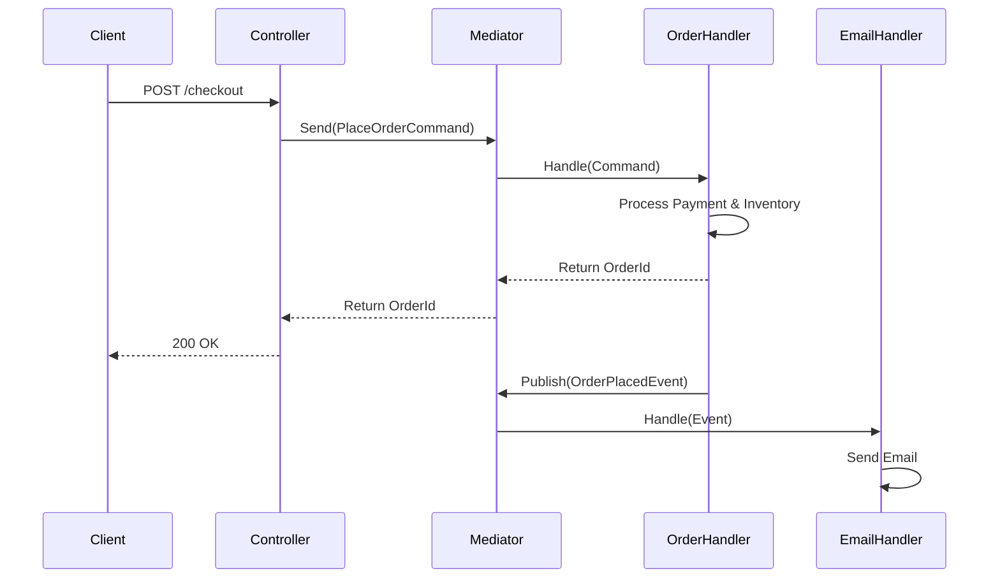

# The Mediator Pattern in ASP.NET Core: From Concept to Production


---

## Chapter 1 — Introduction

### What is the Mediator Pattern?
In software engineering, the Mediator is a **Behavioral Design Pattern**. It restricts direct communications between objects and forces them to collaborate only via a mediator object. 

In the context of ASP.NET Core, we rarely build this from scratch. Instead, we use **MediatR**, an open-source library created by Jimmy Bogard that provides a robust, in-memory message dispatcher.

### Why does it exist?
As applications grow, components (like Controllers, Services, and Repositories) start calling each other directly. This creates a tangled web of dependencies—often called "Spaghetti Code." The Mediator exists to **decouple** these components. Instead of Component A knowing about Component B, Component A sends a message to the Mediator, and the Mediator routes it to Component B.

### Real-World Use Cases
1. **CQRS (Command Query Responsibility Segregation)**: Separating read operations (Queries) from write operations (Commands).
2. **Domain Events**: Triggering side-effects (e.g., sending an email after an order is placed) without coupling the order logic to the email logic.
3. **Vertical Slice Architecture**: Grouping code by feature rather than by technical layer.

### 🧠 Unasked Questions: What nobody is asking yet
Based on current .NET community research and architectural discussions, here are the questions you *should* be thinking about:
1. **"Is MediatR becoming an anti-pattern in the era of Minimal APIs and Vertical Slices?"** Many argue that Minimal APIs already provide enough routing, making MediatR an unnecessary abstraction layer for simple apps.
2. **"Are we just trading 'Fat Controllers' for 'Fat Handlers'?"** Moving logic out of controllers is good, but if your handlers become 500 lines long, you haven't solved the complexity problem; you just moved it.
3. **"How does the Mediator affect cognitive load for new developers?"** A new dev can easily trace `ServiceA -> ServiceB`. Tracing `HandlerA -> Mediator -> HandlerB` requires understanding the implicit routing, which can slow down onboarding.

---

## Chapter 2 — Core Concepts


### 1. The Problem
Imagine an e-commerce `CheckoutController`. To process an order, it must:
1. Validate the cart.
2. Charge the credit card.
3. Deduct inventory.
4. Send a confirmation email.

If the controller calls `PaymentService`, `InventoryService`, and `EmailService` directly, the controller is tightly coupled to all of them. If you add a "Send SMS" feature later, you must modify the controller. This violates the **Open/Closed Principle**.

### 2. The Solution
Instead of the controller calling services, the controller creates a `PlaceOrderCommand` and hands it to a **Mediator**. The Mediator finds the correct handler, which does the work. The handler then publishes a `OrderPlacedEvent`, and independent event handlers (Email, SMS) react to it.

### 3. Simple Explanation & Analogy
**Analogy:** Think of an **Air Traffic Control (ATC) tower** at an airport. 
- Planes (components) do not talk directly to other planes to avoid collisions. 
- A plane talks to the ATC (Mediator). 
- The ATC tells the plane when to land or take off. 
The planes are decoupled from each other; they only know about the ATC.

### 4. Diagram


### 5. Small Code Example
```csharp
// The Message
public record PlaceOrderCommand(int CartId) : IRequest<int>;

// The Handler
public class PlaceOrderHandler : IRequestHandler<PlaceOrderCommand, int>
{
    public Task<int> Handle(PlaceOrderCommand request, CancellationToken cancellationToken)
    {
        // Process order logic here
        return Task.FromResult(1001); // Return Order ID
    }
}
```

### 6. Explanation
- **What it does:** Defines a command (`PlaceOrderCommand`) and the code that executes it (`PlaceOrderHandler`).
- **Why it works:** MediatR uses Reflection and Dependency Injection at startup to map `PlaceOrderCommand` to `PlaceOrderHandler`. When you call `Send()`, it fetches the handler from the DI container.
- **Alternatives:** You could use an `IOrderService` interface. But that requires injecting `IOrderService` everywhere you want to place an order.

### 7. Chapter Summary
The Mediator pattern decouples the sender of a message from its receiver. In .NET, this is primarily achieved using the MediatR library, promoting single-responsibility and making features easier to test and maintain.

**Key Takeaways:**
- Mediator stops objects from referring to each other explicitly.
- It shifts dependencies from concrete classes to a central dispatcher.

**Checklist:**
- [ ] I understand why direct component communication causes coupling.
- [ ] I can explain the Air Traffic Controller analogy.

**Mini Quiz:**
1. What design pattern category does Mediator belong to? *(Answer: Behavioral)*
2. In the ATC analogy, what represents the Mediator? *(Answer: The ATC Tower)*

---

## Chapter 3 — Building Blocks

MediatR relies on a few core interfaces. Let's break them down.

### 1. `IRequest<TResponse>` (Commands & Queries)
This is the **Message**. It represents a request for work. 
- If `TResponse` is `Unit` (MediatR's version of `void`), it's typically a **Command** (changes state).
- If `TResponse` is a DTO or primitive, it's typically a **Query** (reads state).

```csharp
// Query
public record GetUserByIdQuery(int Id) : IRequest<UserDto>;

// Command (Returns nothing, hence Unit)
public record DeleteUserCommand(int Id) : IRequest; 
```
🧠 **Remember:** Commands change state; Queries read state.

### 2. `IRequestHandler<TRequest, TResponse>`
This is the **Receiver**. It contains the actual business logic.
```csharp
public class GetUserByIdHandler(IDbContext db) 
    : IRequestHandler<GetUserByIdQuery, UserDto>
{
    public async Task<UserDto> Handle(GetUserByIdQuery request, CancellationToken ct)
    {
        return await db.Users.FindAsync(request.Id, ct);
    }
}
```

### 3. `INotification` & `INotificationHandler<T>`
These are for **Domain Events**. Unlike `IRequest` (which has exactly *one* handler), an `INotification` can have *multiple* handlers running concurrently.

```csharp
public record UserRegisteredEvent(int UserId) : INotification;

public class SendWelcomeEmailHandler : INotificationHandler<UserRegisteredEvent>
{
    public Task Handle(UserRegisteredEvent notification, CancellationToken ct) 
    { /* send email */ return Task.CompletedTask; }
}

public class AnalyticsTrackingHandler : INotificationHandler<UserRegisteredEvent>
{
    public Task Handle(UserRegisteredEvent notification, CancellationToken ct) 
    { /* track event */ return Task.CompletedTask; }
}
```

✅ **Best Practice:** Use primary constructors (C# 12+) for handlers to keep them clean and inject dependencies elegantly.

---

## Chapter 4 — Practical Examples

Let's build a feature incrementally.

### Step 1: Hello World (Simple Command)
```csharp
public record Ping(string Message) : IRequest<string>;

public class PingHandler : IRequestHandler<Ping, string>
{
    public Task<string> Handle(Ping request, CancellationToken cancellationToken)
    {
        return Task.FromResult(request.Message + " Pong");
    }
}

// In Minimal API:
app.MapGet("/ping", async (IMediator mediator) => 
    await mediator.Send(new Ping("Hello")));
```

### Step 2: Real Application (E-Commerce)
Let's use a Query to fetch a product, and a Command to buy it.

```csharp
// 1. Define the Query
public record GetProductQuery(int Id) : IRequest<ProductDto>;

public record ProductDto(int Id, string Name, decimal Price, int Stock);

// 2. Define the Handler
public class GetProductHandler(IProductRepo repo) 
    : IRequestHandler<GetProductQuery, ProductDto>
{
    public async Task<ProductDto> Handle(GetProductQuery req, CancellationToken ct)
    {
        var product = await repo.GetByIdAsync(req.Id, ct);
        return new ProductDto(product.Id, product.Name, product.Price, product.Stock);
    }
}
```

**Why it is written this way:** 
The handler only knows about the repository. It doesn't know about HTTP, JSON, or Controllers. This makes it 100% unit-testable without needing `HttpClient`.

---

## Chapter 5 — Internal Mechanics

How does MediatR actually work under the hood?

### 1. The DI Container Mapping
When you call `builder.Services.AddMediatR(...)`, MediatR scans your assemblies. It finds every class implementing `IRequestHandler<T, R>`. 
It registers them in the DI container as transient or scoped services, mapping the specific generic interface to the concrete class.

### 2. Execution Flow & Memory
When you call `mediator.Send(new MyCommand())`:
1. MediatR asks the DI container: "Give me the `IRequestHandler<MyCommand, Unit>`."
2. The DI container creates the handler (injecting its dependencies).
3. MediatR wraps the handler's `Handle` method in a `RequestHandlerDelegate<TResponse>`.
4. It invokes the delegate.

⚠ **Common Mistake:** Creating massive objects inside handlers. Because handlers are resolved per request (Scoped/Transient), heavy dependencies injected into them are instantiated every time. Use lightweight services or cache expensive resources at the Singleton level.

🚀 **Pro Tip:** MediatR caches the delegate creation for requests. The first time a request type is sent, it uses Reflection to build a delegate. Subsequent calls use the cached delegate, making it extremely fast.

---

## Chapter 6 — Real World Patterns

### 1. CQRS (Command Query Responsibility Segregation)
CQRS separates reads and writes. MediatR is the perfect tool for this.
- **Queries** (`IRequest<T>`) go to the Read Database (e.g., using Dapper directly, bypassing EF Core tracking).
- **Commands** (`IRequest`) go to the Write Database (using EF Core).

### 2. Pipeline Behaviors (Cross-Cutting Concerns)
Instead of putting `try/catch`, logging, and validation inside *every* handler, we use the **Decorator Pattern** via `IPipelineBehavior<TRequest, TResponse>`.

```csharp
public class LoggingBehavior<TRequest, TResponse>(ILogger<LoggingBehavior> logger) 
    : IPipelineBehavior<TRequest, TResponse>
    where TRequest : IRequest<TResponse>
{
    public async Task<TResponse> Handle(TRequest request, RequestHandlerDelegate<TResponse> next, CancellationToken ct)
    {
        logger.LogInformation("Handling {RequestName}", typeof(TRequest).Name);
        var response = await next(); // Call the actual handler
        logger.LogInformation("Handled {RequestName}", typeof(TRequest).Name);
        return response;
    }
}
```
Register it in `Program.cs`:
```csharp
builder.Services.AddTransient(typeof(IPipelineBehavior<,>), typeof(LoggingBehavior<,>));
```

---

## Chapter 7 — Common Mistakes

### Mistake 1: Using MediatR for Everything
**The Error:** Using MediatR to map a DTO to a Domain model, or doing simple math.
**Why it happens:** Developers think "MediatR = Clean Architecture."
**The Fix:** Only use MediatR for application-level use cases (Commands/Queries). Simple mapping should just be a method call.

### Mistake 2: Returning Entities from Queries
**The Error:** `IRequest<User>` (where `User` is an EF Core Entity).
**Why it happens:** Laziness.
**The Fix:** Always return DTOs or Records. Exposing EF Core entities to the API layer causes serialization loops (circular references) and over-posting security vulnerabilities.

### Mistake 3: Swallowing Exceptions in Pipelines
**The Error:** Catching an exception in a `ValidationBehavior` and returning a generic error object, but failing to log it.
**The Fix:** Always log exceptions in pipeline behaviors before returning a specialized response (like a `Result<T>` object).

---

## Chapter 8 — Best Practices

✅ **Use Records for Messages:** C# `record` types provide built-in value equality and immutability, which is perfect for Commands and Queries.
✅ **Keep Handlers Thin:** A handler should orchestrate, not implement complex business rules. Delegate complex logic to Domain Services or Aggregate Roots (if using DDD).
✅ **Use FluentValidation with Pipelines:** Create a `ValidationBehavior` that automatically runs FluentValidation validators before the handler executes.
✅ **Cancellation Tokens:** *Always* pass the `CancellationToken` from the Controller/Minimal API down through the Mediator and into the Database calls.

---

## Chapter 9 — Advanced Topics

### Stream Requests (`IStreamRequest<T>`)
Sometimes you need to return a massive dataset (e.g., exporting 1 million rows to CSV). Returning a `List<T>` will cause an `OutOfMemoryException`.
MediatR supports `IAsyncEnumerable<T>` via `IStreamRequest`.

```csharp
public record ExportUsersStream() : IStreamRequest<UserDto>;

public class ExportUsersHandler : IStreamRequestHandler<ExportUsersStream, UserDto>
{
    public async IAsyncEnumerable<UserDto> Handle(ExportUsersStream request, [EnumeratorCancellation] CancellationToken ct)
    {
        // yield return users one by one
    }
}
```

### Polymorphic Dispatch
MediatR can handle base classes. If you have a base `Notification` and derived `UserNotification`, you can write a handler for the base class that catches all derived notifications. This is powerful for generic logging or auditing pipelines.

---

## Chapter 10 — Hands-on Exercises

### Easy: The Ping-Pong
Create a `PingQuery` that takes a string, and a Handler that returns the string reversed.

### Medium: The Caching Behavior
Create a `CachingBehavior<TRequest, TResponse>` that checks an `IMemoryCache` for a key before calling `next()`. If found, return the cached value. (Hint: You'll need an interface like `ICacheableQuery` to define the cache key).

### Hard: Transactional Outbox
Create an `OrderPlacedEvent` (Notification). Create a handler that saves this event to an `OutboxMessages` database table instead of sending an email directly.

---

## Chapter 11 — Solutions

### Solution: Medium (Caching Behavior Concept)
```csharp
public interface ICacheableQuery { string CacheKey { get(); } }

public class CachingBehavior<TRequest, TResponse>(IMemoryCache cache) 
    : IPipelineBehavior<TRequest, TResponse>
    where TRequest : ICacheableQuery
{
    public async Task<TResponse> Handle(TRequest req, RequestHandlerDelegate<TResponse> next, CancellationToken ct)
    {
        if (cache.TryGetValue(req.CacheKey, out TResponse cachedResponse))
            return cachedResponse!;

        var response = await next();
        cache.Set(req.CacheKey, response, TimeSpan.FromMinutes(5));
        return response;
    }
}
```

---

## Chapter 12 — Cheat Sheet

| Concept | Interface | Purpose |
| :--- | :--- | :--- |
| **Query/Command** | `IRequest<T>` | Defines the message. |
| **Void Command** | `IRequest` | Message that returns nothing (`Unit`). |
| **Handler** | `IRequestHandler<TReq, TRes>` | Executes the logic for a message. |
| **Event** | `INotification` | Message with multiple handlers. |
| **Event Handler** | `INotificationHandler<T>` | Reacts to an event. |
| **Pipeline** | `IPipelineBehavior<TReq, TRes>` | Cross-cutting concern (Logging, Validation). |
| **Registration** | `services.AddMediatR(cfg => ...)` | Wires up handlers via DI. |

---

## Chapter 13 — Interview Questions

📌 **Beginner:** "What is the difference between `IRequest` and `INotification`?"
*Answer:* `IRequest` is a 1-to-1 mapping (Command/Query) and expects a response. `INotification` is a 1-to-many mapping (Event) and does not return a response; it triggers multiple handlers concurrently.

📌 **Intermediate:** "How would you implement global validation for all MediatR commands?"
*Answer:* I would use the `IPipelineBehavior` interface. I'd create a `ValidationBehavior` that uses reflection or FluentValidation to find validators associated with the incoming request, execute them, and throw a `ValidationException` if they fail, preventing the handler from running.

📌 **Senior:** "MediatR relies heavily on the DI container. In a high-throughput microservice, how does this impact performance and memory, and how do you mitigate it?"
*Answer:* Resolving handlers per request creates garbage collection pressure due to transient object allocations. Mitigation involves using struct-based messages where possible, avoiding heavy dependency trees in handlers, utilizing `IAsyncEnumerable` for large datasets to avoid memory spikes, and potentially using custom factories or pooled objects for extreme edge cases, though standard DI is usually sufficient if handlers remain lightweight.

---

## Chapter 14 — Frequently Asked Questions

**Q: Is MediatR slow?**
A: The reflection overhead only happens *once* per request type at startup (or first use). After that, it uses cached delegates. The performance difference between calling a service directly and calling a MediatR handler is measured in nanoseconds. It is not a bottleneck.

**Q: Do I need MediatR for a small CRUD API?**
A: No. If you are building a simple API with 5 endpoints, standard Controllers or Minimal APIs calling a simple service is perfectly fine. MediatR shines in complex, feature-rich applications where decoupling provides a massive maintenance benefit.

---

## Chapter 15 — Production Tips

### 1. Distributed Tracing
When using MediatR, your logs might lose context. Ensure you pass `Activity.Current` or use OpenTelemetry. MediatR behaviors can automatically start and stop `Activity` spans for every handler, giving you beautiful traces in tools like Jaeger or Datadog.

### 2. Handling Concurrency in Notifications
By default, `INotification` handlers run concurrently (`Task.WhenAll`). If Handler A fails, Handler B might still succeed. If your event requires strict ordering or transactional guarantees (e.g., Handler B must run only if A succeeds), **do not use Notifications**. Use a Saga pattern or explicit sequential method calls instead.

### 3. Testing
Because handlers are isolated classes, testing is trivial. You don't need to mock HTTP contexts. Just instantiate the handler, pass in mocked dependencies, call `Handle()`, and assert the result.

```csharp
[Fact]
public async Task GetUser_ReturnsUser()
{
    // Arrange
    var mockRepo = new Mock<IUserRepo>();
    mockRepo.Setup(r => r.GetByIdAsync(1, It.IsAny<CancellationToken>()))
            .ReturnsAsync(new User { Id = 1, Name = "Alice" });
            
    var handler = new GetUserHandler(mockRepo.Object);
    
    // Act
    var result = await handler.Handle(new GetUserQuery(1), CancellationToken.None);
    
    // Assert
    Assert.Equal("Alice", result.Name);
}
```

### 4. Maintenance & Scaling
As your application grows, you might end up with hundreds of handlers. 
💡 **Tip:** Organize your project folders by **Feature** (Vertical Slices), not by type. 
Instead of `Controllers/`, `Handlers/`, `Models/`, use `Features/Users/GetUser/`, `Features/Users/CreateUser/`. This keeps the command, handler, and DTOs right next to each other, drastically improving developer experience.

---

**Final Words:**
The Mediator pattern, powered by libraries like MediatR, is a cornerstone of modern, maintainable ASP.NET Core architecture. It forces you to think in terms of *messages* and *use cases* rather than tangled service webs. Master it, respect its boundaries, and your codebases will thank you for years to come. Happy coding!